# snort检测SQL注入攻击并利用guardian联动iptables防御 #

## 实验内容 ##
- 简单介绍snort工具的三种工作模式
- 编写自定义snort规则，以对sql注入攻击行为作出警告
- 利用snort的NIDS模式检测SQL注入攻击并发出报警信息
- 利用guardian联动iptables进行防御，阻断攻击IP访问1分钟

##实验环境##
- 本实验攻击方为linux Cali系统pc1
- 服务器采用的是Pentesterlab封装好的镜像来进行搭建，采用的是debian的系统，设置默认网关为PC2
- 所有访问服务器的流量都会经过一台cali主机pc2，snort和iptables均在pc2上设置
- 在/proc/sys/net/ipv4路径下执行echo 1 > ip_forward，将默认值0改为1，开启IP转发，使得网关PC2可以对pc的访问流量进行监控和检测

##实验过程##
- snort的嗅探模式：
该模式下，可以解码捕获到的报文后输出到标准输出到控制台上，功能与tcpdump、wireshark类似
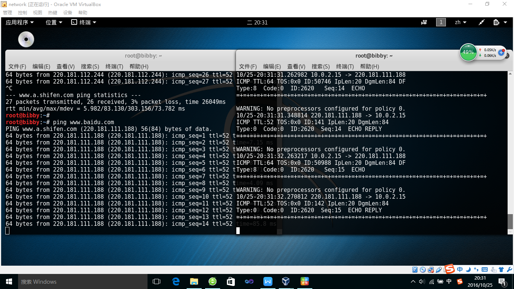
- 实际上snort并没有自己的捕包工具，它需要一个外部的捕包程序库：libpcap。它利用libpcap独立地从物理链路上进行捕包
- snort的报文记录模式：该模式下，snort可以将捕获到的报文保存下来，用wireshark等工具进行后续分析
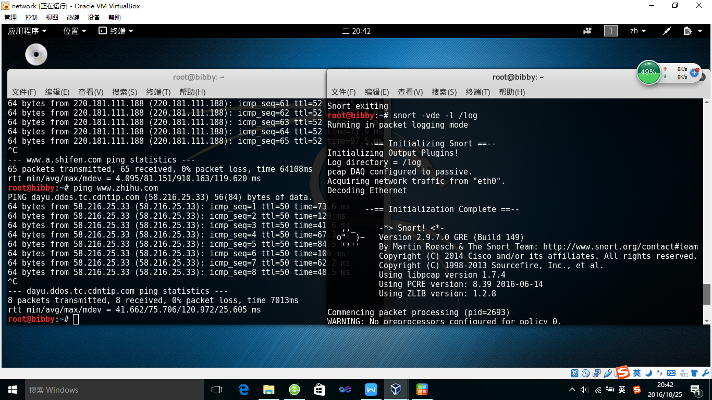
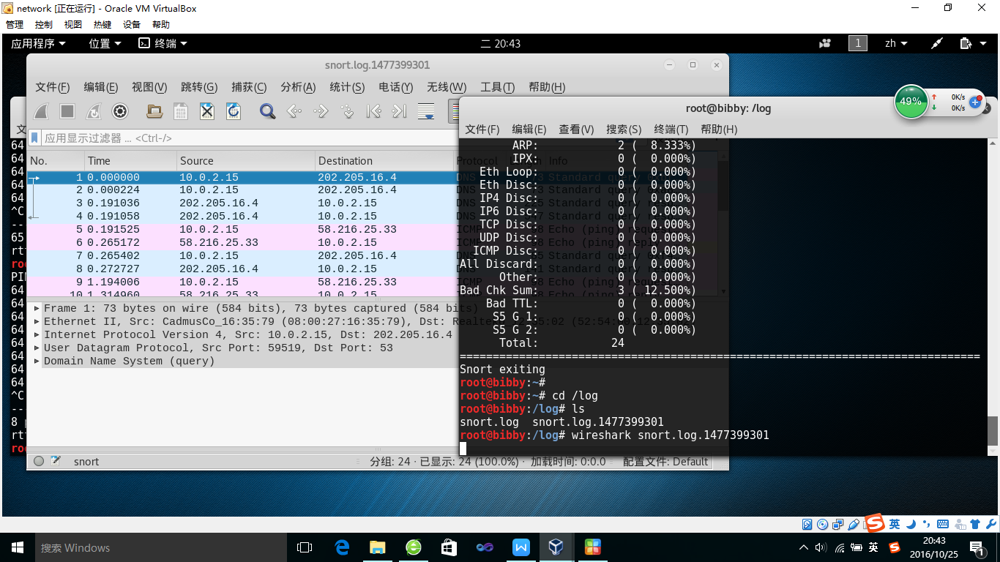

- snort的NIDS模式：这个模式为本次试验的主要工作模式，其探测入侵的方式是通过对嗅探到的数据包与规则链表进行查询匹配，如果有匹配的规则，则进行丢包或者报警
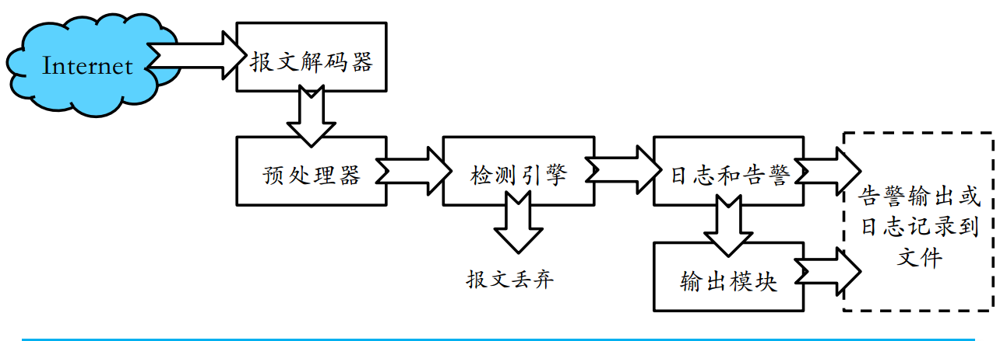
- 进入snort默认的规则目录 /etc/snort/rules,这个目录下可以看到snort自带的规则
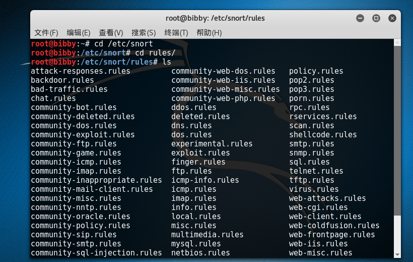
- 先应用snort自带规则进行试验（因为只是单纯的ping所以不会有警告）
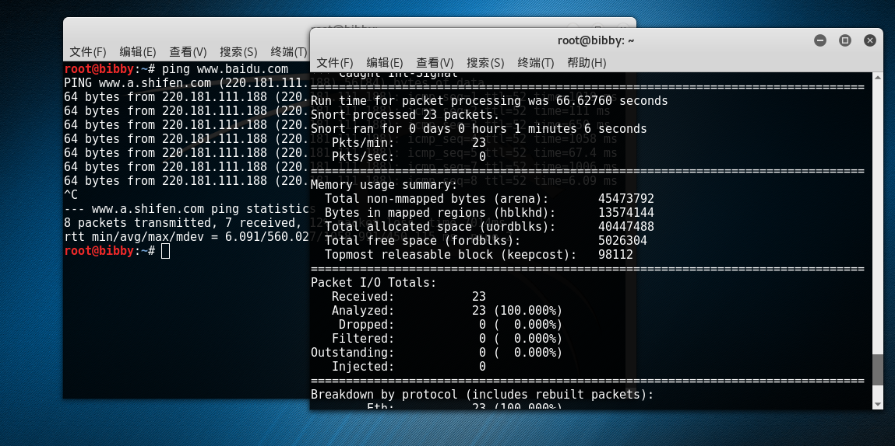
- 为了检测sql注入需要新建一个自定义规则 vim myrule.rules 
- 建立好自定义的规则后，还需要在/etc/snort/snort.conf文件中加入myrule.rules
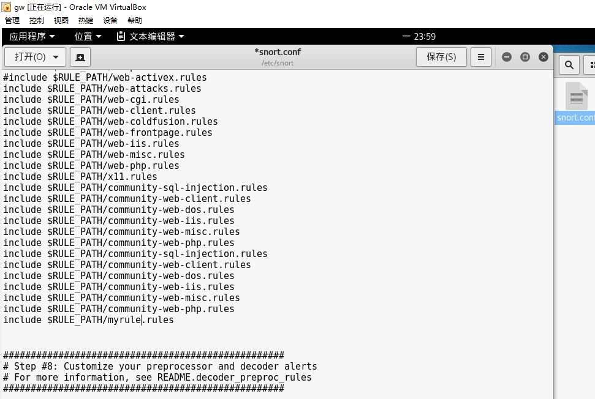
- 本次试验的自定义规则有:
- alert tcp any any -> any 80 (msg:"SQL Injection 1";flow:to_server,established;uricontent:".php";pcre:"/(\%27)|(\')|(\-\-)|(%23)|(#)/i";classtype:Web-application-attack;sid:9099;rev:5;)
- alert tcp any any -> any 80 (msg:"SQL attack";content:"union"; nocase; sid:1000002; rev:1;)

- 接下来输入指令snort -vd -l /log -c /etc/snort/snort.conf -A full 打开snort的入侵检测模式
- 打开攻击机器PC1，在网站界面中输入Sql注入语句http://localhost/cat.php?id=1%20union%20select%201,2,3,4
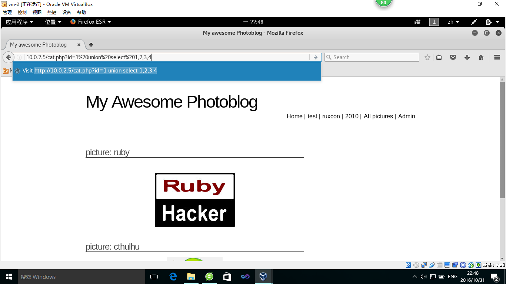
- 回到PC2查看snort监控窗口，可以看到snort已经将数据包显示在了屏幕上
- 停止PC1的访问，现在打开我们指定的报警日志输出目录/log，可以看到两个文件
- 一个alert记录报警信息
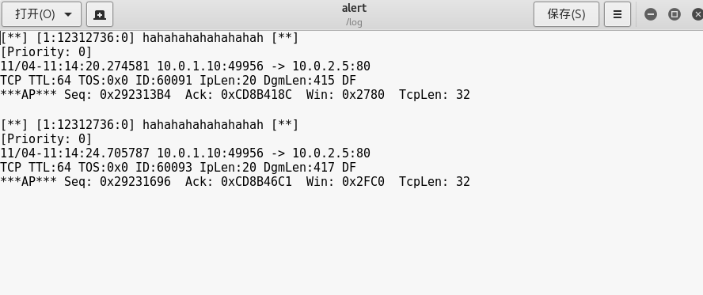
- 一个pcap文件记录报警的可疑数据包
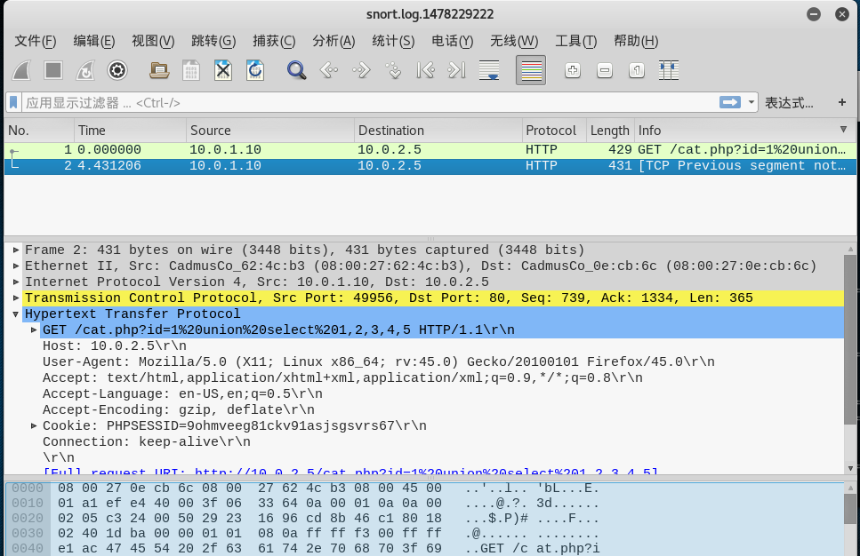
- 现在由snort搭建的入侵检测系统已经基本完成，接下来需要做的就是利用guardian脚本，联动iptables将攻击者的ip阻断，禁止其访问
    
    > guardian下载地址 http://www.chaotic.org/guardian/  
    
     下载并解压完成后,跳转到解压出来的目录打开终端,依次执行以下几条指令：
  
    cp guardian.pl /usr/local/bin/  #将guardian执行文件放入可执行文件目录下  
    cp scripts/iptables_block.sh /usr/local/bin/guardian_block.sh # 拷贝联动iptables锁定ip所需文件，并将其重命名      
    cp scripts/iptables_unblock.sh /usr/local/bin/guardian_unblock.sh # 拷贝联动iptables解锁ip所需文件，并将其重命名
    touch /etc/guardian_ignore #创建白名单  
    touch /etc/guardian_target #创建黑名单
    
- 接下来打开guardian.conf文件对guardian进行配置
   > guardian的日志文件目录需要新建，对目标IP的阻断时间按要求应设置为60s，为实验方便，暂设为20s
   
- 完成好所有配置后，在控制台输入指令，运行guardian脚本
   > guardian.pl -c /guardian-1.7/guardian.conf 
   发现以下报错信息：
   
- 查询后发现是系统缺少了perl中的Perl4::CoreLibs模块，需要手动安装
   > perl -MCPAN -e shell
   cpan[1]> install Perl4::CoreLibs 

- 安装完成后，再次运行guardian脚本，显示后台开始执行

##实验中遇到的问题##
- 嗅探和报文记录模式下出现“No preprocessors configured for policy 0”警告”：其原因是没有加载预处理器，解决方法是应用snort规则
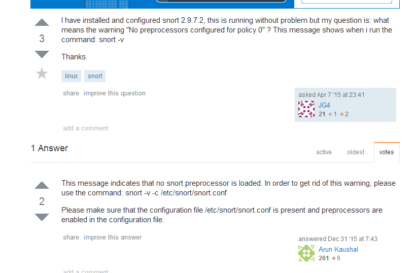
- 开始编写的snort语法规则有些错误
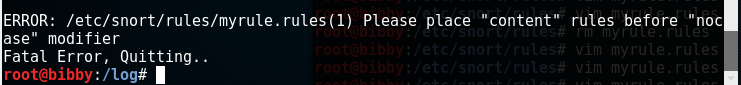

##相关文献##
- Linux平台Snort入侵检测系统实战指南http://www.2cto.com/Article/201208/145925.html
- https://www.snort.org/documents
