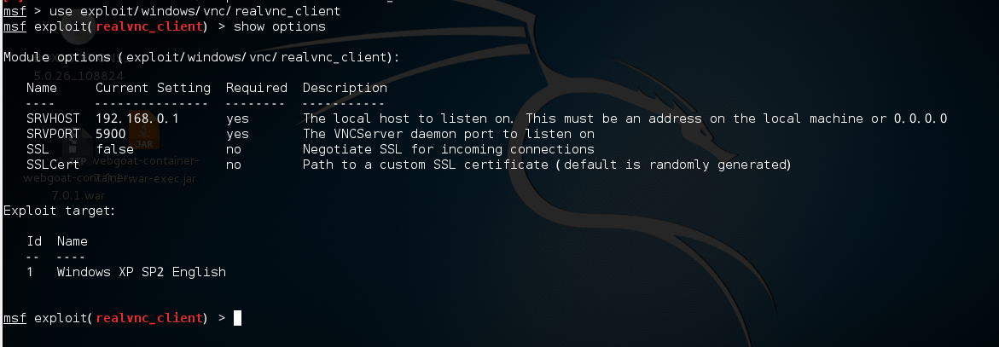
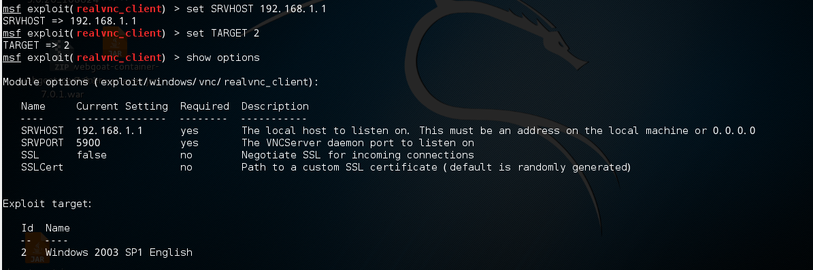
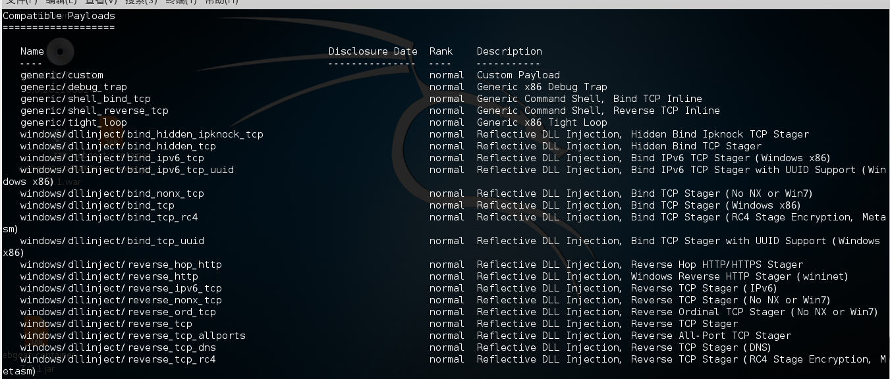
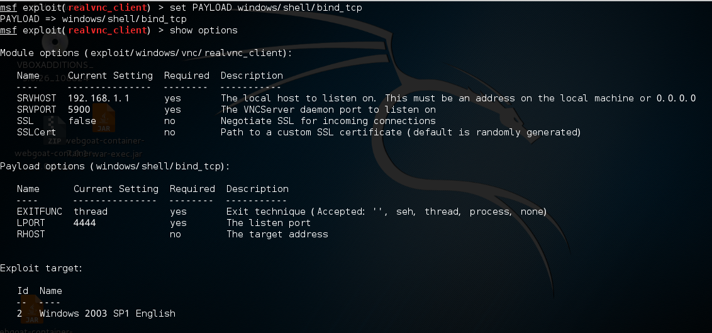
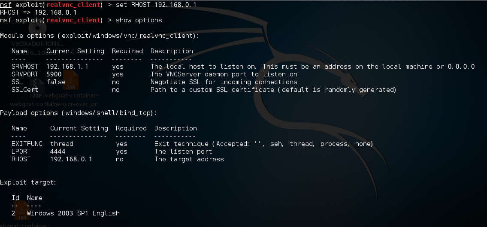

# Metasploit学习4    
  
##  payloads 模块

> ### **简介**  
  
* payload也就是shellcode，就是在漏洞利用成功后所要做的事情。在MSF中为我们提供了大量的实用payloads。  
  
    

* 当我们选择了一个exploit米快并设置完选项后，我们可以用show payloads来看一下当前exploit可以用哪些payloads。   
   
      
   
     
  
     

* payloads命名规则：  
  
* 操作系统/类型/名称 如：windows/shell/bind_tcp  
  
* 类型主要有：   
  
* shell：得到一个shell  
  
* Dllinject：上传DLL并注入到进程  
  
* Patcup***: 修补漏洞   
  
* Upexec：上传并执行一个文件  
  
* Meterpreter：高级payload  
  
* Vncinject： 高级payload  
  
* PassiveX： 高级payload  
  
* Payload名称命名规则：  
    * shell_find_tag:在一个已建立的链接上创建一个shell  
    * shell_reverde_tcp:反向链接到攻击者主机并且创建一个shell  
    * bind_tcp: 监听一个tcp链接  
    * reverse_tcp: 反向建立tcp链接  
    * reverse_http: 通过HTTP隧道通信并创建一个新用户添加到管理组  
    * add_user: 创建一个新用户并添加到管理组  
    * xxx_ipv6_tcp: 基于IPv6  
    * xxx_nonx_tcp:非No eXecute或win7（NX是应用在CPU的一种可以防止缓冲区溢出的技术）  
    * xxx_ord_tcp: 有序payload  
    * xxx_tcp_allports: 在所有可能的端口  
    * 详细解释参考  
    * [http://www.offensive-security.com/metasploit-unleashed/A-Bit-About-Payloads](http://www.offensive-security.com/metasploit-unleashed/A-Bit-About-Payloads)  
      
  
* 设置payload： set PAYLOAD payload_name  
  
    

* 列出选项还是： show options  
   
* 之后设置选项： set RHOST 192.168.0.1  
  
   
  
* 这样exploit和payload就设置完毕了，我们就可以对目标主机进行利用了。  

  

    * 由于payloads只不过是汇编指令序列，通常nop在他前面  
    * 这可能作为特征用来开发检测这些攻击，因此，paylods需要被编码并且变化nop用于独臂IDS或者IPS检测。  
    * MSF提供了一些编码器以及若干NOP生成器来使得检测过程变得极其困难。    
    
  
  
  
  
  

  

    

    

