# Metasploit学习2   
  
##  msfconsole 用户接口介绍    
 
>**msfconsole特点**  
  
* 多个会话可以并发执行，命令能够进行交互会话，比如sessions,jobs这些命令。   
* 也可以列出和杀死运行中的人物，也可以从一个单一里用创建多个会话   
* 这意味着单个利用发动一个用户指定的主机列表   
* 会话可以通过Ctrl+z发送到后台，Ctrl+c停止   
* msf带有一组强大的API，他们可以通过mafconsole访问  
* 在界面中切换到交互式ruby shell， session 和framework使底层交互成为可能   

> ** 核心命令介绍**  
> 
> help 

* **上面部分列出它的核心命令**   
    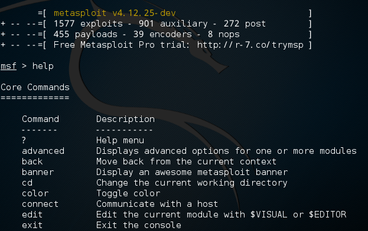 
    
    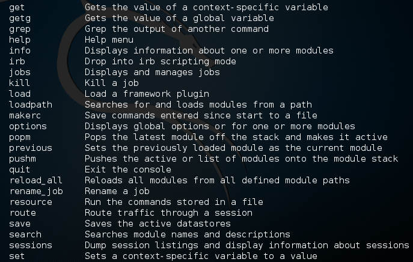   
   
    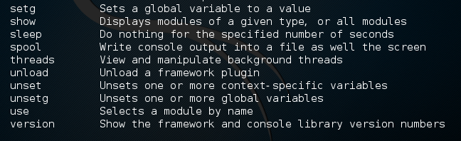   

* 翻译其中一些命令   
    * ？  帮助菜单   
    *  back  从当前环境返回   
    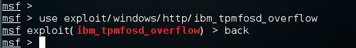  
    *  banner  显示一个MSF banner（随机）
    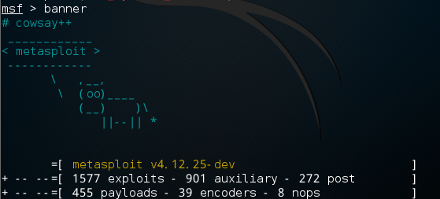   
  
    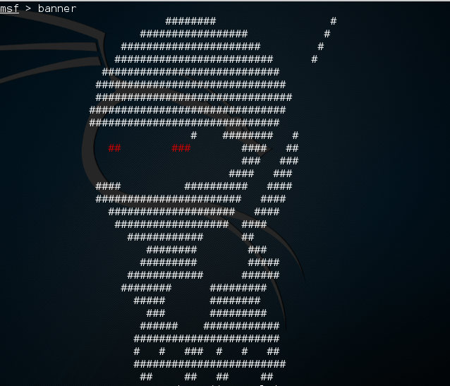   
 
    *  cd  切换目录   
    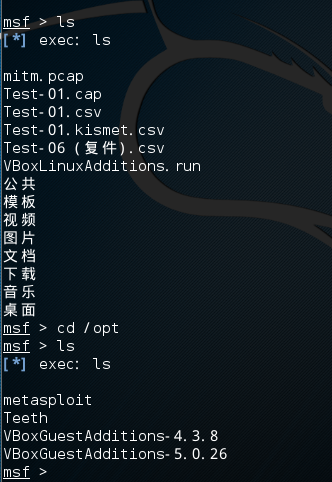   

    *  color 颜色转换  
    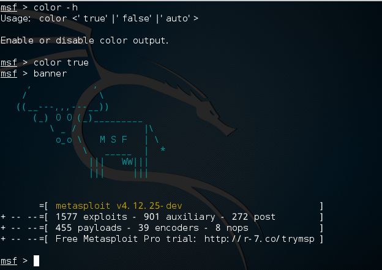  
     
    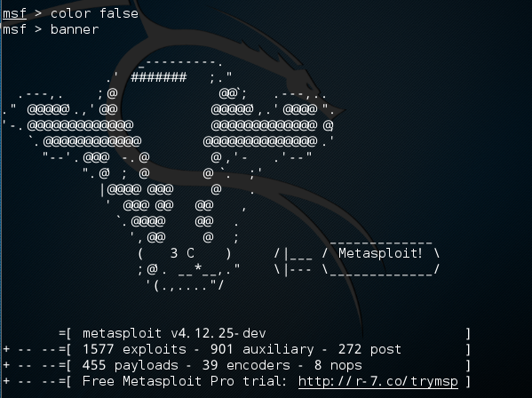 
    
    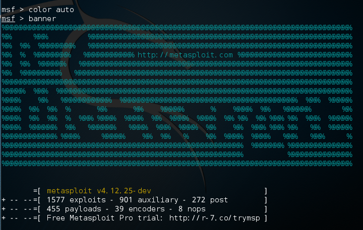   
 
    *  connect 连接一个主机   
    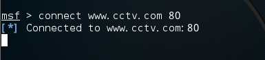  
 
    *  exit  退出MSF  
    *  help  帮助菜单 
    *  info 显示一个或者多个模块信息   
    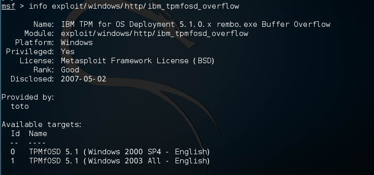  
    
    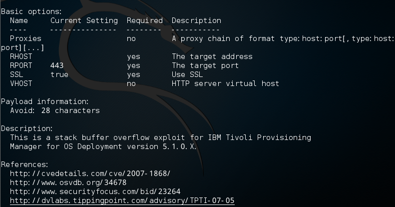  

    *  irb  进入irb脚本模式  
      
 
    *  jobs  显示和管理作业  
    *  kill  杀死一个作业   
    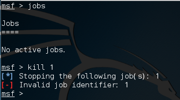  
    *  load 加载一个插件  
    *  loadpath 在一个路径搜索并加载模块  
    *  quit 退出MSF  
    *  resource 运行存储在一个文件中的命令  
    *  route  查看一个会话的路由信息  
    *  save 保存动作  
    *  search 搜索模块名和描述   
    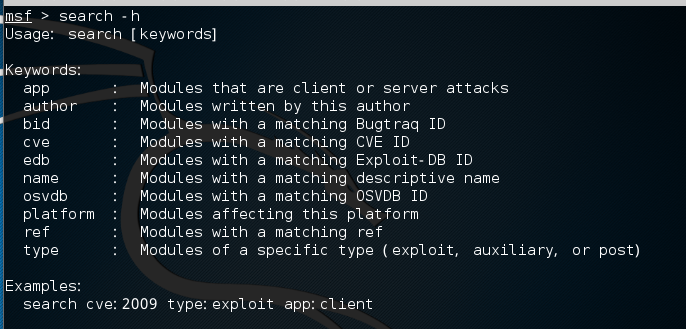  

    *  set  给一个变量赋值   
    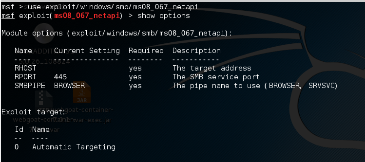  
  
    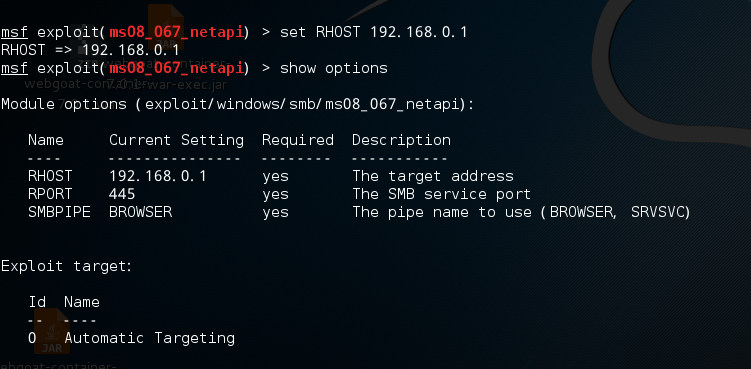  

    *  setg  把一个赋值给全局变量 
    *  show 显示所给的类型的模块，或者所有模块  
     

    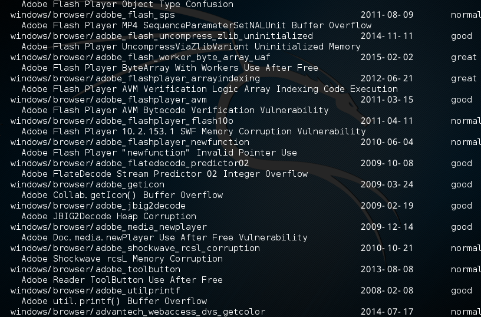  
    
    *  sleep 在限定秒数内什么也不做  
    *  unload 卸载一个模块  
    *  unset 解除一个或者多个变量  
    *  unsetg  解除一个或者多个全局变量  
    *  use 通过名称选择一个模块   
    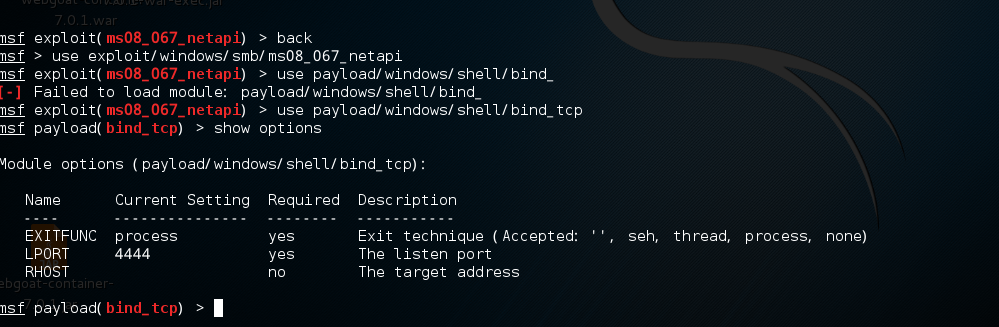  

    *  version 显示MSF和控制台库版本号
  
 

* **下面部分是数据库的后台命令**    
   
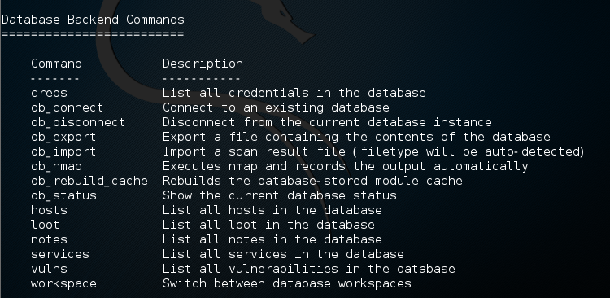   

