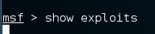
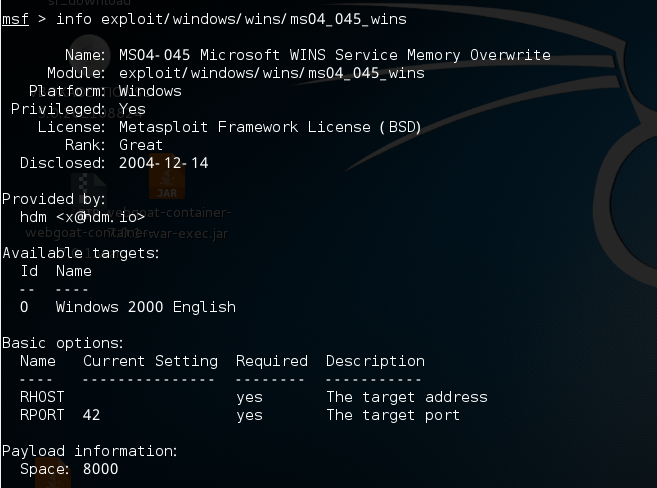
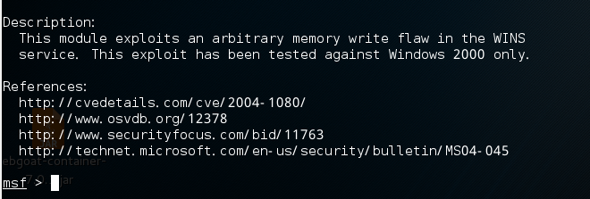
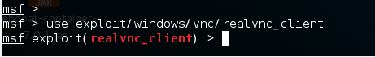
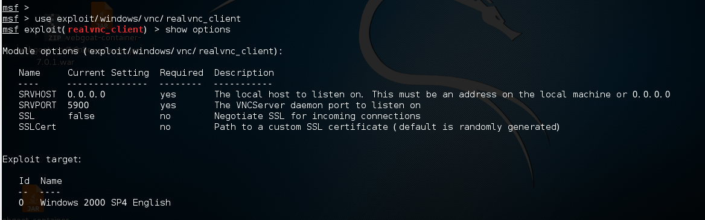
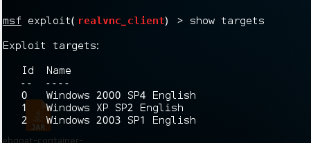
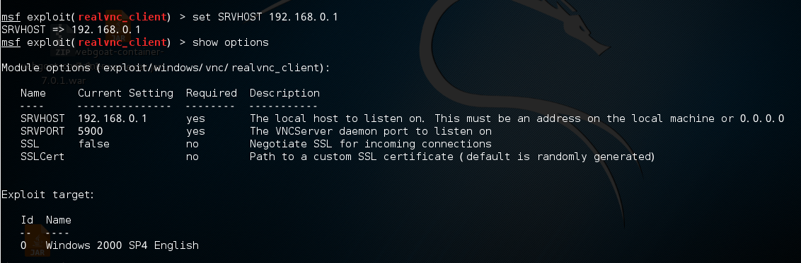
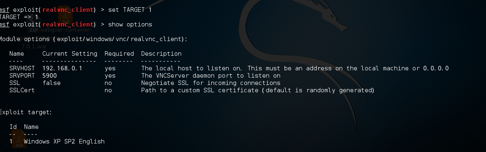

# Metasploit学习3    
  
##  Exploits 模块

> **简介**  

* 简单来讲，就是针对不同的已知漏洞的利用程序。
* 当我们执行show exploits 命令后，显示4列，分别为Exploit名称，公布日期，等级（rank），描述  
  
   
  
   

* exploit命名规则：
    * 操作系统/服务/模块名称   例如：  
    * windows/vnc/realvnc_client      
    * 等级（rank）代表好用程度  
    * 描述就是对漏洞的简介
    * 查看exploit详细信息：info模块名  
        
 
       

  
  
* 选择一个exploit： use exploits/windows/vnc/realvnc_client   
     
   
   
* 列出exploit设置选项：show options    
     

* options中required的是必须设定的选项     
  
* 列出exploit的可攻击目标类型： show targets    
      

* 设置选项： set option值（如 set RHOST 192.168.0.1)   
     

* 设置攻击目标： set TARGET 编号（如set TARGET 1）  
    
  
