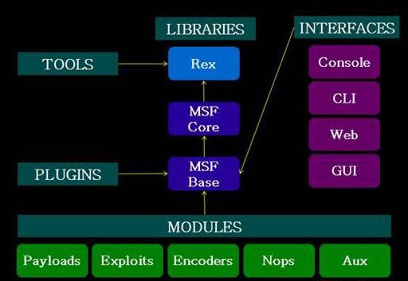

# Metasploit    
  
##  漏洞扫描
  
### **漏洞扫描过程可分为以下几个步骤:**  
  
1. 向扫描软件提供活动系统的主机名和IP地址。这样，扫描器可以发现开放端口，响应的服务和当前可能正在系统上运行的任意应用程序。  
2. 扫描器生成一个报告，告知您所发现的问题。如果扫描器在这个步骤就结束，那它提供的信息也许不太具有操作性。因此软件需要继续进行下一步。  
3. 扫描软件针对第二步中发现的端口和服务进行检测，其目的是显示补丁级别、软件修改或潜在缺陷的信息。现代漏洞扫描器包含一写插件，它们将用于发现新的安全漏洞。因此，可能出现的情况是，今天运行扫描器没有发现问题，但并不代表明天使用了升级后的扫描器，也不会发现问题。  
4. 扫描器针对漏洞的研究，取决于扫描器的先进程度。事实上，某些现在扫描器可以在这个步骤配置它们的攻击程度，以免扫描器的攻击性太强，以至于在扫描过程中导致被扫描系统的崩溃。  
  
  

  
### **漏洞及漏洞发掘方法:**    
  
* 漏洞，是指在硬件、软件、协议实现或系统安全策略上存在缺陷，攻击者能够在未授权的情况下对系统进行访问或破坏。它会成为入侵者侵入系统和植入恶意软件的入口，影响系统用户的切身利益。漏洞与目标系统的操作系统版本、软件版本以及服务设置密切相关。研究漏洞必须要了解当前计算机系统及其安全问题的最新发展动态。常见的漏洞包括缓冲区溢出漏洞、跨站脚本漏洞(XSS)、SQL注入漏洞、数据库漏洞以及WEB应用漏洞等。   
   
* 常见的漏洞发掘方法分为以下几种。  
  
    * 黑盒攻击（Fuzzing）：即通过注入数据进行自动化测试。  
  
    * 获取攻击对象的源代码进行审计：网络上有很多源代码审计工具可供使用，如Fortify。  
  
    * 反汇编审计：如果无法获取到源代码，可以基于汇编码进行反汇编审计。IDA是一款常用的反汇编软件。  
  
    * 动态跟踪分析：通过记录程序在不同条件下执行操作（如文件操作），分析这些操作序列是否存在问题。  
  
    * 补丁比较：厂商软件的问题通常都会在补丁中解决，如微软的Windows操作系统会不定期发布补丁程序，通过对比补丁前后文件的源码（或反汇编码）就能了解漏洞的具体细节。  
  
    * 目前，针对常用的漏洞发掘方法已经开发出了很多漏洞扫描工具。漏洞扫描工具是一种能在计算机、信息系统、网络及应用软件中查找安全弱点的程序。通过对目标系统进行探测，向目标系统发送数据，并将反馈结果与漏洞特征库进行匹配，分析出目标系统上存在的安全漏洞。比较常用的漏洞扫描工具有Metasploit、Nmap、NeXpose、Nessus、Xscan等。  
  
  
### **Metasploit Framework工具简介:**   
  
* Metasploit Framework是一个强大的开源平台，为渗透测试、shellcode 编写和漏洞研究提供了一个可靠环境。它集成了各种常见的溢出漏洞和shellcode ，并且不断更新。当前版本收集了上千个实用的溢出攻击程序及一些辅助工具，操作简单，易用性好。当然，它不只是一个简单的收集工具，还提供了所有的类和方法，以便开发人员使用这些代码方便快速的进行二次开发。漏洞扫描只是Metasploit Framewotk众多功能中的一种，本文只介绍它的漏洞扫描功能。    
  
* Metasploit Framework的总体架构如图1所示，它包含Exploit、Auxiliary、Payload等多个模块：  
  
* m  Exploit是攻击模块，基本上目前所有的操作系统在Metasploit Framework上均有对应的攻击模块；  
  
* m  Auxiliary是辅助模块，用途非常广泛，它可以作为扫描器、拒绝服务攻击工具、Fuzz测试器，以及其他类型的工具；  
  
* m  Payload是在目标系统被攻陷之后执行的代码，如添加用户账号，获取shell交互权限等；    
    
   
  

### **metasploit怎么工作:**   
* metasploit首先执行前面介绍的由漏洞扫描器完成的几个步骤，目的是发现漏洞。从根本上说，这个扫描器：  

    * 选择并配置目标估计。这种代码针对一个系统，并利用软件中的缺陷。   
      注意： 攻击池是特定于操作系统的。根据系统版本不同，它也有所差异，而且在不断发展。  
    * 验证针对系统的攻击，目的是判断系统是否能够经受攻击。  
    * 选择并配置一个将要使用的有效负载。这个有效负载表示在扫描器发现系统的入侵点之后将在系统上运行的代码。  
    * 选择并配置将要使用的编码和交付技术。  
       这个步骤的目的是以一种特殊方式格式化有效负载，以便他能躲避壁垒森严的入侵探测系统（IDSs）。  
    * 执行攻击   
   
  
  
* 注意：
    * 即使metasploit提供了几个预先配置的攻击，但重要的是，这个软件的初衷是作为一个攻击开发环境。我们可以使用这个软件提供的工具来测试系统是否存在漏洞，以及向系统导入特定的工作负载后，系统将如何反应。  
      

  
