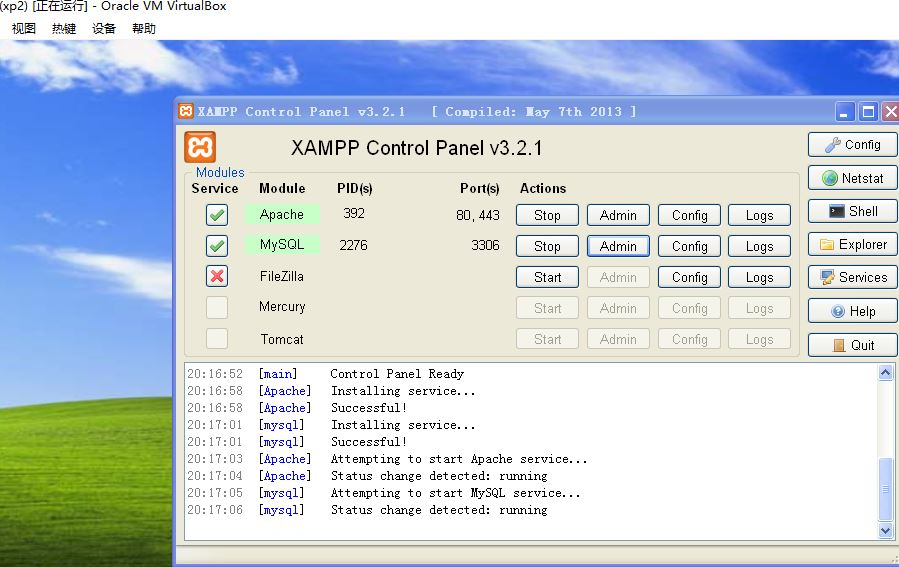
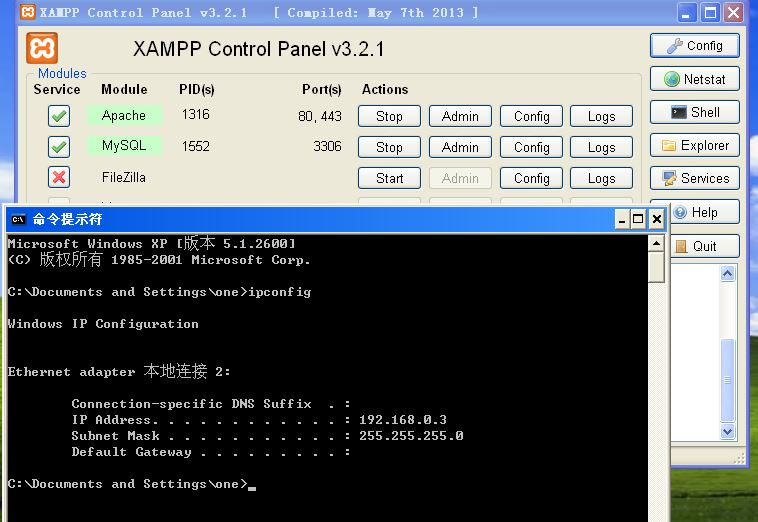
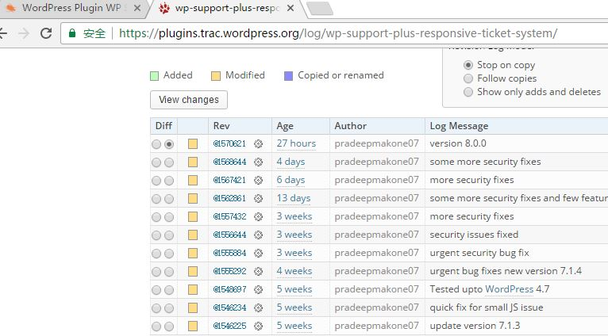
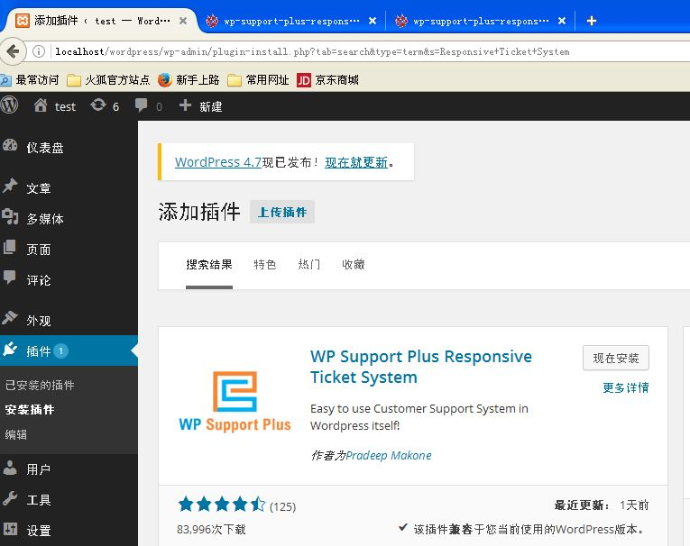
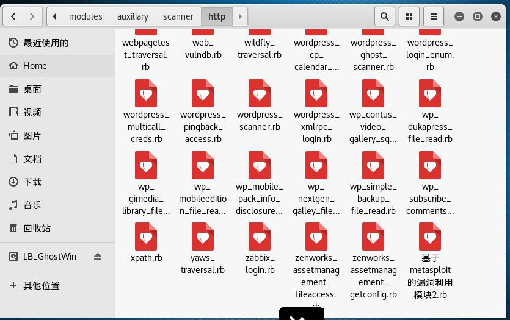
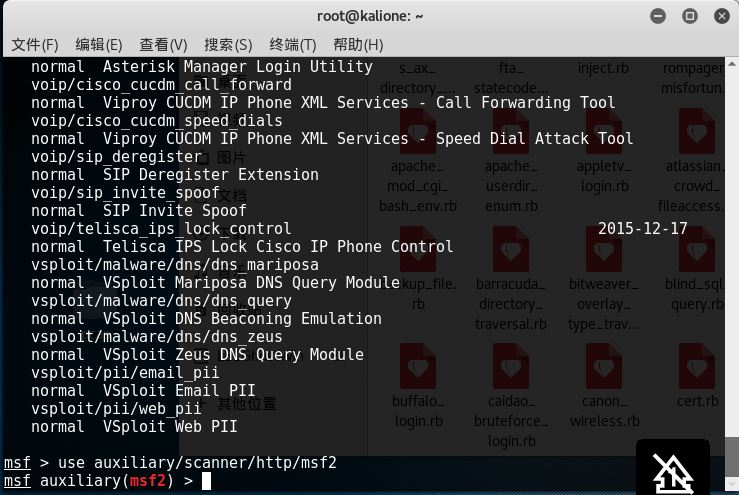
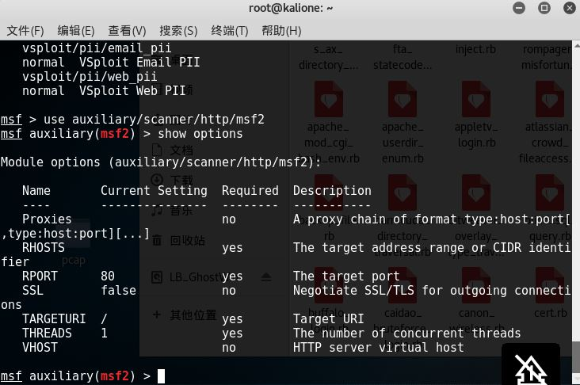
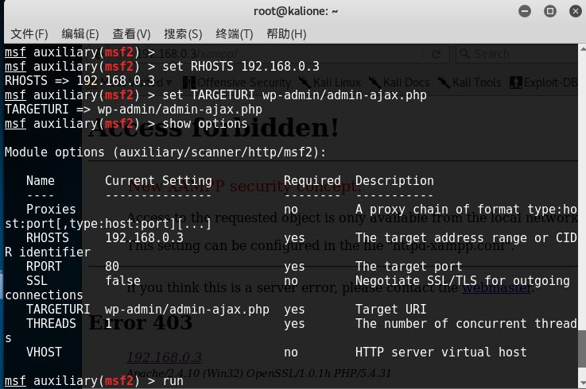
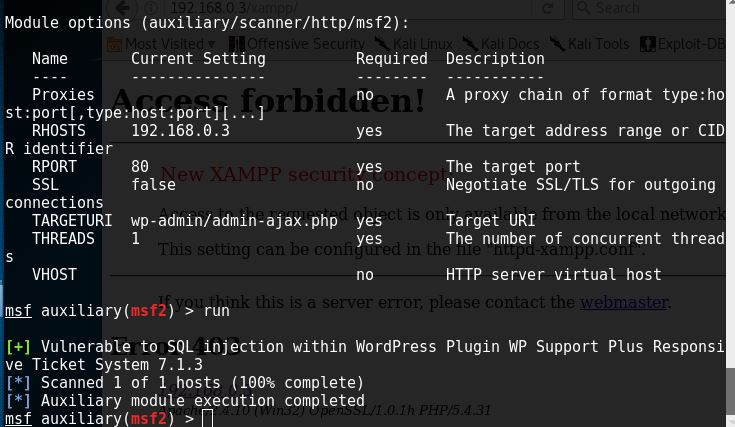

Metasploit漏洞利用实验
----------------------

>   **1.环境配置**

-   实验使用两台虚拟机，一台安装kali2016，另一台为winxp sp3.

-   安装kali系统的主机为攻击主机，装有metasploit

-   安装winxp的系统主机为被攻击方，装有wordpress+漏洞插件

 

-   通过xampp配置php运行环境，使得wordpress可以正常运行

-   先是在漏洞库中找到该sql注入漏洞，根据漏洞描述，在wordpress下下载包含漏洞的插件并
    安装。

-   进行环境配置，在kali中访问攻击主机，可以访问到

 

>   **2.攻击过程**

-   按照规范 ，将写好的sql注入模块放入该目录下，为了方便使用，改名为msf2

 

-   打开Metasploit控制台

    -   使用use命令加载 自己的module

-   加载成功，通过show options选项，显示设置项

-   将目标攻击对象设置为192.168.0.3，设置sql注入的具体目录

-   进行攻击，成功显示结果

 

之前写的一个module是直接根据漏洞数据库中的poc写的，因为漏洞是08年的，漏洞插件找不到了，没法进行
实验，现在又重新编写了一个利用module
