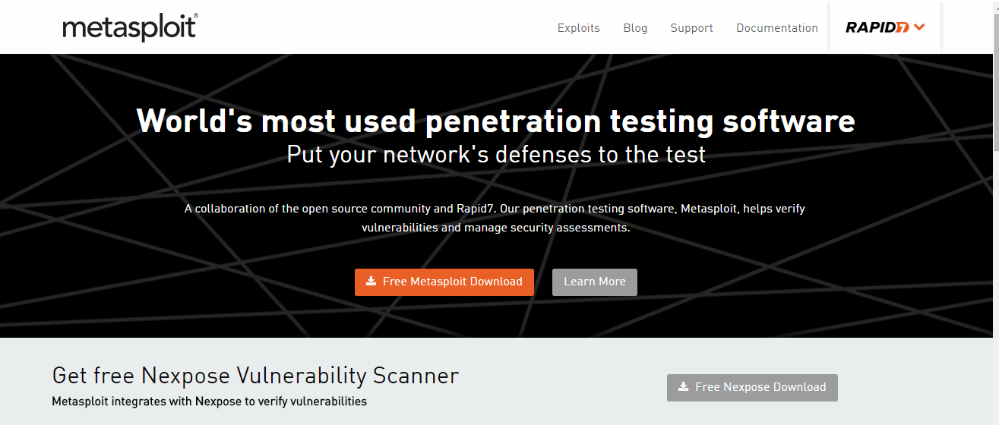
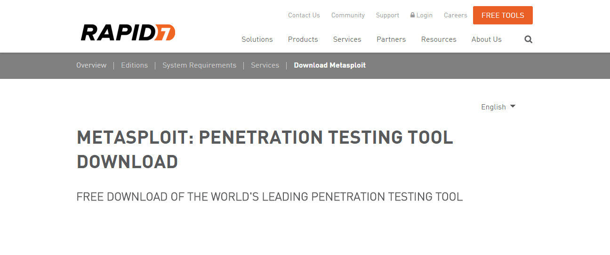
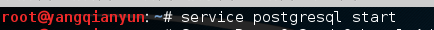
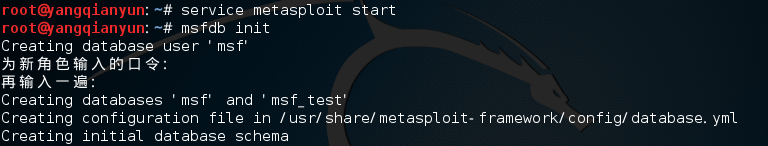
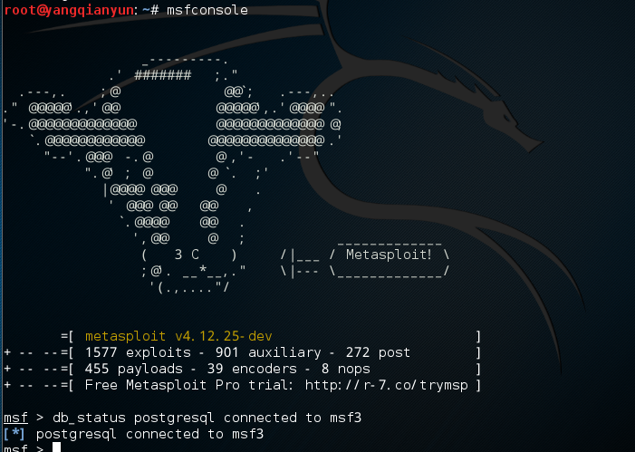

## Metasploit学习

>**Metasploit 简介**

* Metasploit Framework是在2004年美国拉斯维加斯Blackhat黑客大会上发布的，他的发布在安全界引发了强烈的地震，甚至有人把他形容成‘可以黑掉整个星球’。  
* 而且Metasploit在著名的安全站点inscure.org的最受欢迎的100大最佳安全工具的调查中，排名第五。之前没有任何一款工具能够一发布就挤进此列表的15强，超过了很多广为流传的诞生了几十年的老牌工具。   
* 它是一个强大的开源平台，供开发、测试和使用恶意代码。这种可扩展的模型将负载控制、编码器、shellcode生成器和漏洞整合在一起，使Metasploit Framework成为一种研究高危漏洞的绝佳途径。它自带大量的漏洞利用代码和shellcode，到目前为止它已经有500多个漏洞利用代码（exploit）以及近200个有效载荷（payloads），另外，还有200多个辅助工具，其中包括信息收集、枚举、暴力破解、web漏洞扫描、SQL注入、DoS、欺骗、嗅探以及漏洞挖掘等方面的辅助程序。并且每天都在更新。由于它的可扩展性，我们还可以添加自己的模块，如漏洞利用模块、payload以及辅助工具等，这使得我们自己编写漏洞变得更简单，它势必将提升非法shellcode代码的水平，扩大网络的阴暗面。与其相似的专业漏洞工具，Metasploit降低了这种能力的门槛，将其推广给大众。   
* 我们可将其用在网络安全方面，如渗透测试、风险评估等等。  
  

>**Metasploit 安装**
  
* 我们可以登录他的官网[Metasploit](http://www.metasploit.com/)查看具体信息。   
     

* 安装文件可到download页面[下载](http://www.metasploit.com/framework/download/)并安装。   
   

* 我们将演示在Kali Linux上运行Metasploit Framework。  
* **运行Metasploit Framework**
    * 依照[Kali Linux网络服务策略](http://docs.kali.org/policy/kali-linux-network-service-policies),Kali没有自动启动的网络服务,包括数据库服务在内.所以为了让Metasploit以支持数据库的方式运行有些必要的步骤.   
 
* **启动Kali的PostgreSQL服务**   
    * Metasploit 使用PostgreSQL作为数据库,所以必须先运行它。  
    * service postgresql start   
    

* **启动Kali的Metasploit服务**   
    * 随着PostgreSQL的启动和运行,接着我们要运行Metasploit服务.第一次运行服务会创建一个msf3数据库用户和一个叫msf3的数据库.还会运行Metasploit RPC和它需要的WEB 服务端.   
    * service metasploit start   
    * 初始化MSF数据库：msfdb init  
   
* **在Kali运行msfconsole**   
    * 现在PostgreSQL 和 Metasploit服务都运行了,可以运行 msfconsole ,然后用 db_status 命令检验数据库的连通性.  
    * msfconsole   
    * msf > db_status postgresql connected to msf3  
   
    * msf已经运行成功
    * 从图中能看出漏洞利用程序的模块有1577个漏洞的利用代码，shellcode 455个 901个辅助的相关程序，39个编码器，8个nops。

   

