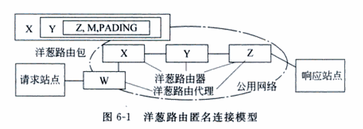

#互联网与局域网身份隐藏与识别实例讲解
---
##1. 代理
 
代理服务器可以分成以下几种类型：代理服务器有超级匿名代理、普通匿名代理和透明代理三种。

 * 超级匿名代理
   * 使用一级匿名代理连上某个服务器，服务器端的网管是不会知道访问者使用了代理，而且无法查出源IP，因为这种代理服务器是真正的匿名代理，它不会改变源的request fields(报文)，使服务器端看起来就像有个真正的客户浏览器在访问它。
   * 二级匿名代理，其安全性不如一级匿名代理，使用二级匿名代理上网，服务器的网管无法查出源IP，但是却知道访问者使用了代理。

 * 普通匿名代理  
   * 这类代理服务器也能隐藏源的真实IP，但是会更改request fields，因此服务器端也会知道访问者使用了代理，不过这种代理会剥离你的部分信息，使服务器端探测不到源服务器的操作系统版本和浏览器版本。 
 * 透明代理
   * 这种代理会改变源的request fields(报文)，并传送源服务器的真实IP，因此假如使用这种代理上网，就不能隐藏源的真实IP。
 

##2.  XFF(X-Forwarded-For)
 * 定义：X-Forwarded-For:简称XFF头，它代表客户端，也就是HTTP的请求端真实的IP，只有在通过了HTTP 代理或者负载均衡服务器时才会添加该项。它不是RFC中定义的标准请求头信息，在squid缓存代理服务器开发文档中可以找到该项的详细介绍。标准格式如下：
     >X-Forwarded-For: client1, proxy1, proxy2。  

 * 字段：
   * REMOTE_ADDR 代表客户端的IP
   * HTTP_VIA 当客户端请求到达第一个代理服务器时，该服务器会在自己发出的请求里面添加 Via 头部，并填上自己的相关信息，当下一个代理服务器 收到第一个代理服务器的请求时，会在自己发出的请求里面复制前一个代理服务器的请求的Via头部，并把自己的相关信息加到后面， 以此类推，当 OCS 收到最后一个代理服务器的请求时，检查 Via 头部，就知道该请求所经过的路由。
 * 识别
   * 没有使用代理服务器的情况：
		* REMOTE_ADDR = 您的 IP
		* HTTP_VIA = 没数值或不显示
		* HTTP_X_FORWARDED_FOR = 没数值或不显示
   * 使用透明代理服务器的情况：Transparent Proxies：
   		* REMOTE_ADDR = 最后一个代理服务器 IP
		* HTTP_VIA = 代理服务器 IP
		* HTTP_X_FORWARDED_FOR = 您的真实 IP
   * 使用普通匿名代理服务器的情况：Anonymous Proxies
        * REMOTE_ADDR = 最后一个代理服务器 IP
		* HTTP_VIA = 代理服务器 IP
		* HTTP_X_FORWARDED_FOR = 代理服务器 IP 
   * 使用欺骗性代理服务器的情况：Distorting Proxies
        * REMOTE_ADDR = 代理服务器 IP
		* HTTP_VIA = 代理服务器 IP
		* HTTP_X_FORWARDED_FOR = 随机的 IP 
   * 使用高匿名代理服务器的情况：High Anonymity Proxies (Elite proxies)
        * REMOTE_ADDR = 代理服务器 IP
		* HTTP_VIA = 没数值或不显示
		* HTTP_X_FORWARDED_FOR = 没数值或不显示 

##3. 匿名通信
### Mix-Net
   * Mix系统是对基于单代理技术的匿名系统的增强，Mix系统由用户节点和提供转发服务的多个Mix节点组成。每个报文经过一组 Mix节点的处理后最终到达接收者。为了消除输入报文与输出报文之间的关联性，每个 Mix节点接收一定数量的报文作为输入，对这些报文进行变换并随机排序后，将报文成批输出。发送者采用转发路径上依次经过的各个Mix节点的公钥对报文进行嵌套加密处理。报文每经过一个Mix节点，该节点将自己的那一层解密，得到下一站的地址，再转发给下一个节点。通过层层解密，消息最终提交给接收者。Mix网络在传输消息时，节点之间采用公钥加密，外部攻击者以及Mix路径上除最后一个Mix节点都无法获知最终的接收者的地址。[1]
    
			参考文献：[1]高超.《基于Mix网络的通信系统安全性能分析》 [J].计算机与信息处理技术,2010,(02)

###Crowds
   * Crowds系统中每个成员上运行一个名为jondo的代理程序，用于转发来自本地浏览器或其他成员上jondo的HTTP请求。初始时，jondo向系统中行使管理功能的成员(称为blender)注册，并获得系统中的活动jondo表和相应的共享密钥。当收到来自本地浏览器的HTTP请求时，jondo从jondo列表中随机选取一个作为后继(可能是它自己)，并将请求转发给该后继jondo。若后继jondo接收到请求，则以概率pf(1/2<pf<1)将该请求继续转发，否则以概率1-pf将请求直接提交给接收者，即发送给系统中任何一个jondo的可能性是pf，而发送给服务器的概率是1-pf。每一步跳都决定是否将HTTP请求直接交给目的服务器或根据转发可能性将它转发给下一个随机选择的成员，重路由路径中允许存在循环。选择了一条重路由路径后，在24 h的时段内，所有从该发送者到该接收者的匿名通信都将使用该路径。新成员可以在一些特定时段加入Crowds并形成新路径。[2]

			参考文献：[2]徐静.《基于IPv6的接收者匿名Crowds系统》 [J].计算机工程,2009,35(23)
###Tarzan
   * Tarzan在Mix网络的基础上，引入IP隧道技术，构造P2P匿名网络。系统采用发送覆盖流量使得全局观察者无法利用流量分析来识别发起者。报文的发起者以不易受对手影响的方式，伪随机地在一个受限的拓扑内选择一条由Peers组成的路径，并利用嵌套加密和多跳转发路由来实现其匿名。由于它提供IP服务，对应用程序透明，因此具有容错性、高度可扩展性及易于管理等特性。[3]
   
	[参考链接：[3]http://blog.sina.com.cn/s/blog_6c7e113d0100nxxo.html](http://blog.sina.com.cn/s/blog_6c7e113d0100nxxo.html) 
###洋葱路由
   * 洋葱路由是用确定路由地址的源路由协议，选定由若干中间目标组成的多段路径，并把后段路径的IP包的数据和地址一起加密作为前段路径IP包的载体传送，就隐藏掉了目标节点地址，从而得到多级混淆的匿名路径。[4]
    
			参考文献：[4]王育民.《信息隐藏：理论与技术》  [M]
      

 
##4. CSRF
 * CSRF（Cross-site request forgery）跨站请求伪造，也被称为“One Click Attack”或者Session Riding，通常缩写为CSRF或者XSRF，是一种对网站的恶意利用。
