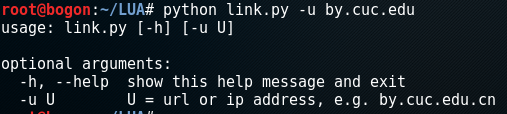

# 为nmap开发一款原创漏洞扫描插件  
***
## CVE-search的搭建  
* CVE-search所依赖的Python环境为：Python 3.3 or later  
* CVE-search所依赖的Mongodb环境为：MongoDB 2.2 or later  
> apt-get install mongodb  

* 搭建CVE-search  
> git clone https://github.com/cve-search/cve-search.git  
> pip3 install -r requirements.txt  

* CVE漏洞库迁移
> ./sbin/db_mgmt.py -p  

* [CVE-search搭建参考](https://github.com/cve-search/cve-search)  

## 基于Python代码开发的nmap插件
* Python中实现nmap功能的第三方库：libnmap  
* Python中实现脚本扫描的第三方库：requests  
* 利用python第三方库libnmap，requests来获得指定URL的nmap扫描信息和脚本扫描信息  
* 利用python第三方库argparse（解析命令行参数和选项的标准模块）实现通过shell命令传参调用脚本

* 实现功能：
	* 根据扫描信息和相应请求头信息查询产品中的漏洞信息或者厂商信息
	* 根据产品名称和版本来查询其受影响版本，如查询nginx:1.8.0,可匹配到1.9.0以前的所有受影响版本的漏洞
	
	
	* 若用户输入不合法，无法获得扫描信息，输出帮助信息
	

	