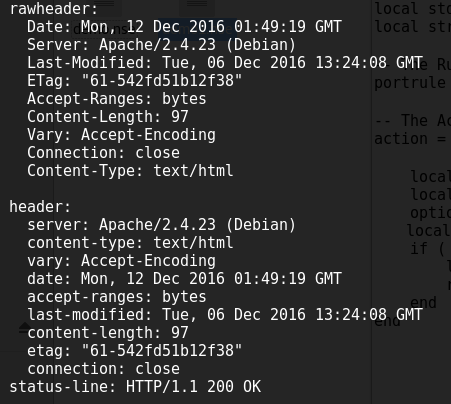
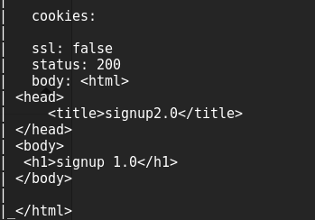

# 大作业阶段总结 20161212  
## NSE  
* NSE主要分为两大部分：内嵌Lua解释器与NSE library。  
	* 解释器：Nmap采用嵌入的Lua解释器来支持Lua脚本语言。Lua语言小巧简单而且扩展灵活，能够很好地与Nmap自身的C/C++语言融合。  
	* NSE library：为Lua脚本与Nmap提供了连接，负责完成基本初始化及提供脚本调度、并发执行、IO框架及异常处理，并且提供了默认的实用的脚本程序。  
*	NSE脚本主要由三部分组成:  
	* The Head Section:该部分包含一些元数据，主要描述脚本的功能，作者，影响力，类别及其他。  
	* The Rule Section:该部分定义脚本执行的必要条件。至少包含下面列表中的一个函数:  
	*  
			portrule	--检测主机某个端口开放时才执行，通常用于侦查特定的服务类型；  
			hostrule	--该规则在检测到主机在线时候才执行；  
			prerule		--如果脚本定义该规则，则在预扫描阶段该脚本会被执行；  
			postrule	--在所有主机都被扫描完毕后执行。
	* The Action Section:该部分定义脚本逻辑。  
## 当前进度  
* 实现扫描指定ip的指定端口  
* 提取扫描获得的信息，如服务器及其版本号,源代码  
  
  
* NSE的'http'库使用的默认User-Agent是 “Mozilla/5.0(compatible; Nmap Scripting Engine;http://nmap.org/book/nse.html)”  
  为了安全起见，修改User-Agent  
	> local options = {header={}}  
	> options['header']['User-Agent'] = "Mozilla/5.0 (compatible; demo1.nse)"  
* 调用脚本命令  
  -p 接端口  
  --script 接nse代码  
  --script-trace 显示扫描请求头及源代码  
  最后接ip  
	> nmap -p 80,443 --script /path/demo1.nse --script-trace 127.0.0.1  
## 下一步思路  
* 利用NSE漏洞库来对当前通过nmap扫描获得的信息信息进行匹配  
* NSE漏洞库由DjalalHarouni和HenriDoreau开发，目的是标准化呈现与管理漏洞  