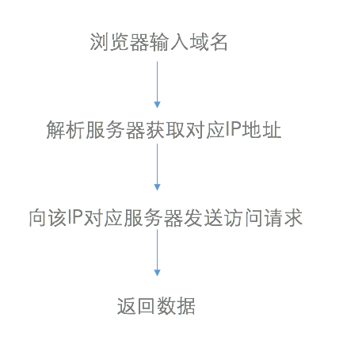
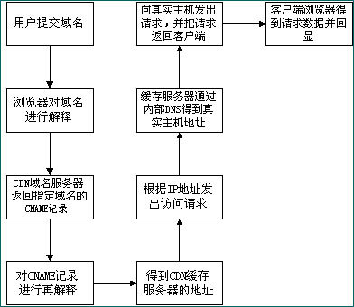
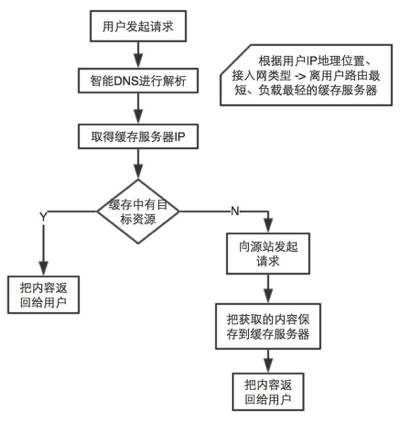
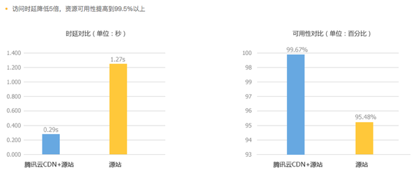
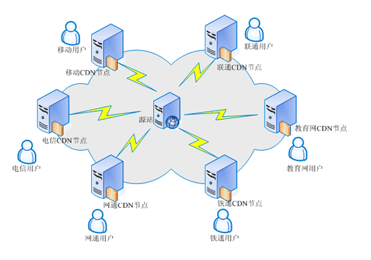
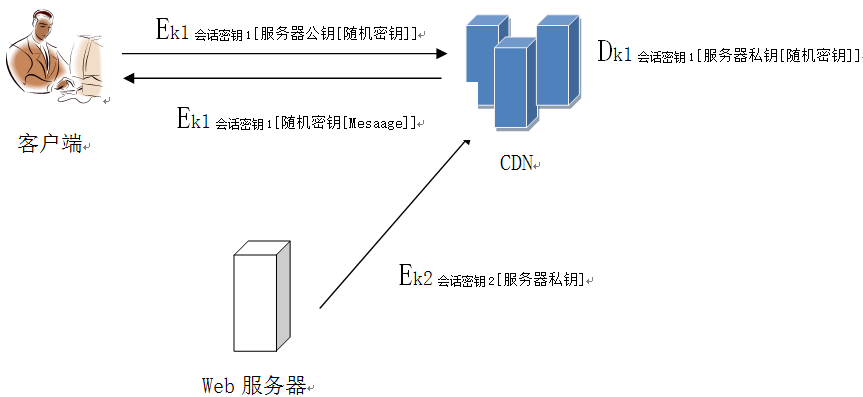
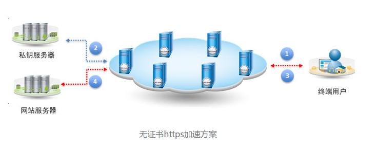

##HTTPS站点如何启用CDN服务？  
##是否一定要上传源站点的SSL证书私钥到CDN服务提供商？如果不是，请详细讲述解决方案及其原理

----------

##前言
随着各种互联网安全事件的频发，互联网安全也越发受到重视，因此越来越多的站点开始使用https协议来代替http协议。不过由于https协议流量更大，加密解密也会消耗更长的传输时间，所以https网站相比普通的http网站在加载、传输过程中需要不断提高本身速度。

##一、概念

###1.HTTPS （Hyper Text Transfer Protocol over Secure Socket Layer ）
安全套接字层超文本传输协议    

就是在HTTP下加入SSL层，HTTPS的安全基础是SSL，因此加密的详细内容就需要SSL

- 作用：  
1.建立一个信息安全通道，来保证数据传输的安全  
2.确认网站的真实性，凡是使用了 https 的网站，都可以通过点击浏览器地址栏的锁头标志来查看网站认证之后的真实信息，也可以通过 CA 机构颁发的安全签章来查询

###2.CDN （Content Delivery Network）  
内容分发网络

- 基本思想：  
尽可能避开互联网上有可能影响数据传输速度和稳定性的瓶颈和环节，使内容传输的更快、更稳定。通过在网络各处放置节点服务器所构成的在现有的互联网基础之上的一层智能虚拟网络，CDN系统能够实时地根据网络流量和各节点的连接、负载状况以及到用户的距离和响应时间等综合信息将用户的请求重新导向离用户最近的服务节点上。
- 目的：  
使用户可就近取得所需内容，解决 Internet网络拥挤的状况，提高用户访问网站的响应速度。

###3.SSL（Secure Sockets Layer ）  
安全套接层  

- 定义  
SSL协议是为网络通信提供安全及数据完整性的一种安全协议。利用数据加密技术，可确保数据在网络上之传输过程中不会被截取及窃听。    
当前版本为3.0。它已被广泛地用于Web浏览器与服务器之间的身份认证和加密数据传输。

- SSL证书   
SSL证书是数字证书的一种，遵守SSL协议，由受信任的数字证书颁发机构CA，在验证服务器身份后颁发，具有服务器身份验证和数据传输加密功能。
##二、SSL协议过程
###1.SSL协议的握手过程
开始加密通信之前，客户端和服务器首先必须建立连接和交换参数，这个过程叫做握手。  

`假定客户端叫做Alice，服务器叫做Bob  `   

1.Alice给出协议版本号、一个客户端生成的随机数，以及客户端支持的加密方法。  
2.Bob确认双方使用的加密方法，并给出数字证书、以及一个服务器生成的随机数。  
3.Alice确认数字证书有效，然后生成一个新的随机数，并使用数字证书中的公钥，加密这个随机数，发给鲍勃。  
4.Bob使用自己的私钥，获取Alice发来的随机数。  
5.Alice和Bob根据约定的加密方法，使用前面的三个随机数，生成"对话密钥"，用来加密接下来的整个对话过程。
###2.私钥的作用  
**根据上面的步骤可以看出：**  
1.生成对话密钥一共需要三个随机数。  
2.握手之后的对话使用"对话密钥"加密（对称加密），服务器的公钥和私钥只用于加密和解密"对话密钥"（非对称加密），无其他作用。  
3.服务器公钥放在服务器的数字证书之中。  

**得出可以不使用私钥启用CDN服务的原因：**  
服务器的公钥和私钥只需要用到一次，只用于加密和解密"对话密钥"。  

某些客户（比如银行）想要使用外部CDN，加快自家网站的访问速度，但是出于安全考虑，不能把私钥交给CDN服务商。这时，完全可以把私钥留在自家服务器，只用来解密对话密钥，其他步骤都让CDN服务商去完成。

###三、传统访问与启用CDN访问的对比
####1.传统访问Web服务器过程
 

由上图可见，用户访问未使用CDN缓存网站的过程为:  
（1）用户向浏览器提供要访问的域名；  
（2）浏览器调用域名解析函数库对域名进行解析，以得到此域名对应的IP地址；  
（3）浏览器使用所得到的IP地址，域名的服务主机发出数据访问请求；  
（4）浏览器根据域名主机返回的数据显示网页的内容。  
通过以上四个步骤，浏览器完成从用户处接收用户要访问的域名到从域名服务主机处获取数据的整个过程。

####2.启用CDN访问Web服务器过程  

    
通过上图，可以看出使用了CDN缓存后的网站的访问过程变为：    
（1）用户向浏览器提供要访问的域名；    
（2）浏览器调用域名解析库对域名进行解析，由于CDN对域名解析过程进行了调整，所以解析函数库得到的是该域名对应的CNAME记录（由于现在已经是使用了CDN服务，CNAME为CDN服务商域名），为了得到实际IP地址，浏览器需要再次对获得的CNAME域名进行解析以得到实际的IP地址；在此过程中，使用的全局负载均衡DNS解析，如根据地理位置信息解析对应的IP地址，使得用户能就近访问。（CDN服务来提供最近的机器）    
（3）此次解析得到CDN缓存服务器的IP地址，浏览器在得到实际的IP地址以后，向缓存服务器发出访问请求；    
（4）缓存服务器根据浏览器提供的要访问的域名，通过Cache内部专用DNS解析得到此域名的实际IP地址，再由缓存服务器向此实际IP地址提交访问请求    
（5）缓存服务器从实际IP地址得得到内容以后，一方面在本地进行保存，以备以后使用，二方面把获取的数据返回给客户端，完成数据服务过程；    
（6）客户端得到由缓存服务器返回的数据以后显示出来并完成整个浏览的数据请求过程。    
（CNAME(Canonical Name)指别名记录也被称为规范名字,CNAME可以理解为对域名设置别名。）

####3.完整的CDN工作流程

####4.实际访问的时延和可用性对比
以腾讯云CDN为列
  
不使用CDN时，访问请求导源站用的时间是1.27S。
使用了腾讯云CDN后，会将这个访问时间缩短为0.29s，访问速度提高了5倍，而且可用性也可以得到很好的提升，原因是CDN的网络的链路质量都比较好。

##四、HTTPS站点启用CDN服务
常规的HTTPS加速方案，HTTPS网站需要将HTTPS证书以及私钥提供给第三方CDN服务商，由CDN节点服务器来持有证书和私钥，进而实现HTTPS网站加速效果。  

**建立通信过程**  
双方之间已经进行过SSL握手，产生彼此会话密钥。

建立好连接之后，客户端即可通过CDN中的缓存来加快访问速度。

##五、无证书启用CDN服务的HTTPS方案
对于普遍的HTTPS加速方案，HTTPS网站必须向第三方CDN服务器节点提供私钥，这就增大了在传输和部署过程中泄漏私钥的风险。
所以无证书的HTTPS加速方案更安全。

####无证书HTTPS加速步骤：  

1.用户向CDN节点发起https请求，进行SSL握手，公钥加密客户端生成随机密码后发往CDN节点；

2.CDN节点与私钥服务器建连，通过SSL加密的方式将客户端发来的经公钥加密的随机密码发往源站的私钥服务器，私钥服务器通过私钥解密获得随机密码后再将其返回给CDN节点；

3.CDN节点和终端用户双方都拥有随机密码，后续两者即可以正常通信；

4.如果用户请求的是缓存的内容，则由CDN节点直接响应；若需回源请求，则CDN节点再与源站服务器建立连接来获取内容；

[参考文献]：  
1.阮一峰网络日志http://www.ruanyifeng.com/blog/2014/09/illustration-ssl.html  
2.网宿科技新闻http://chinanetcenter.com/content/details45_1765.html  
3.知乎https://www.zhihu.com/question/20571239  
4.https://segmentfault.com/a/1190000000538796
