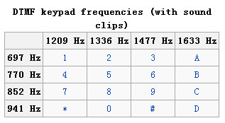
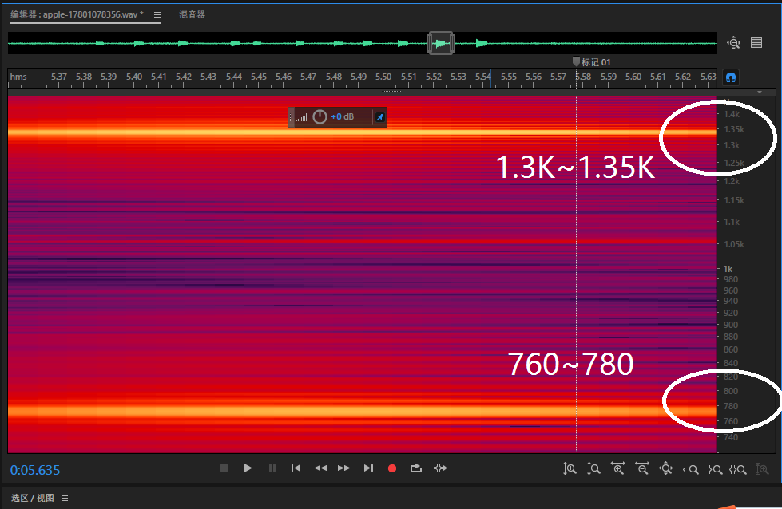
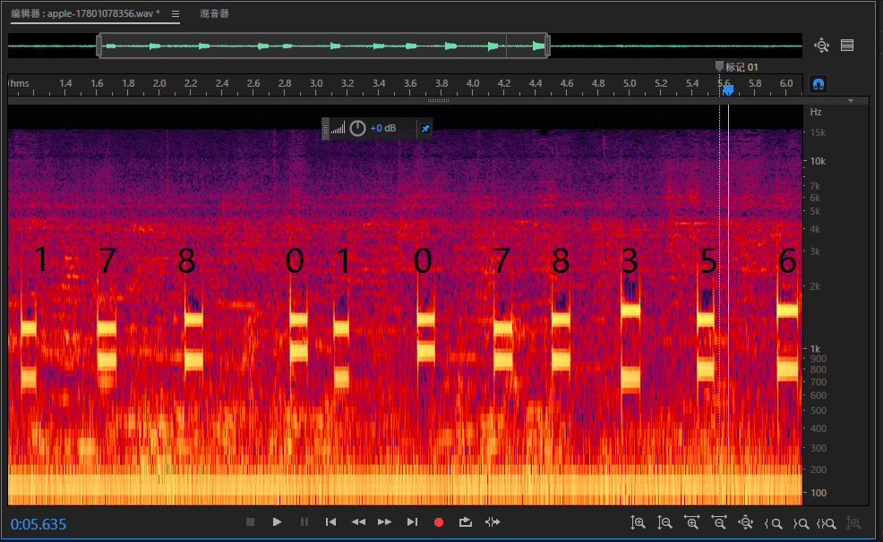
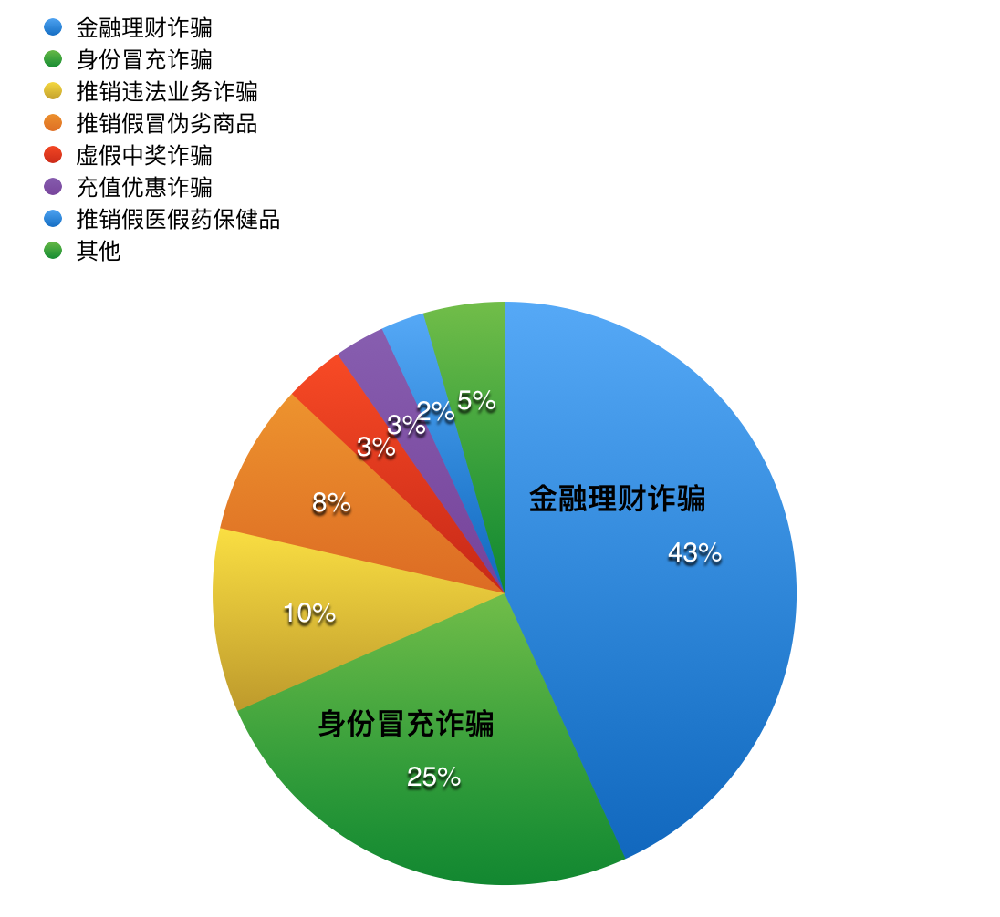
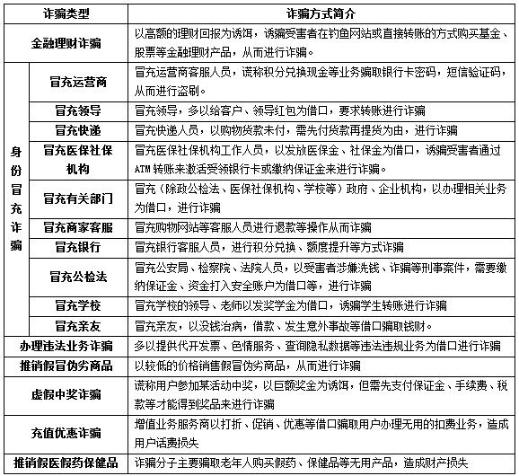

# 电信诈骗案例及防骗总结

----------

##  一、电信诈骗的特点

1. 诈骗手法更新快、多样化  
从2008年上半年开始，电信诈骗在全国范围内蔓延，手法多种多样，更新速度快。根据近期发生的案件及相关媒体报道来看，犯罪分子主要通过下列手法实施诈骗：一是冒充国家机关工作人员实施诈骗；二是冒充电信等有关职能部门工作人员，以电信欠费、送话费、送奖品为由实施诈骗；三是冒充被害人的亲属、朋友，编造生急病、发生车祸等意外急需用钱，或称被害人亲属被绑架索要赎金为名等事由骗取被害人财物；四是冒充银行工作人员，假称被害人银联卡在某地刷卡消费为名，诱使被害人转帐实施诈骗等。随着时间的变迁，作案手法不断翻版。

1. 集团化管理，组织严密  
电信诈骗犯罪分子几乎没有单打独斗，而是团伙作案，内部呈现出典型的集团化、职业化特征。该类犯罪中，主要团伙组织成员均在境外，主要分散于泰国、新加坡、越南等东南亚国家或地区。犯罪集团内部组织严密，采取企业化运作，分工精细、明确，成员之间各司其职，彼此之间实行单线联系。电信诈骗团伙成员内部可以分为四个层次：“组织和拨打诈骗电话层”、“VOIP技术支撑层”、“网络银行拆解资金层”和“银行取款层”。

1. 作案技术前沿  
犯罪分子首先通过一定的渠道套取被害人家固定电话的开户资料，然后利用VOIP（网络电话）语音呼叫平台和软转换技术（也叫呼叫系统）将网络数据通过电信运营商提供的线路（即落地语音网关）接入PSTN电话网向被害人拨打电话①，并通过租用的“透传”线路使被害人的电话来电显示为110或12315或电信10000或移动13800138000等常见的业务电话，或是被害人熟悉的亲友的电话，使被害人误以为对方是公信力较强的公安、工商或是电信和移动公司工作人员，或是自己的亲友，从而放松警惕。骗得被害人的信任后，则采用网上银行U盾转帐等技术将被害人的现金快速分解并将赃款转走套现。

1. 作案手法高度隐蔽  
与传统的诈骗不同，电信诈骗犯罪分子与被害人的联系方式均为电话或短信，无须直接和被害人见面，电信诈骗的组织者不 抛头露面，以单线方式实行远程操控，即使到银行提取或转移诈骗所得的款项也从不出面，而是指使手下人员或是以较高的提成方式雇请无业人员进行转移赃款，使侦查机关即使找到相关线索也很难准确实施抓捕。

1. 社会危害巨大  
该类诈骗案件的辐射范围广，作案时间快，诈骗数额大，动辄就是几十上百万，使受害人瞬间蒙受巨大财产损失，严重扰乱社会经济秩序。与传统诈骗中“一对一”或者“一对多”的方式相比，电信诈骗表现出来的是面对整个电话用户或者特定户群体，其诈骗行为的实施并不是特意针对某一特定对象，而是广泛散布诈骗信息。这种方式带来的后果，往往是大量的电话用户上当受骗，涉案数额巨大，其对社会的危害远远超过传统诈骗。
(《法治与社会》报纸 2011年6月下）

## 二、电信诈骗的分类及案例分析
### （一）网络听号诈骗
“听号”诈骗案是一种新型的电信诈骗案，作案人在与被害人通话中，偷录对方拨电话银行的拨号音后，采用辨听电话拨号音频的方法对其进行分析，然后破解被害人的银行账户号和密码，再实施转账。这类案的作案人作案手法隐蔽，公众知晓度较低，被害人很容易上当受骗。    

**相关案例：**  

- 案例1：2011年6月，浙江李某通过百度，找到一家化工企业，拟购买甲醛，电话联系中，对方称不要定金以表明合作的诚意，经过多次联系后，李某相信了对方。后对方要求李某使用电话银行业务，以方便交易，李某在同意后还特地修改了银行卡密码。后对方谎称准备发货，发货前要确认李某账户是否足额，并要求听到李某拨打电话银行时的情况，李某在与对方通话的同时，拨打了电话银行直至语音播报余额，对方之后表示马上发货。当天下午，李某却发现自己银行卡内的5万元不翼而飞。  
- 案例2：2011年5月，浙江王某在网上采购原材料，与对方签订了合同，并将定金付到对方的银行账号。之后，王某接到自称该公司送货司机电话，要求其办理建设银行的电话银行转账业务，待验货后，用电话银行支付余款，然后卸货。王某在办理了电话转账业务后，对方以测试电话银行转账业务是否正常为由，让王某先用电话向其指定的建行账号打款1元钱。接着，王某便在未挂断通话手机的情况下，使用固定电话的免提功能，让对方听到向其账号成功打入1元钱的操作。其间，对方多次称听不清楚。王某换了一只声音比较响的电话机再次操作，对方终于表示认可。而此后，对方王姓司机以天色已晚为由，推说第二天送货。当晚，王某建行账户中的资金被人分两次转走，总计81940元。 
　　从上述案例看出，在通话联系中，以测试被害人电话转账业务是否正常，或账户内是否真的有钱为借口，要求被害人在测试电话银行业务时使用免提功能，对被害人的拨号音进行偷录，然后对录音进行分析，在破解账户号和密码后，对被害人的账号进行转账。案件二，作案人从网上以2000元购得的音频分析软件对录音进行分析。 

**分析：**  
手机拨号键盘使用双音多频 DTMF（Dual Tone Multi Frequency）信号。双音多频，由高频群和低频群组成，一个高频信号和一个低频信号叠加组成一个组合信号，代表一个数字。    

**实验过程**（adobe au 实验截图）  

----------

对比DTMF表可得出所有数字

**听号电信诈骗案的特点：**  
前面介绍的两案，共同体现了该类案的几个显著特点：  
1.此类案一般是通过在网络上发布虚假商业信息，大多数以发布销售工业原材料等为幌子，并要求被害人支付方式为电话银行转账支付。  
2.此类案具有犯罪隐蔽性，是通过网络或电话进行联系，被害人的拨号音在不经意间被作案人偷录。  
3.此类案的作案人作案手段具有特殊性，所谓的“听号”手段不是靠人耳听辨，而是靠所谓的音频解码器或音频分析软件去“听”。  

**防范对策：**  
“听号”诈骗案给社会带来极大危害，受害人疏于防范是诈骗案的典型特点，也是诈骗得以成功的主要原因。  
1. 在进行交易时，应选择相对有安全保障的支付方式，如选择支付平台，尽量避免使用电话银行转账，以防重要信息泄露。  
2. 如确需使用电话银行业务，务必不要使用免提业务，以防拨号音被偷录，增加重要信息泄露的风险。 

【注释与参考文献】 
警惕利用高科技音频分析手段进行电信诈骗的案件  
【文章来源】《湖北警官学院学报》2014年第3期

### （二）网络改号诈骗
**相关案例：**  

- 案例1:杨女士收到一个自称某银行的电话告知自己的信用卡欠款逾期未还，并轮番冒充警方、检查院的电话对杨女士进行恐吓。结果银行卡中的资金被瞬间转走44万元。由于目前资金已经被转到境外，所以仍然无法追回。  
- 案例2:2013年7月份，台湾地区人员“阿水”（另案处理）组织台湾被告人吴金龙等人前往老挝万象进行电信诈骗活动。该团伙在万象设置窝点，将事先编辑好的诈骗语音包通过网络电话向中国大陆各省市固定电话用户群发送语音信息，谎称被害人“医保卡出现异常，有疑问则回拨电话”。待被害人回拨时，电话转到冒充医保中心工作人员的团伙一线人员，谎称被害人的医保卡涉嫌盗刷违禁药品，要求被害人向公安机关“报案”，并引导被害人同意由其转接公安机关的报案电话，后一线人员将电话转接给冒充公安人员的团伙二线人员接听。期间，二线人员以预先更改好来电显示号码的“公安局号码”与被害人通话以取得被害人信任，后套取被害人个人信息，谎称被害人银行账户存在安全问题，并将电话转至冒充检察院工作人员的团伙三线人员，要求被害人将银行卡内的存款转到指定账户，进行所谓的“资金清查比对”，以此手段骗取被害人钱财。吴金龙等人诈骗金额共计10192500元。  

**裁判结果：**  
本案由福建省晋江市人民法院一审，福建省泉州市中级人民法院二审。据此以诈骗罪判处被告人吴金龙有期徒刑十三年六个月，并处罚金人民币二十万元；以诈骗罪判处庄靖凡等被告人十二年六个月至二年不等有期徒刑。  

**诈骗原理分析：**  
利用网络改号软件诈骗

主要工具：网络改号软件。网络改号软件最终在用户手机上显示篡改过的电话号码，需要通过给“落地网关”预先设定好要显示的号码，设定完成后再通过运营商的“通信网络”发送至被叫网关，从而实现了来电号码的更改。
诈骗分子利用网络改号软件改号过程：  

不法分子购买这些“落地网关”设备后，然后接入了运营商的网络。

### （三）伪基站诈骗
**相关案例：**  

- 案例1:湖北侦破“伪基站”通讯网络诈骗案  
2016年3月，湖北十堰市公安机关发现，有人利用“伪基站”发送诈骗短信实施诈骗。在公安部的统一指挥下，湖北、福建等地公安机关抽调30名精干警力，历经81天艰苦侦查，查清了以刘某、陈某、史某、黄某为首的犯罪团伙及其活动轨迹和制售窝点，一个专门面向全国及缅甸等国销售伪基站“核心配件”电脑主板的特大职业化犯罪团伙逐渐浮出水面。5月26日，多地同时收网，抓获刘某等15名犯罪嫌疑人，缴获“伪基站”设备成品和半成品共计300余套；生产“伪基站”设备核心主板窝点2个，扣押伪基站的“核心配件”电脑主板1100余套以及多条生产线，涉案资金达300余万元。经查，2015年8月以来，犯罪嫌疑人黄某、史某、刘某等人秘密开设地下“黑工厂”加工生产可以伪装安置在汽车音响中的新型伪基站“核心配件”电脑主板，然后通过网络联系买家，销往全国23个省市以及缅甸等国，从中牟取暴利。

**相关资料：**  
"伪基站"即假基站，设备一般由主机和笔记本电脑组成，通过短信群发器、短信发信机等相关设备能够搜取以其为中心、一定半径范围内的手机卡信息，通过伪装成运营商的基站，冒用他人手机号码强行向用户手机发送诈骗、广告推销等短信息。  

**设备原理:**  
伪基站设备运行时，伪基站作案流程图用户手机信号被强制连接到该设备上，导致手机无法正常使用运营商提供的服务，手机用户一般会暂时脱网8～12 秒后恢复正常，部分手机则必须开关机才能重新入网。此外，它还会导致手机用户频繁地更新位置，使得该区域的无线网络资源紧张并出现网络拥塞现象，影响用户的正常通信。  
犯罪嫌疑人通常将“伪基站”设备放置在汽车内，驾车缓慢行驶或将车停在特定区域，进行短信诈骗或广告推销。短信诈骗的形式主要有两种：一是嫌疑人在银行、商场等人流密集的地方，以各种汇款名义向一定范围内的手机发送诈骗短信；二是嫌疑人筛选出“尾数较好”的手机号，以这个号码的名义发送短信，在其亲朋好友、同事等熟人中实施定向诈骗。  

**工作原理：**  
伪基站它是利用移动信令监测系统监测移动通讯过程中的工作原理各种信令过程，获得手机用户当前的位置信息。当用户的位置信息（Cell－id）与业务选择发送的特定区域一致时，为用户下发业务定制的短信。为获得准确、全面的用户信息（当前位置信息和用户手机号），信令检测系统需要监控移动通信网络中的相关信令链路（即下面的拓扑图中双向箭头所对应的物理链路），包括：MSC到BSC之间的信令链路（A接口）、MSC到HLR之间的信令链路（C接口）、MSC到其他MSC之间的信令链路（E接口）以及MSC到LSTP之间的信令链路。  
也就是伪基站启动，干扰和屏蔽一定范围内的运营商信号，伪基站则趁着这个时间，搜索出附近的手机号，并将短信发送到这些号码上。屏蔽运营商的信号，能持续10秒到20秒，短信推送完了，对方手机才能重新搜索到信号。有很多用户的手机不能自动恢复信号，需要重启。伪基站能把发送号码显示为任意号码
  

### （四）下载软件植入木马 远程控制
**相关案例：**

- 案例1：徐州侦破手机植入木马盗窃案  
2014年2月19日，江苏省徐州市公安局云龙分局接淘宝店主郝某报警称，有“客户”以定做服装的名义发送“图片”，致使其手机被植入木马，损失近2万元。经查，向受害人郝某手机植入木马的犯罪嫌疑人是姜某。姜某假借定做服装名义，向郝某手机发送样品“图片”，致使郝某的手机被植入木马。姜某通过嫌疑人李某查询被害人郝某身份证、银行卡等信息，将受害人卡内余额转至刘某处销赃变现。

**常见手机木马植入方式：** 

1. 通过手机短信等即时通讯工具消息植入  
通过发送短信的方式植入木马是最简单和最常见的方式，黑客及不法份子通过伪基站技术及短信群发器，结合社会工程学理论进行身份伪装、欺骗、诱导，冒充移动运营商客服、银行客服、电商客服、亲朋好友等熟人向手机用户发送带有木马链接或钓鱼网站链接的短信，通过诱导、恐吓等手段诱骗用户点击木马链接达到植入木马的目的 

2. 山寨App应用捆绑木马植入
目前我国智能手机软件应用平台以谷歌的Android为主，占据国内全部移动应用的86.4%，不法厂商借助其开源性和开放性的特点，通过伪装篡改热门游戏/软件嵌入木马、在游戏/软件中捆绑恶意广告插件来构建谋利链条，使不少手机游戏/软件用户频频上当，落入吸费、隐私窃取、流氓推广陷阱之中。 
网络购物改变了我们的生活方式，如今不少年轻用户会使用手机购物，手机支付方便快捷!而黑客们就对电商APP进行二次打包，伪装知名应用混淆用户，还企图通过输入法窃取用户的淘宝或支付宝帐号密码，从而窃取用户的财产。 
由于我国尚未出台针对移动应用商店安全要求的准则，导致部分应用商店安全门槛较低，大量恶意应用可以轻易进驻应用商店提供下载。第三方应用商店是手机病毒传播的重要途径，很多应用都被黑客二次打包重新上传，让用户混淆

3. 使用二维码打包木马植入  
扫一扫，就能打开店铺网页；扫一扫，就能快捷支付……只需用手机对着二维码扫一扫，就能加微信、装软件、发名片，甚至网上购物，让生活变得更简单、更时髦。但在看到二维码便捷性的同时，不少人往往忽略了二维码的来源可靠性。由于技术门槛过低，二维码目前处在“人人皆可制作、印刷和发布”的状态，由此带来的信息安全风险不容忽视。不法分子在网上下载一款“二维码生成器”(工具软件)，再将木马病毒程序的网址粘贴到二维码生成器上，就可以生成一个二维码，整个过程不超过1分钟。二维码本身无毒，一个二维码相当于一个网络链接，黑客及不法份子将含有木马链接的地址包装成二维码借以商品打折优惠的名义诱骗用户扫描安装植入木马程序。对用户而言，二维码是否藏有木马病毒，从外观上无法辨别，用户一旦扫了“木马”二维码，就会导致隐私泄露、账户被盗刷等。
 
4. 通过微信朋友圈等社交平台内容分享植入木马  
移动互联网时代，微信已经成为人们最主要的社交工具。很多人都说，微信朋友圈是
近年来最伟大的社交发明。微信朋友圈最大的不同，朋友圈是双向认证的，因此在我们朋友圈里面出现的新鲜事都来源于我们熟知的朋友。黑客和不法分子利用微信公众平台发布社交信息，如发布集赞兑奖、分享有礼、邀友砍价等活动，或通过算命，心理测试等游戏要求用户输入姓名，手机号等内容以达到收集用户隐私数据的目的。更有甚者，黑客可通过公众号发布含有木马链接的内容，通过营销手段（如送流量、返现金红包）诱使用户点击安装植入木马病毒.黑客同时也会利用微博、博客等网络社交工具发布包含木马链接的消息诱骗用户点击
从而达到植入木马的目的。
5. 通过公共WIFI热点植入木马  
随着移动互联网的普及，越来越多的商家、公共场所都开始提供Wi-Fi网络，方便顾
客随时使用手机、笔记本上网冲浪。听上去这是服务体验的提升，但并非完全没有风险。事实上，一个黑客完全可以通过公共网络入侵你的设备，侵犯你的隐私。公共Wi-Fi的安全性通常较差，简单的密码不能阻止黑客入侵。比如，黑客可以通过攻击软件在设备和路由之间伪造中转站，也可以使用内网广播的机制，监控上网流量，从而找到你的浏览记录。还有一种比较常见的手段，是伪造Wi-Fi广播，比如将SSID设置为一种常见的公共Wi-Fi，当你连接时，设备便有可能被植入木马或是间谍软件。

6. 通过刷机植入木马  
随着移动互联网的迅猛发展，智能手机更新迭代的速度加快。来不及更换手机的消费者开始不满足于自己手机的功能，刷机一方面可以使智能手机安装更多的应用和游戏，另一方面则可以通过系统升级进行手机功能的更新。为满足这样的需求，越来越多的用户选择刷机，刷机应用成为了木马病毒泛滥的新渠道。 
 
不少怀疑自己手机有“问题”的用户，多数会选择主动“刷机”。而一些街头流动的
刷机摊子靠的就是刷入恶意软件、木马病毒这样的“猫腻”来恶意吸金。即便是手机用户自己刷机，有时候也有一定的风险。黑客及不法分子通过在网上发布带有木马及恶意程序的刷机包，以酷炫的界面风格、打着优化稳定的幌子，诱导用户下载安装。用户在刷机过程中，被植入恶意软件或者木马病毒，让用户蒙受经济损失，导致重要隐私泄露。

### （五）“x卧底”手机病毒 手机监听软件
手机病毒“潜伏”进智能手机，可以在用户毫不知情的情况下，成为窃听他人隐私的“卧底”。这种病毒一旦植入到手机之中就可以实现对用户的通话记录、短信等等内容的全程监控，在用户毫不知情的情况下窃取到用户的隐私信息。
那么，“X卧底”潜伏成功的奥秘在哪里？“X卧底”病毒主要利用了智能手机“三方通话”功能中存在的漏洞。监控人获取“X卧底”软件后，可发送含有窃听程序的彩信等方式骗取用户点击来窃听对话。“X卧底”在感染手机后，会强制手机开启“三方通话”功能，用户通话过程被强行“插入”到共享通话序列中，实现对通话信息的全程监控；此外，它还强制手机默认开启短信分发功能，悄悄的将机主收发到的信息内容全部抄送到一份监控的手机之中。还能远程监听用户手机所处位置的环境音，让被监控对象的一举一动变得“毫无保留”。

**“x卧底“病毒的来历：**  
该软件的前身是泰国Vervata公司的FlexSpy软件，该病毒软件通过彩信或连接电脑等方式驻留在手机上，在用户毫不知情的情况下实现对手机通话记录／通话录音、短信、邮件、现场声音、地理位置等的全程监控，并将窃取到的用户信息上传到远程服务器，被监控对象的手机行踪在监控者面前一览无余。

**“x卧底”病毒的主要功能：**  
当前新版本“x卧底”手机病毒及其延伸的变种已经有多款，且新版本“x卧底”病毒在远端服务器平台的配合下，大大提升了监控能力，对于用户信息安全的危害更大。“x卧底”病毒的主要功能表现在四个方面：  

1. 通话语音上传：将被监控手机的通话语音上传至服务器，监控者可以随时经互联网登录服务器，对通话语音进行监听、下载或者复制等管理操作。  
2. 通信记录上传：将被监控手机内所有通讯录信息、通话记录、短信记录、邮件记录等通信信息上传至“x卧底”服务器。  
3. 环境监听：监控者远程激活被监控手机，实现在被监控手机所处位置隐秘地监听周围环境声音。  
4. 定位追踪：监控者可以登录“x卧底”服务器平台，查看、查询被监控对象当前的地理位置信息。  

除了上述四个基本功能外，“x卧底”病毒还具备如下增强功能：  
被监控手机换卡通知：一旦被监控手机更换SIM卡且该被监控手机重新启用，“x卧底”软件会在第一时间控制被监控手机，将新号码发送给监控者。  
提升远程管控能力：监控者可以在远端发送指令，控制被监控手机进行关机、振铃以及远程自动卸载“x卧底”软件等功能。  
另外，“x卧底”病毒还加强了对软件功能完整性校验以及软件自我保护等功能，如果没有输入安装码，对于已经感染了“x卧底”病毒的手机很难将病毒软件彻底清除干净。
（论文《“x卧底”病毒引发手机安全思考》）

### （六）网络电信结合诈骗
案例1:接到自称是亚马逊客服的电话，被告知有一个订单发货异常，打开自己的亚马逊，果然订单里有一个订单尚未发货，注意，这本书和受害者最晚买的那本书是同一本。【1】

对方让受害者查看心愿单中的系统公告。【2】

点开系统公告（注意公告的文字，给的电话是和来电诈骗电话同样的号码。）【3】

对方只是说让受害者按照公告上面说的去做。【4】取消订单后，打开退款中心的网址。

点击开始操作，出现一个假登录页面。

一般这种页面账号密码都是可以随便输的，随便输了一个账号密码，直接登陆。

一步一步输进去，如果真的输入真实信息，点击确认退款后，估计钱就没了。

复盘一下这个骗局
【1】网站是自己登录的，不存在登录一个虚假网站的可能
【2】真的有一个未发货订单，并且这个订单不是一个完全陌生的商品，它是和最晚的订单一样。大部分人看到这种情况可能会怀疑自己是不是多下了一个。一旦受害者开始怀疑自己，骗子就要成功了。
【3】亚马逊网站上的系统公告，按照正常思维，这个页面要不就是亚马逊被黑了，要不就真有这件事。网站是自己打开的，网站上白纸黑字写着公告，电话号码也能对上，这一般就彻底打消疑虑了。
【4】这个骗局最精妙的地方，对方不告诉受害者任何信息，也不告诉他怎么做，只是引导受害者去发现亚马逊官网上的信息。

诈骗流程：对方登录受害者的账号，修改了心愿单设置，照着受害者最后一个订单重新下了一单，然后拨通电话。

案例2：400开头的电话主动来电，自称亚马逊工作人员，因工作失误，错把受害者设置为批发商，每个月会购买相同书籍20本，连续12个月，并向银联办理了代缴代收之类的业务，对方提出申请取消这一业务，通过询问得知受害者当时是使用建行付款，并告知银行取消后会给一个证明已取消的文件请务必收好。随后，又一个400开头的电话打来，自称为建行工作人员，说收到亚马逊方面的传真，需要取消一个代缴代收的业务，请受害者到附近找一家银联的存取款机确认一下其银联卡上第一个月的800元是否已经被划走，然后再在存取款机上办理取消业务相关的操作。当受害者到达存取款机时，对方又打来电话，首先要求受害者查一下所有卡的余额，然后询问有没有绑定支付宝，并让受害者把支付宝里的钱全部转到绑定的卡里。接着，对方要求受害者插入储蓄卡并输入其早已给出的一个安全代码，说因为要远程控制，并且需要在英文界面下完成，要求受害者点击左上角的选项（其实是Transfer），遭到受害者的拒绝后，对方又提出另一种做法，就是要把所有的钱都取出来，再选择英文选项的——无折存取款，并要求点击第一个选项，输入新的编号。受害者再次拒绝挂断了电话。

首先，对方知道我买了什么，这对一开始引诱受害者上钩起到了决定性的作用。其实从购买记录来看，这本书不见得是最好的选择，而且对方也不知道通过何种方式购买（所以一开始询问银行类型），最合理的解释就是随意丢弃的快递单泄露了这些信息。
其次，逻辑环环相扣。比如一开始就告知受害者“会给出一个证明已取消业务的文件，这个很重要一定要拿到”，让人自然地产生一种期待，后面的环节也随之呼应。
然后，细节非常到位。比如扮演亚马逊和银行的那种客服语气，一些“XXX祝您生活愉快”之类的结语，也与亚马逊和建行完全一致。
最后，那个“需要切换为英文”的细节，如果是不熟悉英文的人，想必对“Transfer”之类的单词远没有“转账”这么敏感。
整个过程时刻不忘通过所谓到期扣款来恐吓威慑，让不明所以者提心吊胆、不敢多质疑。

## 三、总结
###（一）360互联网安全中心：2016中国电信诈骗形势分析报告 （附全文）
http://www.askci.com/news/hlw/20160914/16583362442_3.shtml

**诈骗电话类型分析**   
根据2016年8月360手机卫士用户的“吐槽信息”的统计分析显示：  
在用户接到所有诈骗电话中，虚假的金融理财诈骗最多，占43.2%，此类诈骗在北上广深等大城市尤其盛行。其次是身份冒充诈骗，占25.2%。各类虚假的业务推销电话也是被用户大量吐槽的诈骗电话类型，包括推销违法业务诈骗10.2%，推销假冒伪劣商品8.4%，推销假医假药保健品2.4%。此外，还有虚假中奖诈骗3.3%，充值优惠诈骗2.8%，其他类型4.5%。 

下表给出了部分典型诈骗电话的诈骗方式简介

###（二）**中国网络诈骗地图**[http://vis.360.cn](http://vis.360.cn)  

## 四、防骗总结
当前手机用户的安全防范意识比较薄弱，在日常工作生活中应注意不要轻易将手机借人，收到赠送手机、新购二手手机或者手机维修后，最好及时安装专业的手机安全软件，检测手机中是否有可疑程序，不随意点击、访问、下载、接收来历不明的彩信、短信、页面广告］应用软件等；对于商业谈判、业务洽谈、私密性接触等安全性要求较高的场所，用户要定期进行手机安全检查和技术手段免疫；出席重要场所或涉密性较高的场所，必要时可以采取拆卸手机电池、手机集中放置隔离房间等措施，加强手机安全的防护。

1. 对陌生人的电话或短信中涉及中奖、退税、低价购物等“好事”信息一律不要相信。  
2. 收到陌生人以各种身份(公安、银行、社保、教师、医生等)打来电话或发来“坏事”信息时，不要恐惧，应及时与本地相关部门联系确认，不要轻易相信。  
3. 绝不给陌生人转账或者透露账户、密码，绝不将陌生人手机和网银绑定。  
4. 凡以“400”开头的来电多是骗子，因为“400”客服只可以接听客户来电，不能向客户去电。  
5. 不要随意透露家人姓名、电话、职业等相关信息，坚持做到不透露、不相信、不理睬，更要警惕骗子实施的诈骗。  
6. 对自己的隐私要严格保密，定期更换密码，增加密码的强度，使用不同的密码。遇事一定要冷静，不要盲目相信相关信息，要亲自对情况进行核实

