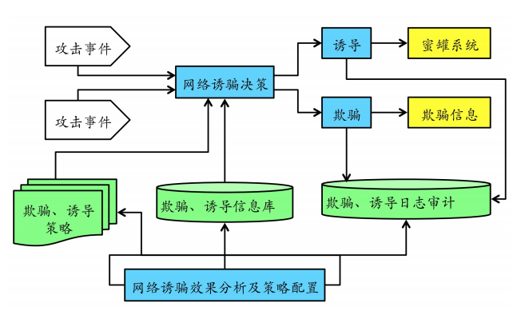
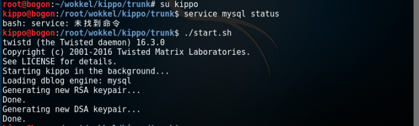
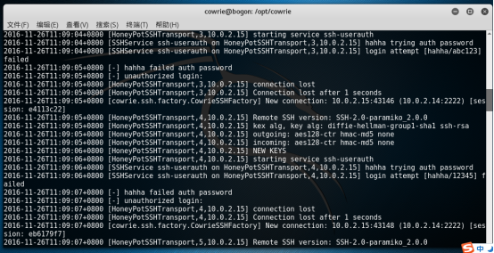

#三种或三种以上不同SSH蜜罐应用实验对比分析报告

### SSH蜜罐实验原理
-  模拟为SSH网络服务进程, 记录每次SSH口令暴力破解所尝试使用的用户名与口令
-   并在口令猜测成功之后为攻击者提供模拟的shell 执行环境
-   对攻击源IP 地址、使用的SSH 客户端类型、输入的控制命令以及下载的攻击工具文件进行捕获与记录.
-   是蜜罐基本体系架构图如下所示

###实验环境
- virtualbox
- kali-honeypot用于设置SSH蜜罐系统引诱黑客进行入侵
- kali-attacker作为攻击主机用于测试
- 安装蜜罐

###实验工具
##Kippo#
- 工具简介

    <pre> kippo在 Kojoney 基础上能够进一步提供更加真实的 shell 交互环境，比如支持对
一个文件系统目录的完全伪装，允许攻击者能够增加或者删除其中的文件；包含一些伪装的文件
内容，如/etc/passwd 和/etc/shadow 等攻击者感兴趣的文件；以 UML（User Mode Linux）兼容格
式来记录 shell 会话日志，并提供了辅助工具能够逼真地还原攻击过程；引入很多欺骗和愚弄攻
击者的智能响应机制</pre>
## Kippo SSH 蜜罐的安装和使用

* **实验环境**
	* 虚拟机：
		* kippo蜜罐 : 
			* kali-linux 
			*  ***IP:10.0.2.13***
			*  user: **kippo** ; **root**
			*  password: **123456**
		* Attacker : 
			* Kali-rolling 
			*  ***IP:10.0.2.15***
	* 网络模式：
		* NAT-Network模式 （保证两台主机之间的连通性，只要知道了蜜罐主机开放的端口，攻击者便可尝试进行远程主动访问）

<pre>
Attacker  是攻击者，他试图通过SSH远程登录暴力破解目标主机。
kali-kippo  是蜜罐,它可以获取攻击者用于暴力破解的字典、输入的命令以及上传或下载的恶意文件。攻击者在上传恶意文件后，执行恶意文件的操作均会失败，所以对蜜罐本身来说比较安全。</pre>

* **实验过程**

    1，添加非root用户
   
        adduser kippo –p *******(设置密码)

    2，安装各种python相关包
   
        apt-get install python-twisted python-twisted-conch python-dev python-crypto python-pyasn1 python-gmpy2 python-openssl  python-mysqldb python-zope.interface
    3，切换到指定目录下进行安装
   
        cd /home/kippo
    4，下载kippo包

   
        svn checkout https://github.com/desaster/kippo
    5，kippo配置文件

   
        cp kippo.cfg.dist kippo.cfg
    5，将公网访问服务器22端口的请求做端口转发，转发到蜜罐的端口2222中

   
         iptables -A PREROUTING -t nat -i eth0 -p tcp  --dport 22 -j REDIRECT -to-port 2222

安装完成后下一步就是运行kippo啦，大家安装时有问题也可以私戳我，或许可以帮助到你们啊！

* 切换到指定kippo目录下，以非root用户启动蜜罐，root用户下不能启动：
		
        ./start.sh

出现以上图片信息说明已经成功启动蜜罐，下面说明攻击者如何通过SSH远程登录服务对蜜罐进行入侵行为

*启动蜜罐后，进行实时监控产生的日志信息：
		
        tail  -f  log/kippo.log

Kippo 蜜罐的捕获日志除了保存在本地 log 目录之外，还可以通过 Kippo 源码目录下的
dblog/mysql.py 导入到 MySQL 数据库中，以供分析人员进一步分析，日志信息的更改我们在后续的操作中可以很明显地观察到。

* **攻击主机**
	* 扫描目标主机和端口上运行的软件的版本：
		
             nmap -sV 10.0.2.13
	* 连接目标主机：
               
             ssh 10.0.2.13 -p 2222

进入了蜜罐系统后，但是系统模拟比较完整，所以攻击者还无法察觉自己正在被监视

	* 登陆成功后进行一系列的shell交互行为：
               
            whoami
            cd /
            ls    //查看系统文件
            Ifconfig
            Ping google.com   //测试入侵的主机能否连接网络
            Cat etc/passwd  //尝试打开文件查看敏感文件内容

在kippo蜜罐主机，我们可以看到正在实时监测的日志如下所示，下面显示了获取的行为信息，包括攻击者尝试登陆使用的用户名和密码，以及IP地址，尝试登陆时间等等。

###分析数据信息
1. data: 存放ssh key,lastlog.txt和userdb.txt lastlog.txt:last命令的输出,即存储了登陆蜜罐的信息,也可以伪造 userdb.txt:可以登陆的用户,可以给一个用户设置多个密码,一个用户一行 格式为username:uid:password

2. honeyfs: etc目录中存在group hostname hosts issue passwd resolv.conf shadow这些 文件,cat /etc/filename目录中对应的文件时会显示这些文本文件中的内容. proc目录中存在cpuinfo meminfo version这些文件,cat /proc/filename目录中对应的文件时会显示这些文本文件中的内容.

3. log: 存放日志文件的地方,该目录包含一个kippo.log文件和tty目录 kippo.log:是存放启动记录,那些IP连接等信息 tty目录是每一个ssh过来后操作的记录,可以使用strings filename直接看到里面的内容

4. txtcmds: 存放命令的地方,这些命令都是文本文件,执行相关命令的时候直接显示文件内容

5. kippo: 核心文件,模拟一些交互式的命令等等

6. dl: wget等等下载的文件存放的地方

### 小结

 Kippo 是一款非常优秀而且容易使用的开源 SSH 蜜罐软件，使用 Python 编写使其能够运行
与各种 Linux、Unix 和 Windows 操作系统平台。Kippo 具有发现并监测 SSH 口令爆破攻击及进
一步的控制攻击行为的能力，可以有效的发现大量针对网络中 SSH 服务的攻击行为。
但是也不能否认他所支持的交互行为还有更大开发的空间，以方便我们收集攻击者更多的试图攻击行为和攻击方式，从而学习到更多针对攻击的防御方式！

###参考链接
关于Kippo的安装、配置参考以下文章

[kippo on github](http://code.google.com/p/kippo/)

[linux下安装kippo](http://297020555.blog.51cto.com/1396304/553382/)

[kippo官方安装地址](https://github.com/desaster/kippo)

[Kippo: 一款优秀的 SSH 蜜罐开源软件](http://netsec.ccert.edu.cn/zhugejw/files/2011/09/Kippo-%E4%BB%8B%E7%BB%8D.pdf)

[youtube kippo安装使用视频](https://www.youtube.com/watch?v=OyBiIjrVXgk)

