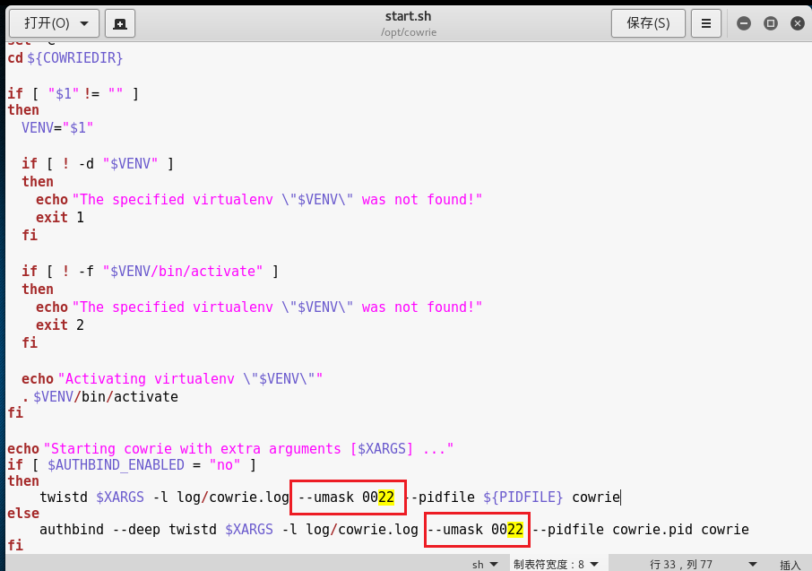
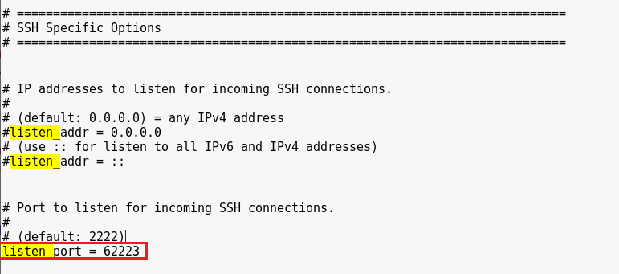
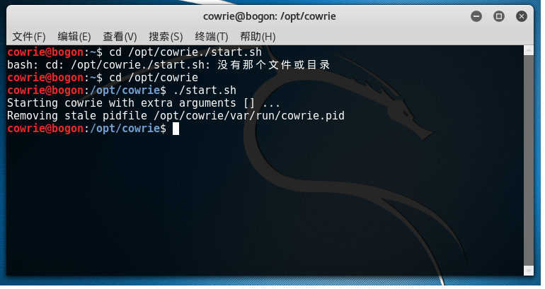
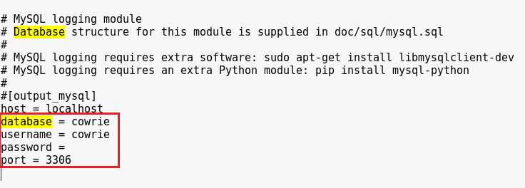
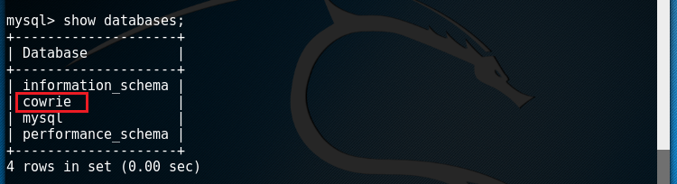
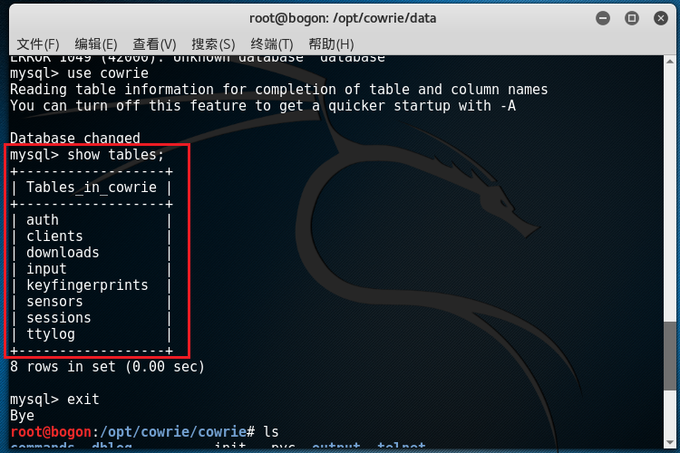

# cowrie 蜜罐安装

 
- cowrie简介
    
      它是一个具有中等交互的SSH蜜罐，安装在Linux中，它可以获取攻击者用于暴力破解的字典、输入的命令以及上传或下载的恶意文件。攻击者在上传恶意文件后，执行恶意文件的操作均会失败，所以对蜜罐本身来说比较安全
## cowire安装流程

  1. 环境  kali（Debian64bit）
  2.  添加非root用户
  
       `adduser cowrie –p *******(设置密码)`
  3.   安装各种python相关包
 
       `apt-get install python-twisted python-crypto python-pyasn1 python-gmpy2 python-mysqldb python-zope.interface`
  4.   安装virtualenv
          
       `apt-get install virtualenv`
  5.   下载cowire

       `cd /opt`

       `git clone http://github.com/micheloosterhof/cowrie`
  6.   配置python虚拟环境
 

       `cd /opt/cowrie`

       `virtualenv cowrie-envsource cowrie-env/bin/activate`

       `pip install twisted cryptography pyopenssl gmpy2`
  7.   建立cowrie配置文件
  
       `cp cowrie.cfg.dist cowrie.cfg`
  8.   在start.sh文件修改日志的umask为0022（默认为0077）
 

 9.    在cowrie.cfg文件修改蜜罐的SSH端口（默认为2222）  将linsten_port改为62223即可（最好大于60000，以防止被nmap默认扫描到）
  
 
  10.    将公网访问服务器22端口的请求做端口转发，转发到蜜罐的端口中
    
   `iptables -t nat -A PREROUTING -p tcp--dport 22 -j REDIRECT --to-port 62223` 

   

  11.在/etc/ssh/sshd_config 文件将真正的（非蜜罐）SSH管理端口改为65522。 在第一次改SSH端口时，在前期测试时建议同时保留22与65522，以防止修改保存后出现故障无法连接65522
  
   
12.    此处切换为cowrie用户操作，启动蜜罐

   `cd /opt/cowrie`

   `./start.sh`

   

## 数据库安装

- cowrie中产生的日志杂乱无章，即使放到日志分析工具中也很难制定规则去筛选。然而cowrie具备将攻击IP、时间、历史执行命令等记录直接存在数据库中，下面将说明如何配置数据库

- 切换至root用户安装mysql基础环境

       `apt-get install libmysqlclient-dev python-dev`

       `pip install mysql-python`

       `apt-get install mysql-server python-mysqldb`
   
      安装的过程可能会出现pip版本需要更新的情况，可以下载get-pip.py（下载地址：https://bootstrap.pypa.io/get-pip.py）
    
      `python get-pip.py`

      更新后再对以上安装包下载
- 开启mysql

    `service mysql start`
- 使用root用户建立名为cowrie的数据库并将该库中的所有表授权给cowrie

    `mysql -u root -p`

    `mysql>CREATE DATABASE cowrie;`

    `mysql>GRANT ALL ON cowrie.* TO cowrie@localhost IDENTIFIED BY 'your_password';`
   
    `mysql>exit;`
- 此时进入cowrie安装目录中，使用cowrie用户登录数据库，进入cowrie库中，将/opt/cowrie/ doc/sql/mysql.sql作为数据源即可制成多个表。
   
      `cd /opt/cowri`

      `mysql -u cowrie –p`
    
      `mysql>USE cowrie;`
 
      `mysql>source ./doc/sql/mysql.sql`

      `mysql>exit`
- 停止cowrie，修改配置文件中的数据库配置，使配置文件中的密码与cowrie数据库用户密码一致
     
      `./stop.sh`

-  保存后退出，并su到cowrie用户重启蜜罐
   
     `./start.sh`
- cowrie库中的数据表如下：

