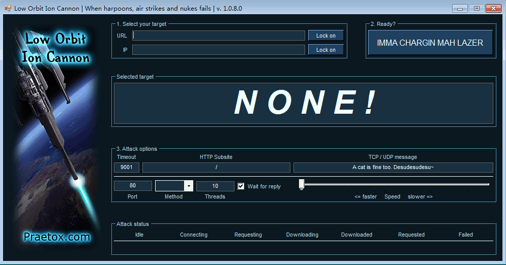
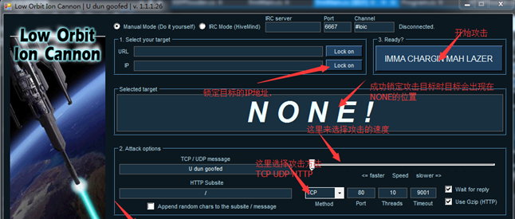
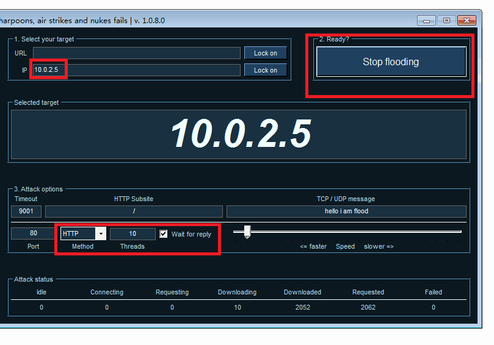
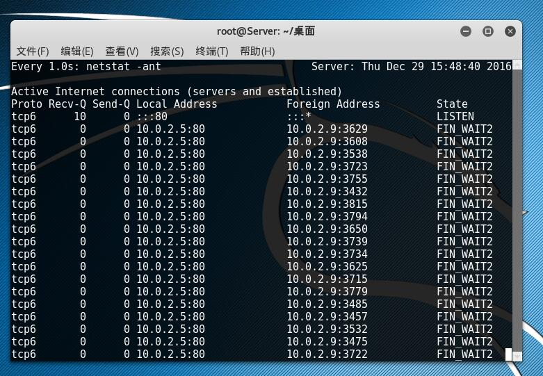
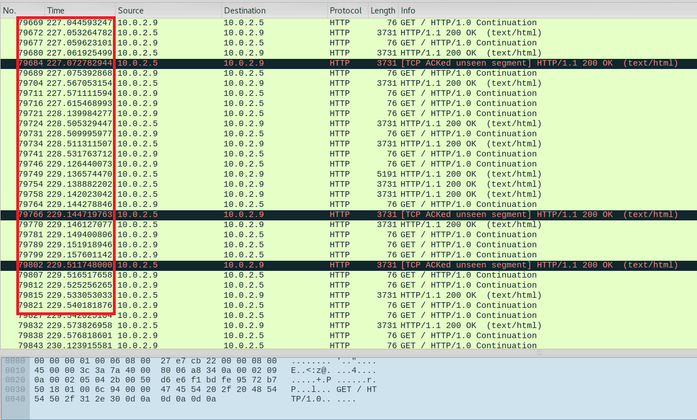

# 使用Loic攻击器进行DDoS攻击实验报告 #
## 一，实验目的

    1，了解DDoS/DoS攻击的概念及其在现实运用方面的危害性
    2，掌握基于HTTP协议的DDoS/DoS攻击的原理与方法
    3，通过测试实例掌握DDoS的检测方法和如何防止DDoS攻击的方法
    4，通过实验测试，提高分析思考问题和解决问题的能力

## 二，实验工具

    LOIC是一款专著于web应用程序的Dos/DDOS攻击工具，它可以用TCP数据包、UDP数据包、HTTP请求于对目标网站进行DDOS/DOS测试，不怀好意的人可能利用LOIC构建僵尸网络。 
 

## 三，实验过程

1，在虚拟机环境下启动loic攻击器，看看这个神秘的东西到底是怎么样的状况

2，配置10.0.2.5为攻击目标，向80端口发送http请求，threads选择默认为10，我们可以把对勾去掉，避免攻击进行时产生速度变慢的问题

3，设置好了之后，攻击器开始行动啦

4，打开wireshark 准备抓包，同时通过netstat –ant查看端口连接情况

4，接下来查看wireshark的抓包情况，从图片我们可以看到，在非常短的时间内，攻击者向被攻击机发送了无数的http请求，在很短时间内被攻击者几乎还能反应过来，这里只是做一个小小的实验，所以攻击的力度设置地比较小，要实现真正地网站挂掉瘫痪的效果，我们可以加大攻击量并加快攻击速度，便能得到理想的实验效果

## 三，实验总结

* 通过本次实验，并从显著的实验现象中我们已经充分了解到了DDoS攻击的实验原理，从一步一步的探索中大体掌握了拒绝服务攻击的监测方法，也对整个实验思路有了更深刻的了解。
* 高速广泛连接的网络给大家带来了方便，也为DDoS攻击创造了极为有利的条件,到目前为止,进行DDoS攻击的防御还是比较困难的。首先,这种攻击的特点是它利用了TCP/IP协议的漏洞,除非你不用TCP/IP,才有可能完全抵御住DDoS攻击。不过这不等于我们就没有办法阻挡DDoS攻击,我们可以尽力来减少DDoS的攻击

* **参考文章**

[https://sourceforge.net/projects/loic0/](https://sourceforge.net/projects/loic0/)

[https://en.wikipedia.org/wiki/Low_Orbit_Ion_Cannon](https://en.wikipedia.org/wiki/Low_Orbit_Ion_Cannon)

[http://www.aipai.com/c31/PDcoIyAqIidqJWQuKg.html?fromvsogou=1](http://www.aipai.com/c31/PDcoIyAqIidqJWQuKg.html?fromvsogou=1)
