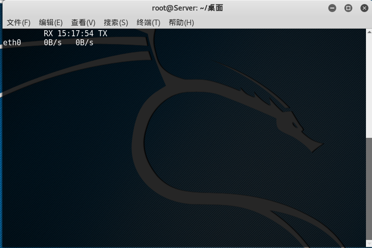
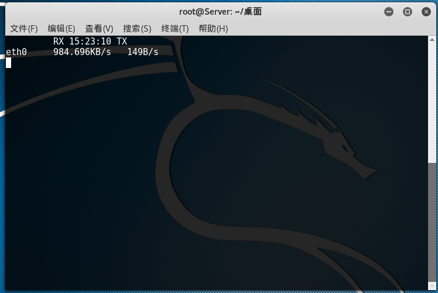
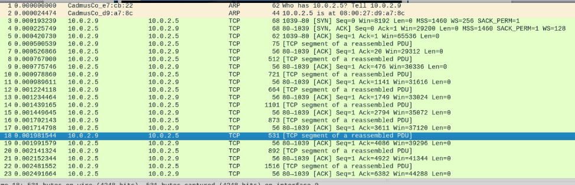
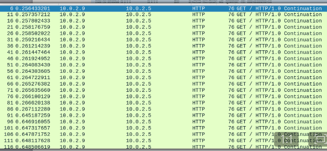
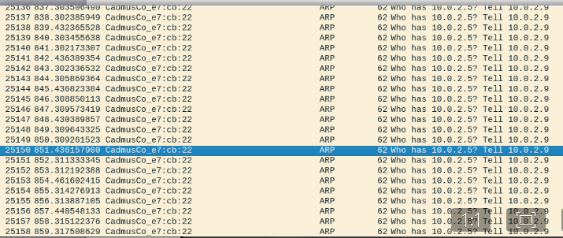
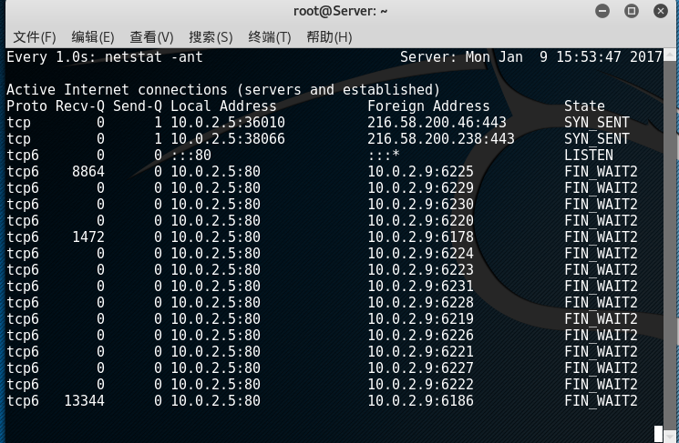
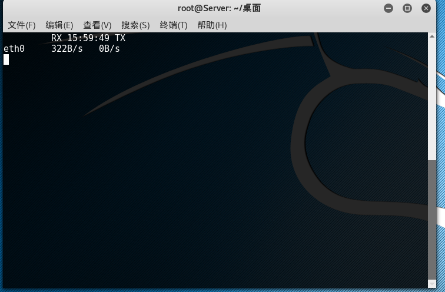

# 使用Loic攻击器进行DDoS攻击实验报告 #
## 一，实验目的

    1，了解DDoS/DoS攻击的概念及其在现实运用方面的危害性
    2，掌握基于HTTP协议的DDoS/DoS攻击的原理与方法
    3，通过测试实例掌握DDoS的检测方法和如何防止DDoS攻击的方法
    4，通过实验测试，提高分析思考问题和解决问题的能力

## 二，实验工具

    LOIC是一款专著于web应用程序的Dos/DDOS攻击工具，它可以用TCP数据包、UDP数据包、HTTP请求于对目标网站进行DDOS/DOS测试，不怀好意的人可能利用LOIC构建僵尸网络。 
 

## 三，实验过程
* **实验环境**
	* 虚拟机：
		* DDoS攻击主机 : 
			* win7 
			*  ***IP:10.0.2.9***
		* 客户机服务器 : 
			* Kali-rolling 
			*  ***IP:10.0.2.5***
		* 虚拟机连接方式 
			* NAT 网络

使用loic作为攻击工具，下面的实验中会对80端口进行三种不同协议的数据包的flooding攻击，本实验分为两部分。

一是通过攻击器的对服务器进行DDoS攻击，由于是实验测试用例，因为DDoS攻击强度增大的时候，实验虚拟机每次都会出现卡死的情况， 囧，所以我们在进行实验时所设置的攻击包数量和速度都进行了限制。

二是通过抓包分析数据观察ddos攻击的痕迹以及ddos攻击导致的后果，并针对此种情况进行防御尝试实验。

* **实验步骤**

    1，在攻击主机下载loic攻击器，下载后便可以直接启动（下载地址为[https://sourceforge.net/projects/loic/](https://sourceforge.net/projects/loic/)）
   

    2，为了实现ddos攻击流量异常现象的观测，在客户机服务器环境运行一段流量监测脚本，包含的信息不是特别多，但是也可观测出流量异常的情况

          #!/bin/bash

           while [ "1" ]
           do
           eth=$1
           RXpre=$(cat /proc/net/dev | grep $eth | tr : " " | awk '{print $2}')
           TXpre=$(cat /proc/net/dev | grep $eth | tr : " " | awk '{print $10}')
           sleep 1
           RXnext=$(cat /proc/net/dev | grep $eth | tr : " " | awk '{print $2}')
           TXnext=$(cat /proc/net/dev | grep $eth | tr : " " | awk '{print $10}')
           clear
           echo  -e  "\t RX `date +%k:%M:%S` TX"
           RX=$((${RXnext}-${RXpre}))
           TX=$((${TXnext}-${TXpre}))
           if [[ $RX -lt 1024 ]];then
           RX="${RX}B/s"
           elif [[ $RX -gt 1048576 ]];then
           RX=$(echo $RX | awk '{print $1/1048576 "MB/s"}')
           else
           RX=$(echo $RX | awk '{print $1/1024 "KB/s"}')
           fi
           if [[ $TX -lt 1024 ]];then
           TX="${TX}B/s"
           elif [[ $TX -gt 1048576 ]];then
           TX=$(echo $TX | awk '{print $1/1048576 "MB/s"}')
           else
           TX=$(echo $TX | awk '{print $1/1024 "KB/s"}')
           fi 
           echo -e "$eth \t $RX   $TX "
           Done

       3，在服务器主机打开wireshark进行抓包

       4，在攻击主机配置10.0.2.5为攻击目标，向80端口发送http请求，threads选择默认为10，我们可以把对勾去掉，避免攻击进行时产生速度变慢的问题 

       5，设置好了之后，启动攻击
       

       6，此时在服务器脚本中我们看到流量指数明显比之前多了特别多
       

       7，除了查看流量外，我们再来看看wireshark的抓包情况，如下面所示的TCP包flooding，大量的tcp发送过来，服务器在最初时还能够进行回应，但是到最后已经无法发送自己的数据包进行回应。发送HTTP包时，请求也已全部搁置，服务器不再产生回应。
       

这里只是做一个小小的实验，攻击的力度设置地比较小，要实现真正地网站挂掉瘫痪的效果，我们可以加大攻击量并加快攻击速度，便能得到理想的实验效果

* **设置防火墙规则**
	* 服务器：
	    * 当察觉到本地受到攻击时，可以使用命令查看端口活动，捕捉到一直进行发出请求的主机的IP地址
        
	            `  watch -n 1 netstat -ant`

	
* 措施：
	   
 * 针对此种情况我们可以使用iptables命令将该IP地址或者IP网段添加至黑名单
	          
      `  iptables -I INPUT -s 10.0.2.9 -j DROP`	

添加之后我们可以通过流量监测脚本或者wireshark抓包查看拦截是否有效，通过实验得出，我们针对ddos攻击设置防火墙规则还是具有一定的可行性与有效性的！！！

## 四，实验小结

* 通过本次实验，并从显著的实验现象中我们已经充分了解到了DDoS攻击的实验原理，从一步一步的探索中大体掌握了拒绝服务攻击的监测方法，也对整个实验思路有了更深刻的了解。

* **参考文章**

[lioc攻击器官方下载地址](https://sourceforge.net/projects/loic0/)

[lioc即Low_Orbit_Ion_Cannon维基百科](https://en.wikipedia.org/wiki/Low_Orbit_Ion_Cannon)

[iptables规则的使用（网络安全课程pdf）](http://sec.cuc.edu.cn/huangwei/textbook/ns/)

[loic使用视频（网上找的，具有可行性）](http://www.aipai.com/c31/PDcoIyAqIidqJWQuKg.html?fromvsogou=1)

http://blog.nsfocus.net/evolution-of-ddos-attack-tools/

[http://www.aipai.com/c31/PDcoIyAqIidqJWQuKg.html?fromvsogou=1](http://www.aipai.com/c31/PDcoIyAqIidqJWQuKg.html?fromvsogou=1)

