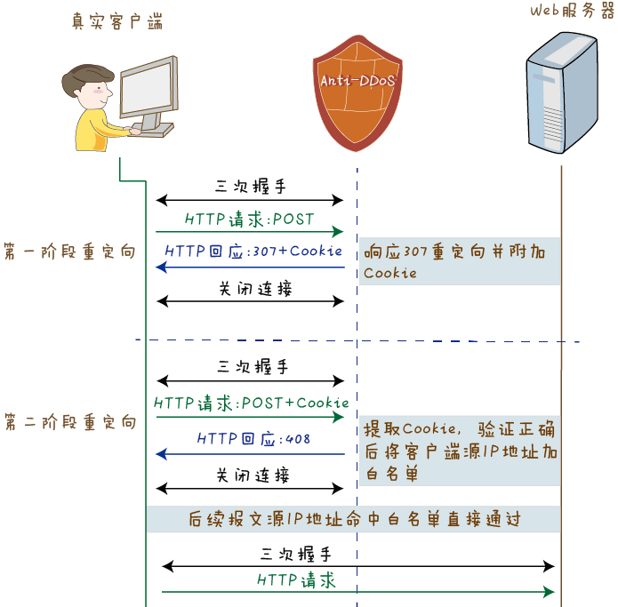

# 基于HTTP协议的DOS/DDoS的防御手段
    
    在本文之前我们已经细致地了解到了攻击原理，进行了一些的实验,并且实际地体会到DDoS攻击对日常网络的危害性，那么应该怎么进行防御呢?
* **基于HTTP协议的DOS/DDoS的防御**

- 重定向认证

    Anti-DDoS系统代替服务器向客户端响应307状态码（针对POST请求方法的重定向），同时向客户端的浏览器注入Cookie，客户端再次发起请求时会在HTTP报头上附加Cookie信息，Anti-DDoS设系统通过验证Cookie信息的真实性来验证客户端。

1、当连续一段时间内去往目标Web服务器的HTTP POST请求报文超过告警阈值后，Anti-DDoS系统启动源认证机制。源认证机制启动后，Anti-DDoS系统将会代替服务器与客户端建立TCP三次握手。

2、Anti-DDoS系统拦截HTTP请求，代替Web服务器回应307状态码，并在响应头部附加上由客户端IP生成的Cookie。

3、如果这个源是虚假源，或者不支持完整HTTP协议栈的攻击工具，不会重新发起请求。

4、如果这个源是真实客户端，Anti-DDoS系统生成的Cookie会写入到浏览器中，并且客户端会重新发起请求，请求头部就会带有该Cookie信息。Anti-DDoS系统收到请求后，验证Cookie是否正确，如果正确则将该客户端的源IP地址加入白名单。然后Anti-DDoS系统会回应408状态码，表示请求超时，使客户端重新发起访问。

5、后续这个客户端发出的HTTP请求报文命中白名单直接通过。

- 307重定向认证方式能够很好地防御HTTP POST Flood攻击，但是这种方式也具有一定的局限性。其一，依赖于客户端浏览器的Cookie的机制，受安全级别限制。如果客户端的浏览器安全级别较高而无法写入Cookie，会导致认证不通过；其二，第一阶段重定向结束后，需要客户端再次手动执行提交等操作，才能重新发起POST请求

<pre>
上面介绍了基于HTTP协议的DOS/DDoS的一种防御模式，接下来我们就整个DDoS攻击的防御进行了一定程度的汇总。
</pre>

* **DDoS攻击的防御手段**
	* 确保服务器的系统文件是最新的版本,并及时更新系统补丁：
		* 要定期扫描现有的网络主节点,清查可能存在的安全漏洞,对新出现的漏洞及时进行清理

	* 关闭不必要的服务：
		
        * 过滤不必要的服务和端口.可以使用Inexpress、Express、Forwarding等工具来过滤不必要的服务和端口,即在路由器上过滤假IP。

	* 限制同时打开的SYN半连接数目,缩短SYN半连接的time out 时间,限制SYN/ICMP流量：
		* 用户应在路由器上配置SYN/ICMP的最大流量来限制SYN/ICMP封包所能占有的最高频宽,这样,当出现大量的超过所限定的SYN/ICMP流量时,说明不是正常的网络访问,而是有黑客入侵。
		

	* 正确设置防火墙：
		*      <pre>1,禁止对主机的非开放服务的访问,限制特定IP地址的访问
2,过滤所有RFC1918 IP地址，RFC1918 IP地址是内部网的IP地址,像10.0.0.0、192.168.0.0和172.16.0.0,它们不是某个网段的固定的IP地址,而是Internet内部保留的区域性IP地址,应该把它们过滤掉。此方法并不是过滤内部员工的访问,而是将攻击时伪造的大量虚假内部IP过滤,这样也可以减轻Ddos的攻击。 
3,启用防火墙的防DDoS的属性
4,严格限制对外开放的服务器的向外访问
5,运行端口映射程序祸端口扫描程序,要认真检查特权端口和非特权端口。
6,在骨干节点配置防火墙,防火墙本身能抵御Ddos攻击和其他一些攻击。在发现受到攻击的时候,可以将攻击导向一些牺牲主机,这样可以保护真正的主机不被攻击。当然导向的这些牺牲主机可以选择不重要的,或者是linux以及unix等漏洞少和天生防范攻击优秀的系统。
 </pre>

	
	* 认真检查网络设备和主机/服务器系统的日志。只要日志出现漏洞或是时间变更,那这台机器就可能遭到了攻击

	
	* 限制在防火墙外与网络文件共享。这样会给黑客截取系统文件的机会,主机的信息暴露给黑客,无疑是给了对方入侵的机会
		* 所谓网络设备是指路由器、防火墙等负载均衡设备,它们可将网络有效地保护起来。当网络被攻击时最先死掉的是路由器,但其他机器没有死。死掉的路由器经重 启后会恢复正常,而且启动起来还很快,没有什么损失。若其他服务器死掉,其中的数据会丢失,而且重启服务器又是一个漫长的过程。特别是一个公司使用了负载 均衡设备,这样当一台路由器被攻击死机时,另一台将马上工作。从而最大程度的削减了Ddos的攻击

#####  如果用户正在遭受攻击，他所能做的抵御工作将是非常有限的。因为在原本没有准备好的情况下有大流量的灾难性攻击冲向用户，很可能在用户还没回过神之际，网络已经瘫痪。但是，用户还是可以抓住机会寻求一线希望的。 

<pre>
      （1）检查攻击来源，通常黑客会通过很多假IP地址发起攻击，此时，用户若能够分辨出哪些是真IP哪些是假IP地址，然后了解这些IP来自哪些网段，再找网网管理 员将这些机器关闭，从而在第一时间消除攻击。如果发现这些IP地址是来自外面的而不是公司内部的IP的话，可以采取临时过滤的方法，将这些IP地址在服务器或路由器 上过滤掉。 

     （2）找出攻击者所经过的路由，把攻击屏蔽掉。若黑客从某些端口发动攻击，用户可把这些端口屏蔽掉，以阻止入侵。不过此方法对于公司网络出口只有一个，而 又遭受到来自外部的DdoS攻击时不太奏效，毕竟将出口端口封闭后所有计算机都无法访问internet了。 

     （3）最后还有一种比较折中的方法是在路由器上滤掉ICMP。虽然在攻击时他无法完全消除入侵，但是过滤掉ICMP后可以有效的防止攻击规模的升级，也可以在一定 程度上降低攻击的级别。
</pre>

* **总结**
 
    在虚拟化时代，海量用户的不同业务共处在相同的物理机平台，遭受DDoS攻击的可能性越来越高。而且一个用户被攻击可能牵扯到大量的其他用户，危害被显著放大，因此防御显得尤为重要.

## 参考文献

[http://www.bingdun.com/cc/6290.htm](http://www.bingdun.com/cc/6290.htm)

[http://blog.csdn.net/huwei2003/article/details/45476743](http://blog.csdn.net/huwei2003/article/details/45476743)

[http://www.haodc.com/gaofang-36.html](http://www.haodc.com/gaofang-36.html)

[http://d.g.wanfangdata.com.cn/Thesis_Y1572297.aspx](http://d.g.wanfangdata.com.cn/Thesis_Y1572297.aspx)

[http://support.huawei.com/huaweiconnect/enterprise/thread-367981.html](http://support.huawei.com/huaweiconnect/enterprise/thread-367981.html)