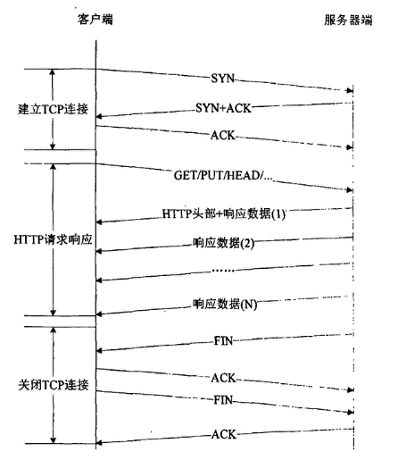
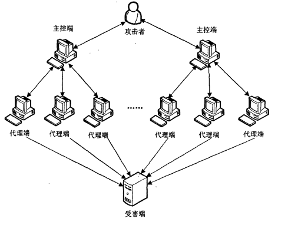

## 基于HTTP协议的DDOS攻击的原理 ##

* **前言**

     <pre>
       基于应用层协议的DDoS攻击，是一类利用了TCP/IP协议栈高层协议的漏洞发起的攻击。相对于底层协议而言，
高层的协议具有多样性和复杂性等特征，同时由于高层协议的应用离不开底层协议的支持，所以基于高层协议的
DDoS攻击的底层特征协议完全正常，传统的基于底层协议特征的检测方法将不再适用，这使得基于应用层的DDoS
攻击的破坏力远大于传统网络层的DDoS攻击
     </pre>

* **DOS/DDOS攻击概念**
<pre>    我们先来通俗地理解一下DoS（DDoS）拒绝服务攻击：
    我们浏览一个网站，就要像这个网站发送数据包（合理请求），因为请求完全合理，那么也就意味着，网站将会正常
处理我们的请求，这样就是说每一个请求都会消耗一些资源，那么在这样一种情景：比如大学抢课经常出现几千人同时在
同一时间上网导致服务器"瘫痪"的事件，那么如果大家能理解到这里的话，我们简单来解释DoS就会变得很容易了，Dos就
是你不停的发送某一个请求去占用服务器系统资源，就好比你充当了很多人同时访问一个网站一样，如果网站服务器无法
承受这种压力的话自然会崩溃
    DoS：拒绝服务攻击
    DDos：分布式拒绝服务攻击
    虽然只是三个字（一个字母）的差别，这两个攻击的威力差别很大，Dos大多数只不过指的是一台主机（攻击机）对目标
进行攻击（发送过量的数据包请求来占用服务器资源），而DDoS是一群计算机（被控制者控制的僵尸网络）对目标发起攻击
，强度是Dos的很多倍
</pre>

* **被DDoS攻击时的现象**
     <pre>
 1,被攻击主机上有大量等待的TCP连接 
 2,网络中充斥着大量的无用的数据包，源地址为假 
 3,制造高流量无用数据，造成网络拥塞，使受害主机无法正常和外界通讯 
 4,利用受害主机提供的服务或传输协议上的缺陷，反复高速的发出特定的服务请求，使受害主机无法及时处理所有正常请求
 5,严重时会造成系统死机 
     </pre>

* **DDoS攻击的监测**
	* 异常现象一：
		* 虽然这不是真正的"DDoS"通讯，但却能够用来确定DDoS攻击的来源。根据分析，攻击者在进行DDoS攻击前总要解析目标的主机名。BIND域名服务器能够记录这些请求。由于每台攻击服务器在进行一个攻击前会发出PTR反向查询请求，也就是说在DDoS攻击前域名服务器会接收到大量的反向解析目标IP主机名的PTR查询请求。

		
	* 异常现象二：
		* 当DDoS攻击一个站点时，会出现明显超出该网络正常工作时的极限通讯流量的现象。现在的技术能够分别对不同的源地址计算出对应的极限值。当明显超出此极限值时就表明存在DDoS攻击的通讯。因此可以在主干路由器端建立ACL访问控制规则以监测和过滤这些通讯。

		
	* 异常现象三：
		* 特大型的ICP和UDP数据包。正常的UDP会话一般都使用小的UDP包，通常有效数据内容不超过10字节。正常的ICMP消息也不会超过64到128字节。那些尺寸明显大得多的数据包很有可能就是控制信息通讯用的，主要含有加密后的目标地址和一些命令选项。一旦捕获到（没有经过伪造的）控制信息通讯，DDoS服务器的位置就暴露出来了，因为控制信息通讯数据包的目标地址是没有伪造的

		
	* 异常现象四：
		* 不属于正常连接通讯的TCP和UDP数据包。最隐蔽的DDoS工具随机使用多种通讯协议（包括基于连接的协议）通过基于无连接通道发送数据。优秀的防火墙和路由规则能够发现这些数据包。另外，那些连接到高于1024而且不属于常用网络服务的目标端口的数据包也是非常值得怀疑的。

		
	* 异常现象五：
		* 数据段内容只包含文字和数字字符（例如，没有空格、标点和控制字符）的数据包。这往往是数据经过BASE64编码后而只会含有base64字符集字符的特征。TFN2K发送的控制信息数据包就是这种类型的数据包。TFN2K（及其变种）的特征模式是在数据段中有一串A字符（AAA……），这是经过调整数据段大小和加密算法后的结果。如果没有使用BASE64编码，对于使用了加密算法数据包，这个连续的字符就是“”。

		
	* 异常现象六：
		* 数据段内容只包含二进制和high-bit字符的数据包。虽然此时可能在传输二进制文件，但如果这些数据包不属于正常有效的通讯时，可以怀疑正在传输的是没有被BASE64编码但经过加密的控制信息通讯数据包。（如果实施这种规则，必须将20、21、80等端口上的传输排除在外。）	
		
		
		
* **HTTP Flood攻击原理及分类**
	* 原理：
		* 定义 : 
			*  基于HTTP协议的DDoS攻击也叫做基于HTTP的flood攻击。HTTP Flood攻击是对基于应用层HTTP协议的所有DDoS攻击的总称，即是针对osi协议的第7层协议发起的攻击，是一种典型的应用层DDoS攻击，攻击的主要目标是Web服务器上的网页。 
		* 过程 : 

			*  攻击发生时，攻击者利用看似合法的HTTP GET或POST请求来攻击Web服务器或应用程序。通常使用僵尸网络“僵尸军队”，攻击者向服务器大量的高频请求一个或多个网页，使服务器忙于向攻击者提供资源而无法响应其他合法用户的服务请求
			*  攻击过程中单个请求如下图所示，但是当海量的单个请求同时发生时，HTTP-Flood攻击随之产生，造成的后果就是Web服务器拒绝服务
			
			 
           * 原理 :
                 * 这种攻击主要是针对存在ASP、JSP、PHP、CGI等脚本程序，并调用MSSQLServer、MySQLServer、Oracle等数据库的网站系统而设计的，特征是和服务器建立正常的TCP连接，并不断的向脚本程序提交查询、列表等大量耗费数据库资源的调用，典型的以小博大的攻击方法。
                 * 一般来说，提交一个GET或POST指令对客户端的耗费和带宽的占用是几乎可以忽略的，而服务器为处理此请求却可能要从上万条记录中去查出某个记录，这种处理过程对资源的耗费是很大的，常见的数据库服务器很少能支持数百个查询指令同时执行，而这对于客户端来说却是轻而易举的，因此攻击者只需通过Proxy代理向主机服务器大量递交查询指令，只需数分钟就会把服务器资源消耗掉而导致拒绝服务
                 * 常见的现象就是网站慢如蜗牛、ASP程序失效、PHP连接数据库失败、数据库主程序占用CPU偏高。这种攻击的特点是可以完全绕过普通的防火墙防护轻松找一些Proxy代理就可实施攻击
                 * 缺点是对付只有静态页面的网站效果会大打折扣，并且有些Proxy会暴露攻击者的IP地址
	* 分类：
	     
           HTTP-Flood 攻击一般分以下两类：

		* **请求泛洪攻击（HTTP Get Flood）** 
			*  这种攻击的形式是通过大量合法的HTTP请求，占用目标网络的带宽或者消耗服务器的资源，使正常用户无法进行Web访问。
			
			*  其特点就是攻击速度快，攻击发起节点多，但是每一次攻击带来的危害有限。攻击的内容可以随机生成也可以通过拦截用户正常的HTTP请求序列，然后重放产生 
		* **高消耗请求攻击** 

			*  这种攻击的形式就是攻击者不断访问Web服务器上高耗资源的网页，比如：数据库查询，密码验证等。带来的直接后果就是服务器的资源（CPU，内存，磁盘）被消耗殆尽，从而达到拒绝服务的效果
			
			*  这种攻击的特征是攻击速率低，攻击发起节点少，但每次攻击产生的危害却很大，并且不容易被检测工具发现。
			

        根据攻击采用的代理端不同，HTTP-Flood 又可分为两种
     * 使用代理服务器作为代理端，攻击者只需要提前收集互联网上的代理服务器的IP地址和代理端口，然后开多线程向这些代理端发送攻击数据包，代理服务器会自动把攻击数据包转发到目标主机上，目前互联网上的CC攻击就是采用的这种方式
     

     * 利用“僵尸网络”进行攻击，这时的代理端就是被黑客获取控制权的“僵尸主机”，并且这种攻击的代理端数量巨大。以下便是僵尸网络发动HTTP-Flood攻击时的网络拓扑示意图
		
			 	
			
 在上图中，攻击者是攻击的主控台，向主控端发送攻击命令，控制整个过程。攻击者是主控端的通信一般不包括在DDoS工具中，可以通过多种连接方法完成，最常用的有 telnet TCP 终端会话，也可以是绑定到TCP 端口的远程shell，基于UDP 的客户/服务器远程shell等。

主控端和代理端都是攻击者非法侵入并控制的主机，分为两个层次，分贝运行非法植入的不同的攻击程序。每个主控端控制多个代理端，有其控制的代理端的地址列表，它监听端口接受共接着发来的命令后，将命令转发给代理端，主控端与代理端的通信根据DDoS工具的不同而有所不同。我们通常把主控端和代理端总称为“僵尸网络”。

* **攻击实施方式特点**

    - 利用应用层协议栈漏洞发起的工具比较多。大部分集中在基于web业务的攻击，其它应用层协议如DNS、SIP相对比较少。

   - 能够模拟协议栈行为包括应用层和传输层的攻击工具是未来发展的趋势，实现应用层协议模拟的防御难度会更大。

   - 攻击工具已经逐渐朝更加隐蔽的方式，以能操纵更大规模的僵尸网络为目标方向挺进，比如DirtJumper。

   - 基于应用层协议漏洞的攻击工具会越来越多，由于能够通过较少流量达到攻击目的，对业务的危害比较大

## 参考文献
[DDOS攻击原理及效果详解](http://www.bingdun.com/cc/6290.htm)

[学习手册：浅析DDoS的攻击及防御](http://blog.nsfocus.net/analysis-ddos-attack-defense/)

[DDoS攻击工具演变](http://blog.nsfocus.net/evolution-of-ddos-attack-tools/)

[2015 H1绿盟科技DDoS威胁报告](http://blog.nsfocus.net/2015-h1-nsfocus-ddos-threat-report/)

[DNS DDoS攻击事件分析](http://blog.nsfocus.net/dns-ddos-attack-analysis/)
