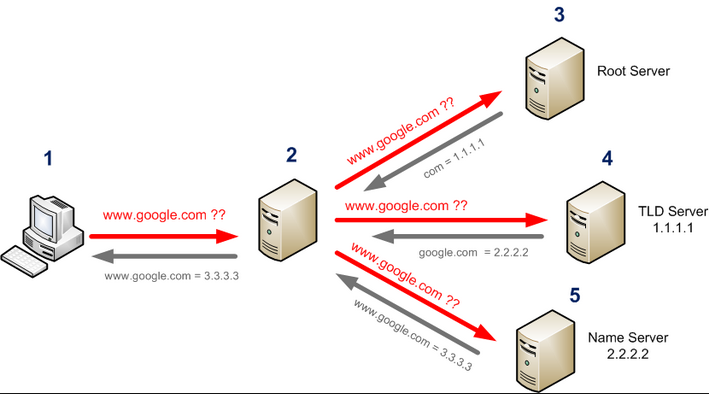
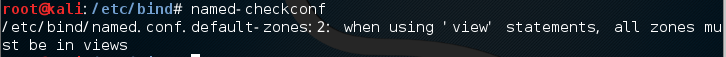
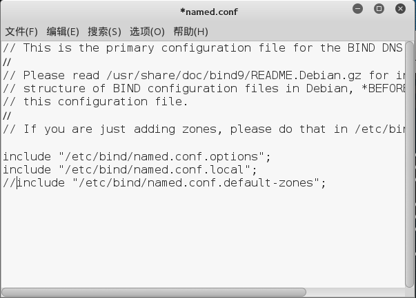
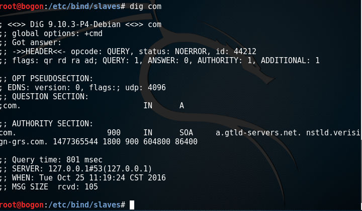
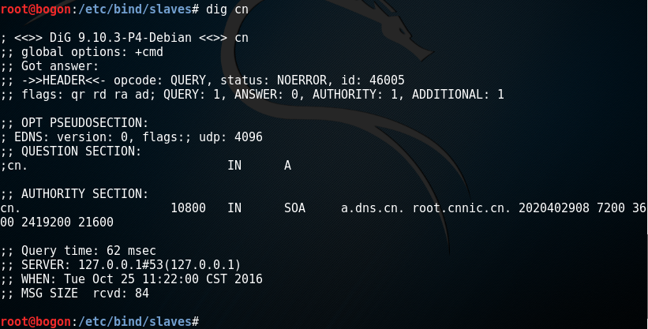
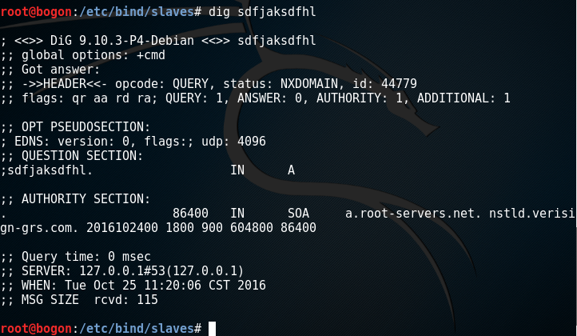

# TASK——搭建DNS服务器完结报告

>***实验目的***：搭建一个支持域名递归解析的DNS服务器，从全球13个根域名解析服务器同步所有TLD域名记录。
***
>***实验思路***：
>>参考了网络上在虚拟机中搭建主从DNS服务器的实验思路，把需要同步域名记的DNS服务器当做主DNS服务器，本地DNS服务器作为从属DNS服务器，先使用两台Linux虚拟机验证了实验思路的可行性，然后再进行从全球13个根域名解析服务器同步所有TLD域名记录实验。因此构造以下三组实验。
>>>实验一：使用bind搭建一组主从DNS服务器，实现DNS解析文件同步，为实验二提供理论可用性。
>
>>>实验二：搭建一台DNS服务器作为root server从属服务器，同步root zone file。
>
>>>实验三：在实验二的基础上结合RFC7706提供的思路，搭建完善后的DNS服务器，实现利用本地root zone file进行递归查询。
***
>***实验环境***：
>
>>系统环境：***Linux kali-rolling***
>
>>***DNS\_master(IP:1.2.3.4)***      
>>***DNS\_slave(IP:1.2.3.5)***
>
>>网络环境：
>
>>搭建主从DNS服务器使用***内部网络***【实验一】   
>>DNS_master用***NAT地址转换***的方式与外网连通【实验二、实验三】
>
***

### 实验一：
>****实验步骤：****
>
>**STEP 1:**
>
>DNS\_master：在目录/etc/bind/中创建一个主域 linux10haha.com 更改此配置文件 named.conf.local，添加如下记录，允许从属DNS服务器同步主服务器的zone记录： 

><pre><code>zone "linux10haha.com" IN {
    type master;
    file "linux10haha.com.zone";
    allow-update { none; };
    allow-transfer { 1.2.3.5; };   //允许IP为1.2.3.5的DNS_slave同步zone文件
};</code></pre>
>**STEP 2:**
>
DNS_master：/etc/bind/创建中一个zone文件linux10haha.zone，在此文件下添加如下内容：

><pre><code>$ORIGIN .
$TTL 86400      ; 1 day
linux10.com            IN SOA  primary.server.com. your.email.address. (
                            2010122801 ; serial
                            7200       ; refresh (2 hous)
                            7200       ; retry (2 hours)
                            2419200    ; expire (5 weeks 6 days 16 hours)
                            86400      ; minimum (1 day)
                            )
$TTL 14400      ; 4 hours
                    NS      scz.alketech.com.
                    NS      ns1.alketech.com.
                    A       10.1.1.2 ; If you want to assign a server to your domain 
                   MX      10      mx1 ; Your email server if you have any
                   MX      20      mx2 ; Your secondary email server if you have one
$ORIGIN linux10haha.com.
www                     A       1.2.3.4 ; The IP of your web server if you want to have one.</code></pre>

>**STEP 3:**

>DNS\_slave：配置从属DNS服务器即DNS_slave，更改此配置文件 named.conf.local，添加如下记录：
><pre><code>zone "linux10haha.com" {
    type slave;
    file "linux10haha.com.zone";
    masters { 1.2.3.4; };
    allow-transfer { none; };
};</code></pre>

>**STEP 4:**

>对DNS_master和DNS_slave重启bind服务，并验证配置是否生效  
><pre><code>root@kali#: sudo /etc/init.d/bind9 restart</code></pre>
><pre><code>root@kali#:  dig @1.2.3.4 linux10haha.com</code></pre>
>
><pre><code>root@kali#:  dig @127.0.0.1 linux10haha.com</code></pre>
>

>****实验结论:****

>验证了利用bind中搭建slave zone的功能同步root zone file的可行性。

***
### 实验二：
>****实验步骤：****
>
>**STEP 1:**
>
>首先确保DNS\_master网络环境：设置默认DNS服务器为127.0.0.1，且可与外网连通。
>
>**STEP 2:**
>
>修改DNS\_master为实验平台，修改文件 named.conf.local，添加如下记录：
><pre><code>zone "." {
           type slave;
           file "/etc/bind/slaves/rootzone.db2";
           notify no;
           masters {
               192.228.79.201; # b.root-servers.net
               192.33.4.12;    # c.root-servers.net
               192.5.5.241;    # f.root-servers.net
               192.112.36.4;   # g.root-servers.net
               193.0.14.129;   # k.root-servers.net
               192.0.47.132;   # xfr.cjr.dns.icann.org
               192.0.32.132;   # xfr.lax.dns.icann.org
               2001:500:84::b; # b.root-servers.net
               2001:500:2f::f; # f.root-servers.net
               2001:7fd::1;    # k.root-servers.net
               2620:0:2830:202::132;  # xfr.cjr.dns.icann.org
               2620:0:2d0:202::132;  # xfr.lax.dns.icann.org
           };
       };</code></pre>
>
>**STEP 3:**
>
>重启服务，使用wireshark抓包，并未发现数据同步的过程。查阅资料得知是因为slaves目录的权限不足，bind无法进行写操作。因此使用如下命令
	<pre><code>chmod 755 slaves</code></pre>
>再次查看slaves权限
>
>
>
>再次重启服务，一段时间后可以在slaves/下找到文件rootzone.db2，这就是我们需要同步的root zone file，大小约为1.5M：
>
>
>
>同时我们可以在重启服务之前打开wireshark进行抓包，可以观察到通信过程：
>
>
>
>****实验结论:****
>
>成功完成了同步root zone file。扩展进阶：可以利用同步下来的root zone file 文件进行迭代DNS查询，即实验三。

***
### 实验三：
>****实验思路：****
>
>根据RFC7706提出的想法，可以实现在本地loopback address搭建DNS服务器，同步root zone file，并充当根域名服务器。类似将下图中的2、3节点捏合于同一台DNS服务器。
>
>
>
>这样做可以有两个优点：
>>1.当主机查询一个包含错误或不存在的TLD的域名时，只需在本地的root zone file查询并返回结果为空的信息，本地DNS中的recursive resolver无需访问最近的Root Server节点，大大缩减了查询速度。
>
>>2.减少了查询行为在网络中的传输过程，有利于提高DNS查询的安全性。【1】
>
>基于此，根据RFC7706中给出bind9配置方法，尝试搭建DNS服务器。

>
>****实验步骤：****
>
>**STEP 1:**
>
>将以下配置添加至DNS\_master的named.conf.local文件中
><pre><code>view root {
       match-destinations { 127.0.0.1; };
       zone "." {
           type slave;
           file "/etc/bind/slaves/rootzone2.db";
           notify no;
           masters {
               192.228.79.201; # b.root-servers.net
               192.33.4.12;    # c.root-servers.net
               192.5.5.241;    # f.root-servers.net
               192.112.36.4;   # g.root-servers.net
               193.0.14.129;   # k.root-servers.net
               192.0.47.132;   # xfr.cjr.dns.icann.org
               192.0.32.132;   # xfr.lax.dns.icann.org
               2001:500:84::b; # b.root-servers.net
               2001:500:2f::f; # f.root-servers.net
               2001:7fd::1;    # k.root-servers.net
               2620:0:2830:202::132;  # xfr.cjr.dns.icann.org
               2620:0:2d0:202::132;  # xfr.lax.dns.icann.org
           };
       };
   };
view recursive {
    dnssec-validation auto;
    allow-recursion { any; };
    recursion yes;
    zone "." {
        type static-stub;
        server-addresses { 127.0.0.1; };
    };
};</code></pre>
>
>该配置的意义：设置两个view(视图)【2】
>>**view recursive**：
>>>a.设置为递归查询.
>
>>>b.包含 zone "."，用于提供根域名解析服务，服务器地址设置为本地loopback address（本实验中是127.0.0.1）.

>>**view root**:
>>>a.对于目标为127.0.0.1的查询（类似对view recursive的接口）进行处理。
>
>>>b.从masters中的root server同步root zone file保存至本地。

>
>**STEP 2:**
>
>配置完成后可以在/etc/bind/目录下使用named-checkconf命令检查配置是否有语法错误。
>
>bug 1：
>
>
>
>所有的域必须在视图中，因此将该文件中之前配置的zone linux10haha.com移动至view recursive中。
>
>bug 2:
>
>
>
>在named.conf.default-zones中还存在着默认的域，可以选择在named.conf中将语句：
><pre><code>include "named.conf.default-zones"</code></pre>
>注释掉。
>
>
>
>**实验效果检验:**
>
>dig google.com:
>
>
>
>dig com:
>
>
>
>dig cn:
>
>
>
>dig无效域名：
>
>
>
>同时，可以对比在未进行该配置的DNS服务器上查询无效域名，其返回时间远大于经过配置后的服务器。
>
>**搭建完成后的效果：**
>
>当主机发送域名查询请求时，view recursive使用已经保存在本地的root zone file进行迭代查询，利用返回后的TLD server 地址进行下一步迭代查询。最终得到的目标ip地址返回给主机作为递归查询的结果。

***
### 参考：
>【1】NAME:《Decreasing Access Time to Root Servers by Running One on Loopback》
>
>>WRITERS:   W. Kumari  P. Hoffman
>
>>LINK:   <https://tools.ietf.org/html/rfc7706>
>
>【2】LINK:   <https://en.wikipedia.org/wiki/Root_name_server>
>
>【3】LINK:   <https://en.wikipedia.org/wiki/Domain_Name_System>
>
>【4】LINK:   <https://wiki.debian.org/Bind9>
>
>【5】NAME:  《How to setup a DNS server master - slave with BIND》	
>
>>WRITERS:   Guillermo Garron
>
>>LINK:  <https://www.garron.me/en/go2linux/how-setup-dns-server-master-slave-bind.html>
>
>【6】NAME:《第13章 使用Bind提供域名解析服务》	
>
>>LINK:  <http://www.linuxprobe.com/chapter-13.html?jimmo2574#131>
