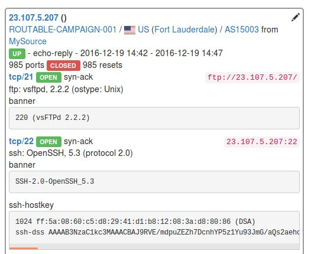
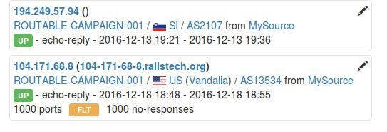
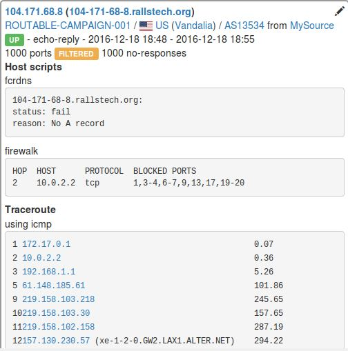
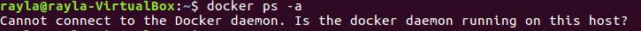
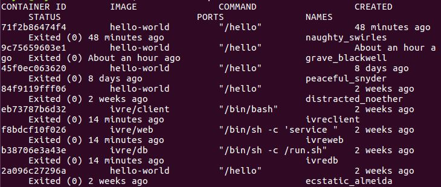
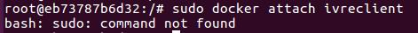

# **基于开源系统、搭建类Zoomeye、shodan服务**  
  
## **一、名词解释**
#### Zoomeye  
[Zoomeye](https://www.zoomeye.org)（钟馗之眼)是知道创宇推出的一款网络空间搜索引擎,可以搜索网络组建和网络设备,是国产的'shodan'。   
#### IVRE  
[IVRE](https://ivre.rocks)(又名DRUNK)是一款基于python的网络侦查框架，包括两个基于p0f和Bro的被动侦查模块和一个基于Nmap&Zmap的主动侦查模块。采用Docker和Vagrant可以方便快速的搭建和管理维护。  
#### Docker  
[Docker](http://www.docker.com):一个开源的应用容器引擎，让开发者可以打包他们的应用以及依赖包到一个可移植的容器中，然后发布到任何流行的 Linux 机器上，也可以实现虚拟化。容器是完全使用沙箱机制，相互之间不会有任何接口（类似 iPhone 的 app）。几乎没有性能开销,可以很容易地在机器和数据中心中运行。最重要的是,他们不依赖于任何语言、框架包括系统。   
#### Vagrant 
Vagrant是一个基于Ruby的工具，用于创建和部署虚拟化开发环境。它 使用Oracle的开源VirtualBox虚拟化系统，使用 Chef创建自动化虚拟环境。  
**功能：**  
1. 统一开发环境。一次配置打包，统一分发给团队成员，统一团队开发环境，解决诸如“编码问题”，“缺少模块”，“配置文件不同”带来的问题；  
2. 避免重复搭建开发环境。新员工加入，不用浪费时间搭建开发环境，快速加入开发，减少时间成本的浪费；  
3. 多个相互隔离开发环境。可以在不用box里跑不同的语言，或者编译安装同一语言不同版本，搭建多个相互隔离的开发环境，卸载清除时也很快捷轻松。   

## **二、搭建过程**

### 运行环境  
virtualbox   ubuntu-16.04-LTS-desktop-64bits     
Docker  
IVRE 
### 安装docker  
更新列表
> sudo apt-get update 
 
使用curl命令进行安装  
> sudo curl -sSL https://get.docker.com/ | sh  

检查是否安装成功   
> sudo docker run hello-world  

如果出现"cannot connect to the docker daemon. is the docker daemon running on this host",大部分原因可能是因为权限问题注意sudo   
安装成功：  
  

### 安装Vagrant  
> sudo apt-get install -y vagrant  

使用 vagrant -v 查看版本，版本要求大于1.4（好像是）以上才能使用,否则后续安装会提示会找不到docker。  
     
### 安装IVRE
创建相关文件并安装ivre  
> mkdir -m 1777 var_{lib,log}_{mongodb,neo4j} ivre-share  
> wget -q https://ivre.rocks/Vagrantfile   
> sudo vagrant up --no-parallel  
  
 
> docker attach ivreclient   
  
  
  
此时IVRE已经安装成功  
通过Docker装好的IVRE是没有数据的  
在浏览器中访问localhost可以查看IVRE的WebUI。        
  
  
### IVRE运行和停止  
查看docker有那些容器  
> sudo docker ps –a  
  
开启IVRE分三步  
1. 要开启database serve  
> sudo docker start ivredb  

2. 开启web  
> sudo docker start ivreweb  

3. 开启客户端  
> sudo docker start ivreclient  

### IVRE扫描并导入数据  
通过attach命令进入ivreclient  
> sudo docker attach ivreclient  
> root@881486651a32:/$ ivre  ipdata --download

对互联网上10个随机主机进行标准扫描，开启13个nmap进程   
> root@881486651a32:/$ ivre runscans --routable --limit 10 --output=XMLFork    

   

扫描结果入库  
> root@881486651a32:/$ ivre nmap2db -c ROUTABLE-CAMPAIGN-001 -s MySource -r scans/ROUTABLE/up  

在浏览器中查看扫描结果  
    
 

####runscans命令的用法:  
**select output method for scan results :**  
 --output {XML,XMLFull,XMLFork,Test,Count,List,ListAll,ListAllRand,ListCIDRs,CommandLine}
**number of addresses to output :**  
 --limit LIMIT, -l LIMIT                    
**select a country :**	  
--country CODE, -c CODE  
**select a region :**	   
--region COUNTRY_CODE REGION_CODE  
	

    
##  三、参考资料  
 * [IVRE官方网站](https://ivre.rocks/)  
 * [IVRE官方文档](https://github.com/cea-sec/ivre/tree/master/doc)  
 * [通过Docker搭建开源版IVRE](http://www.freebuf.com/sectool/92179.html)  
 * [开源版ZoomEye：基于Python的网络侦查框架 – IVRE](http://www.freebuf.com/sectool/74083.html)

## 四、实验过程中出现的问题
1. ** 使用apt-get进行软件的install或update时，有时会出现以下提示信息：**    
E: Could not get lock /var/lib/dpkg/lock - open (11 Resource temporarily unavailable)  
E: Unable to lock the administration directory (/var/lib/dpkg/), is another process using it?  
  
原因是有可能有其他的apt-get进程在活动。  
**解决办法:**  
把apt-get进程找出来，杀死  
    ps aux | grep apt-get  
    sudo kill -9 <PID>  
如果再次执行apt-get，还是有这样情况出现，删除/var/lib/dpkg/lock文件，即可。  
	sudo rm /var/cache/apt/archives/lock  
	sudo rm /var/lib/dpkg/lock   

2.  **docker安装后出现Cannot connect to the Docker daemon.**  
   
查看了docker的状态，发现是运行的  
    
发现是没有添加sudo的原因  
  
    
3. **查看docker有那些容器时，无法连接docker daemon**     
    
**解决办法:**  
首先要查看docker daemon是否在运行    
ps aux | grep docker      
    
这样看来，docker deamon正在运行，但是报此错误实属不应该。那么将其停止，再启动  
 service docker stop  
 service docker start   
  还是失败了，考虑权限问题，切换到root
 sudo docker ps -a  
    
发现是权限问题

4.  **通过attach命令进入ivreclient时直接在root@eb73787b6d32:/# 后面输入指令会提示无法识别指令**   
     
**解决办法:**    
在每条命令语句前添加ivre即可  

TODO：其余功能的补充和使用  

