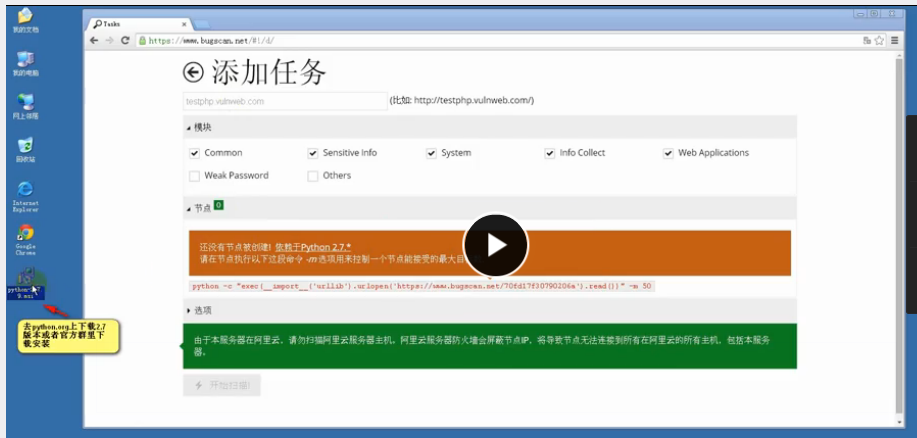
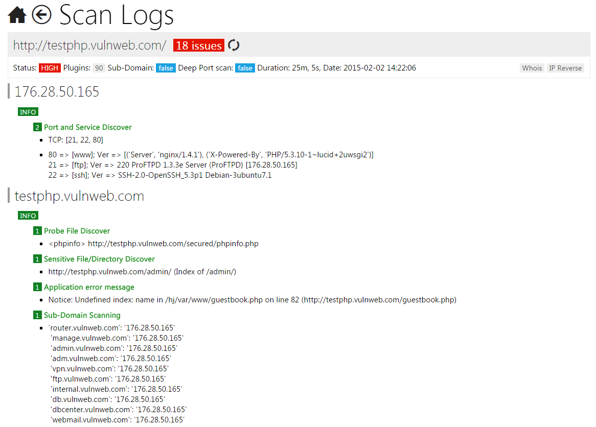

# BugScan具体使用方法  
-----  
### 说明：   
现在新版的扫描平台已经内测结束，并关闭了访问。
[旧版的bugscan平台](https://old.bugscan.net/#!/)目前只支持社区内的2级以上且有60积分的用户使用，我还没达到。。   
### 使用流程   
BugScan的社区支持用户上传基于Python和利用提供的SDK编写的脚本插件，并且用户可以决定公开或作为私人插件使用。   
用户提交的插件，会有专人来审核，并决定是否上线到扫描器上。  

用户登录后创建任务 
  
Python 中运行给定的命令用于创建扫描器的节点  
   

命令实现的是python运行http远程的会话访问并获取数据（正因为如此，BugScan支持跨平台） 
填入目标的URL，该任务的就是对指定的URL的服务器进行扫描，并出具报告。   
并且支持设置扫描的个性化参数(如扫描漏洞的不同类型等)   
  
该节点任务会进入到队列中进行等待，之后状态会变为"爬行"状态。  
   
扫描结束后就可以查看扫描报告，获取网站漏洞的相关信息  
### 总结  
BugScan 扫描器实际上是用户在本地创建节点，设置任务，发送http请求给远端的服务器，服务器中集成了扫描器，服务器进行扫描，并将扫描的状态结果等通过Python或网页进行返回供用户阅读。  
这样既做到了跨平台，支持用户的自定义扫描插件，并且也可以对用户的扫描行为等有一定的监管作用。  

### 参考   
[旧版平台帮助说明](https://old.bugscan.net/#!/h/)