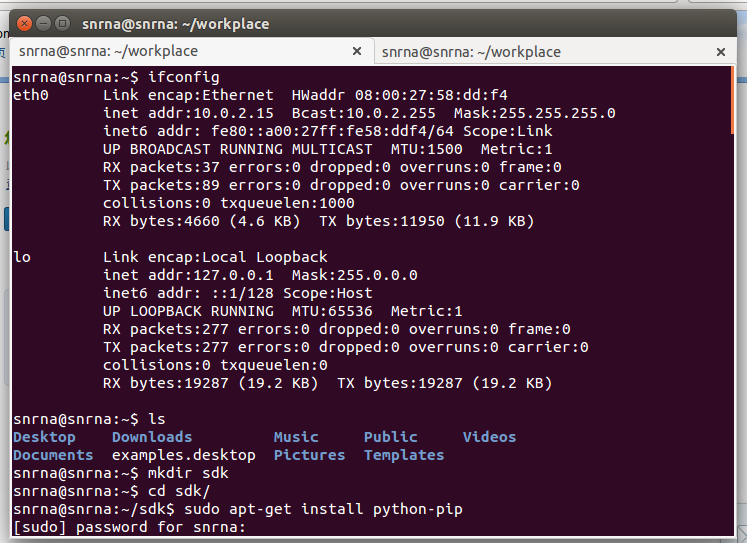
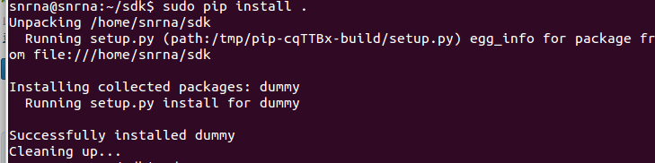
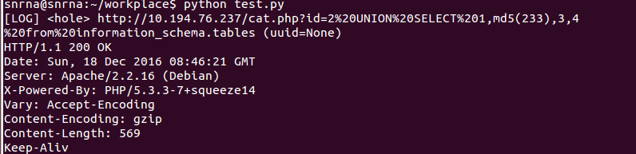

# BugScan 扫描器开发漏洞插件   
----   
#### BugScan   
[BugScan](http://www.bugscan.net/) 是西安四叶草信息技术有限公司旗下 BugScan 社区出品的国内首款基于社区的分布式漏洞扫描框架。   
基于Python实现引擎，插件支持用户自定义，可以对扫描对象进行精准的扫描   
## 安装过程  
   
#### 环境  
- Virtualbox  
- ubuntu-14.04-LTS-desktop-64bits(内装有Python2.7.x)  
  
1.下载安装SDK     
>sudo apt-get install python-pip   
>便于后来的安装   
  

官网下载SDK的zip压缩包然后解压缩。   
进入SDK目录，执行  
>sudo pip install .    
  
   
在Python解释环境中 通过 from dummy import * 查看是否安装成功。    
2.插件的编写  
首先编写的是针对pentesterlab的from sql to shell 的SQL注入检测的插件  
代码见[test.py](test.py)  
执行后的结果：
