# HTTPS协议中间人攻击的可能性探究与实验 

__——以攻击为导向的探究与学习__

回顾[2003年黑帽大会](https://www.blackhat.com/presentations/bh-europe-03/bh-europe-03-valleri.pdf)相关演讲内容，先来看看经典的中间人攻击(MITM):

- MITM - Different attacks in different scenarios: 

  - LOCAL AREA NETWORK: 

      - ARP poisoning 
      - DNS spoofing 
      - STP mangling 
      - Port stealing

  - FROM LOCAL TO REMOTE (through a gateway): 

      - ARP poisoning 
      - DNS spoofing 
      - DHCP spoofing 
      - ICMP redirection 
      - IRDP spoofing 
      - route mangling 

  - REMOTE: 

      - DNS poisoning 
      - traffic tunneling
      - route mangling

SSL/TLS机制的出现，使得上述中间人攻击得到有效的遏制。
（然而IE用户仍然暴露在简单中间人攻击的威胁下，因为IE浏览器从Windows10起支持HSTS）

但安全对抗从未停止，MITM已经演化出针对SSL的中间人攻击。
ARP欺骗和DNS泄露是实现此类攻击的前提，即获知请求发送者的IP地址。
此外，还提供了其他获取IP的方法，供参考。

详情描述如下：

###DNS查询泄漏（经由DNS解析服务器）与MITM

在某些情况下，即使连接到 VPN，操作系统仍然继续使用其默认的 DNS 服务器（比如在本地解析），导致DNS泄露。

Click it. -> [DNS泄露在线测试](https://www.dnsleaktest.com/) 

DNS查询泄露漏洞存在的主要场景及其解决方案：

1. ZoneTransfer域传送漏洞 - DNS服务器的主备数据同所使用的功能

    详见tjy组翻转课堂。

2. 互联网服务提供商(ISP)给虚拟专用网络(VPN)用户挖坑

    通常情况下，DNS服务器由ISP提供。与此同时，ISP使用透明DNS代理技术，拦截所有DNS查询请求(TCP/UDP端口53)，有效地迫使用户使用他们的 DNS 服务器进行所有的 DNS 查找。这意味着他们可以监控、记录任何该用户发送到服务器的请求。
    
    为了躲避这种监控，用户使用VPN，DNS请求本应该通过VPN被定向到一个匿名的DNS服务器，防止ISP监视此次网络连接。不幸的是，有时用户的浏览器会忽视打开的VPN，并会直接发送DNS请求到ISP。这就是一个DNS泄漏。这会导致用户认为自己实现了匿名通信，但事实上通信数据并不会得到保护。
    
    另外一种类似的情况是，VPN用户开启PAC模式，而非全局模式。这种情况下，浏览器需要先发送DNS请求到本地DNS服务器，即ISP提供的DNS服务器，然后再判断是否通过VPN进行通信。
    
    * 针对VPN的解决方案：
    
      *  使用 VPN 服务商提供的 DNS 服务器，包括使用DNSCrypt加密DNS传输。防止原生ISP或者hacker截获DNS查询请求。
      * 更改默认的DNS服务器。
      * 使用带有DNS泄漏保护功能的VPN。
      * 使用VPN监控软件，某些VPN监控软件还可以修复DNS泄漏。 
      * 禁用Teredo，IPv4和IPv6之间的转换可能会引起DNS泄漏。

* 参考链接：[当DNS泄漏让VPN不再安全，我们该怎么办？](http://www.freebuf.com/articles/network/67591.html) 

__DNS查询泄露造成的后果 --> 基于DNS欺骗的数据重定向__  
泄露域名服务器的IP地址或者关联网址，为hacker实现DNS spoofing制造机会。也就是说当hacker悉知网络层的通信规则，就可以从链路层进行中间人攻击。

相关知识拓展：

* DNS污染

  - DNS劫持就是指用户访问一个被标记的地址时，DNS服务器故意将此地址指向一个错误的IP地址的行为。
  - 网通、电信、铁通的某些用户有时候会发现自己打算访问一个地址，却被转向了各种推送广告等网站，这就是DNS劫持。

* DNS劫持

  - DNS污染，指的是用户访问一个地址，国内的服务器(非DNS)监控到用户访问的已经被标记地址时，服务器伪装成DNS服务器向用户发回错误的地址的行为。
  - 访问Youtube、Facebook之类网站等出现的状况。

More>> [Crippling HTTPS with unholy PAC](https://www.blackhat.com/docs/us-16/materials/us-16-Kotler-Crippling-HTTPS-With-Unholy-PAC.pdf)

###ARP欺骗与MITM

最初，攻击者只要将网卡设为混杂模式，伪装成代理服务器监听特定的流量就可以实现攻击，这是因为很多通信协议都是以明文来进行传输的，如HTTP、FTP、Telnet等。后来，随着交换机代替集线器，简单的嗅探攻击已经不能成功，必须先进行ARP欺骗才行。

__基于ARP欺骗的数据重定向__ 

实际操作命令：

1. 开启端口转发，（攻击者）允许本机像路由器那样转发数据包

    > echo 1 > /proc/sys/net/ipv4/ip_forward

2. ARP投毒，向主机XP（10.23.0.4）声称自己(攻击者)就是网关Ubuntu（10.23.0.5） 

    > arpspoof -i eth0 -t 10.23.2.4 10.23.2.5

3. ARP投毒，向网关Ubuntu声称自己(攻击者)就是XP 

    > arpspoof -i eth0 -t 10.23.2.5 10.23.2.4

* 注意: 当hacker停止投毒时，arpspoof将进行“clean up and re-arping”，发送正确的目的物理地址。  

__端口重定向__

端口重定向接收到一个端口数据包的过程（如80端口），并且重定向它的流量到不同的端口（如8080）。实现这类型攻击的好处就是可以无止境的，因为可以随着它重定向安全的端口到未加密端口，重定向流量到指定设备的一个特定端口上。

具体操作步骤如下：

1. 开启路由转发攻击。执行命令如下所示：

    > echo 1 > /proc/sys/net/ipv4/ip_forward

2. 启动Arpspoof工具注入流量到默认网络。例如，默认网关地址为10.32.2.1。执行命令如下：

    > arpspoof -i eth0 10.23.2.1

3. 添加一条端口重定向的防火墙规则。执行命令如下所示：
 
    > iptables -t nat -A PREROUTING -p tcp --destination-port 80 -j REDIRECT --to-port 8080

* 执行以上命令后，没有任何输出。

以上设置成功后，当用户向网关10.23.2.1的80端口发送请求时，将会被转发为8080端口发送到攻击者主机上。

# SSL协议回顾

* [https连接的前几毫秒发生了什么?](http://yincheng.site/https)

# 针对SSL协议的中间人攻击

	中间人攻击实施路线： 流量劫持 -> SSL嗅探 -> 会话劫持 -> 获取秘密信息

https握手过程的证书校验环节就是为了识别证书的有效性唯一性等等，所以严格意义上来说https下不存在中间人攻击，存在中间人攻击的前提条件是没有严格的对证书进行校验，或者人为的信任伪造证书。

- 存在中间人攻击原因：
    - 证书未校验（客户端没有做任何的证书校验 对应3）
    - 部分校验（例如在证书校验过程中只做了证书域名是否匹配的校验，可以使用burp的如下模块生成任意域名的伪造证书进行中间人攻击）
    - 证书链校验（人为的信任伪造的证书或者安装伪造的CA公钥证书从而间接信任伪造的证书 对应1、2、4）  

* 参考链接：[浅析HTTPS中间人攻击与证书校验](www.evil0x.com/posts/26569.html)  

针对SSL，中间人攻击只可能发生在SSL的前提条件被破坏的时候，以下是一些示例：

1. 服务器私钥被盗取 - 意味着攻击者能够冒充服务器，而客户端并不知情。  
2. 客户端置信于不可靠的CA（或者主密钥被盗取）- 无论谁获取了真实、可信的CA的私钥，他都可以生成证书从而冒充服务器，骗取客户端的信任。这就意味着，当服务器证书更换为另一个合法证书，浏览器并不会告知客户这件“小”事。  
3. 客户端不与可信CA确认合法证书列表。  
4. 客户端被攻击，假CA被写入客户的可信CA列表。假冒的CA可以为不可信的服务器签名。

参考链接：[Answer: SSL and man-in-the-middle misunderstanding - Stack Overflow](http://stackoverflow.com/questions/14907581/ssl-and-man-in-the-middle-misunderstanding)

## 利用伪造的X.509证书（SSL劫持）

这种类型的SSL会话劫持成功的必要条件如下：
  
  * 能够通过ARP欺骗、DNS欺骗或者浏览器数据重定向等欺骗技术，使得SSL客户端C和服务端之间的数据都流向中间人监测主机；
  * SSL客户端在接收到伪造的X.509证书后，用户选择信任该证书，并继续SSL连接；
  * SSL服务端未要求对SSL客户端进行认证。

攻击基本原理：

1. 攻击者对目标客户端和网关发送ARP投毒攻击，污染它们的ARP缓存表。
2. 客户端在浏览器中输入 "https://mail.google.com/" 的网址，浏览器会尝试和 "https://mail.google.com/" 的443端口建立SSL连接，但是因为客户端受到了ARP投毒攻击，原本发往网关的数据包被发往了攻击者的主机。
3. 攻击者在本机使用iptables将接收到的443目的端口的数据包重定向到本机的IP地址。
4. 这样，受攻击者客户端的浏览器就只会和攻击者主机进行SSL连接。
5. 攻击者在本机使用监听443端口，并且伪造一个假的SSL证书，用于和客户端的连接，同时，提取客户端发送的数据包的原始目的IP地址，用于和客户端原始请求的服务器建立另一个SSL连接。
6. 中间人攻击者在双向的SSL Socket通信都建立完成后，对两边的socket进行数据读写同步，将数据通道打通，使客户端的浏览器能够正常访问(受攻击者不会察觉到已经收到SSL中间人攻击)
7. 在数据同步的同时，记录下明文数据，达到SSL中间人攻击的目的。

参考链接：

* [中间人攻击(MITM)姿势总结](http://www.cnblogs.com/LittleHann/p/3735602.html)
* [通过伪造CA证书，实现SSL中间人攻击](http://blog.sina.com.cn/s/blog_4a898cfb0100t8j7.html)

###  SSLsniff

Using a tool maded by [Moxie Marlinspike](https://moxie.org/). <-The man hacked the world! ( • ω ⁃᷄)✧

It supports many kinds of attacks, such as the [Null Prefix Attacks](https://moxie.org/papers/null-prefix-attacks.pdf), the [OCSP attacks](https://moxie.org/papers/ocsp-attack.pdf) and something else.

### 利用代理服务器Burpsuite进行SSL劫持    
  
参考链接：[Burp Suite抓HTTPS数据包](http://blog.csdn.net/zyw_anquan/article/details/47904495)

1. 设置firefox，手动配置代理
Preferences -> Advanced -> Settings -> Manual proxy configuration

2. 运行BurpSuite,用firefox浏览器访问http://burp,点击CA Certificate下载burp的内置证书。

3. 将证书导入Firefox，Burp Suite被视为可信任的根，成为用户浏览器访问HTTPS网站的代理，达到监视双方（客户端与服务器端）通信过程的目的。

### mitmproxy (Transparent Proxying)
[How To: Use mitmproxy to read and modify HTTPS traffic](https://blog.heckel.xyz/2013/07/01/how-to-use-mitmproxy-to-read-and-modify-https-traffic-of-your-phone/#How-it-works)

* 局限：不能理解其他基于TLS/SSL的流量，比如FTPS, SMTP over SSL, IMAP over SSL等。

### SSLsplit  
[工具](https://github.com/droe/sslsplit)  
[English](https://blog.heckel.xyz/2013/08/04/use-sslsplit-to-transparently-sniff-tls-ssl-connections/#Sniffing-HTTPS-google-de-and-facebook-com)  
[中文](http://zhiwei.li/text/2015/08/16/%e7%94%a8sslsplit%e5%88%86%e6%9e%90ssl%e8%bf%9e%e6%8e%a5-%e5%8c%85%e6%8b%ac%e9%9d%9ehttps%e5%8d%8f%e8%ae%ae/)

如同上述方法。

## 利用HTTP与HTTPS之间跳转的验证漏洞 （SSL卸载）

这种类型的SSL会话劫持成功的必要条件如下：
  
  * 能够通过ARP欺骗、DNS欺骗或者浏览器数据重定向等欺骗技术，使得SSL客户端和服务端之间的数据都流向中间人监测主机； 
  * 客户端访问的Web页面存在http页面至https页面的跳转；
  * SSL服务端未要求对SSL客户端进行认证。

### SSLStrip与HSTS的编年史

Moxie Marlinspike 在Black Hat DC在2009年发布了他的工具SSLStrip。SSLStrip通过拦截受害者和路由器之间的请求（ARP欺骗)，用HTTP替换HTTPS请求，以便攻击者能够嗅闻到用户认为是加密的流量。

[New Tricks For Defeating SSL In Practice](https://www.blackhat.com/presentations/bh-dc-09/Marlinspike/BlackHat-DC-09-Marlinspike-Defeating-SSL.pdf) by Moxie Marlinspike

    Something must be wrong, but...

        All the signatures are valid. 
        Nothing has expired. 
        The chain is in tact. 
        The root CA is embedded in the browser and trusted.

SSLstrip使用了社会工程学的原理：为了图方便省事，用户很少直接在地址栏输入https://，用户总是通过点击链接或3xx重定向，从HTTP页面进入HTTPS页面。所以攻击者可以在用户访问HTTP页面时替换所有https://开头的链接为http://，达到阻止HTTPS的目的。

- 如何替换？ 
    - XSS前端劫持

SSL卸载攻击的效果优于证书伪造的攻击方法，因为服务器端看不出任何分别，客户端也不会接收到弹框警告（BetterCap实验可见攻击效果）。

为了对抗上述攻击方法，大多数浏览器引入了“HTTP严格传输安全”（HSTS）安全策略机制。用户曾经访问过的页面将在浏览器注册登记为安全页面，并强制使用HTTPS协议。因此用户未曾访问过的页面或网站，才会面临SSL卸载攻击的威胁。

  > HTTP严格传输安全（HSTS）是一种Web安全策略机制，有助于保护网站免受协议降级攻击和Cookie劫持。 它允许Web服务器声明Web浏览器（或其他合规用户代理）应该只使用安全的HTTPS连接，而不是通过不安全的HTTP协议与它交互。HSTS的作用是强制客户端（如浏览器）使用HTTPS与服务器建立连接。也就是说，当客户端通过HTTPS发出请求时，在服务器返回的超文本传输协议响应头中包含Strict-Transport-Security字段。

2014年，Leonardo Nve	Egea发布了SSLStrip2，用降级攻击绕开HSTS。原始的攻击性工具SSLStrip2和dns2proxy的源码不再公开，其功能集成到MITMf、BetterCap等渗透测试框架下。

  > 通常情况下，HSTS规则在是基于每个主机名应用的，攻击的诀窍是将HTTPS链接降级为HTTP，并在其前面添加一些自定义子域名。 每个生成的链接将不会对任何DNS服务器有效，但攻击者可以解析这些主机名。  

[OFFENSIVE:Exploiting changes on DNS server configuration](https://www.blackhat.com/docs/asia-14/materials/Nve/Asia-14-Nve-Offensive-Exploiting-DNS-Servers-Changes.pdf) by Leonardo Nve	Egea

__HTTPS前端劫持__

* [Content Security Policy](http://www.ruanyifeng.com/blog/2016/09/csp.html)

  * X-WebKit-CSP 
  * X-Content-Security-Policy
  * Content-Security-Policy  

若采用HTTP，攻击者就可以去除头部的字段，应该配合HTTPS使用。

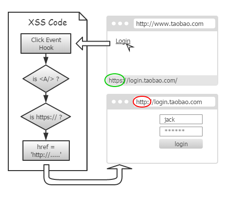

- 前端劫持的方法

   - 替换动态链接  

   - 表单提交  
    
        将click换成submit，href换成action。  

   - 框架页面
    
        页面框架是自动加载的，而且也没有一个即将加载的事件。因此，框架一出现，攻击者必须立即替换掉地址。

        HTML5中的MutationEvent可以实时监控页面元素，当攻击者再代理返回头中，加上如下HTTP 头部，就可以拦截 https 框架页了：

            Content-Security-Policy: default-src * data 'unsafe-inline' 'unsafe-eval'; frame-src http://*

...

- 防御方法：[__XSS前端防火墙__](http://fex.baidu.com/blog/2014/06/xss-frontend-firewall-1/)

- 后端配合
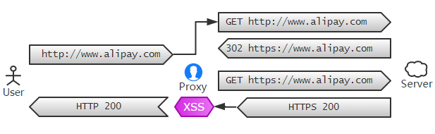

参考链接：[SSLStrip 的未来——HTTPS 前端劫持](http://div.io/topic/747)

### 用于绕过HSTS的工具

* MITMf框架(参见 拓展实验1.md)(https://github.com/cuczj/ns/blob/master/2016-2/zzj_cay/TASK.Exploration_and_experiments_on_SSL_MITM_attacks/%E6%8B%93%E5%B1%95%E5%AE%9E%E9%AA%8C1.md)

* BetterCap(参见 拓展实验2.md)

* cachEraser

* 其他工具

  * ettercap
  * Wifi-Pumpkin
  * Pythem
  * BURP + Tor Browser
  

### SSLStrip的防御方法 

1. 对于网站来说，在配置HTTPS服务的时候加上“HTTP Strict Transport Security”配置项；或者是在代码中将所有HTTP的请求强制转移到HTTPS上，使用URL REWRITE也可以达到同样的效果。   

    HSTS很大程度上解决了上述两种针对SSL的中间人攻击。

    如果中间人hacker使用自己的自签名证书来进行攻击，浏览器会给出警告，但是许多用户会忽略警告。HSTS也解决了这一问题，一旦服务器发送了HSTS字段，用户将不再允许忽略警告。只要浏览器曾经与服务器建立过一次安全连接，之后浏览器会强制使用HTTPS，即使链接被换成了HTTP。

2. 对于关键的信息，例如用户登录网站的ID和密码，在发送之前先用JavaScript进行一次加密处理，这种方法不但是对SSLStrip有效，对SSL劫持攻击也有效，甚至是即便使用HTTP协议来传输用户登录的ID和密码都是安全的。  

3. 对于用户来说，在访问支持HTTPS的网站时，输入URL加上“https://”。大多数用户平时并不会注意这点，比如访问gmail，我们一般就输入“gmail.com”，如果是输入“https://gmail.com”就可以避免SSLStrip的攻击。对于使用脚本实现地址跳转也需要注意这个问题，location.href之后的URL，一定要强制加上“https://”。

防御SSLStrip攻击比较简单，大多数的网站都已经做好了安全方面的配置，但也有少数的网站仍然没有重视这个问题。（MITMf和BetterCap实验中，测试网站都做了较好的防御）

## HTTPS向下降级攻击

SSL/TLS协议通过握手来确定通信信息，其中握手双方要统一加密协议版本。  

在握手过程中这样确认加密协议版本：  

1. 由客户端（如浏览器）发送第一个数据包 ClientHello，这个数据包中保存着客户端支持的加密协议版本。
2. 服务器收到这个ClientHello数据包，查看里面客户端支持的加密协议版本，然后匹配服务器自己支持的加密协议版本，从而确认双方应该用的加密协议版本。
3. 服务器发送ServerHello数据包给客户端，告诉客户端要使用什么加密协议版本。  

在上述过程中，如果客户端发送给服务器的ClientHello数据包中说自己仅支持某个有漏洞的旧版本加密协议（比如仅支持SSLv3.0）,服务器有两种可能：  

* 服务器支持很多版本，其中包括有漏洞的旧版本和新版本（包括了SSLv3.0协议），那么服务器会认可使用有漏洞的旧版本协议，从而告诉客户端使用有漏洞的旧版本（可以使用SSLv3.0）。
* 服务器不支持有漏洞的旧版本，拒绝客户端的这次请求，握手失败。  

对于攻击者，作为中间人只能监听到加密过的数据，如果这些数据通过没有漏洞的加密版本加密，攻击者并不能做什么。但是，如果服务器提供有漏洞的旧版本加密协议的支持，而同时攻击者又能作为中间人控制被攻击者的浏览器发起漏洞版本的HTTPS请求，那虽然攻击者监听到的也是加密过的数据，但因为加密协议有漏洞，可以解密这些数据，所以数据就和明文传输没有什么差别了。
  
这就是HTTPS协议降级。

### 两个栗子：带漏洞的旧版本 

#### 1. SSL V3.0 "Poodle" Vulnerability

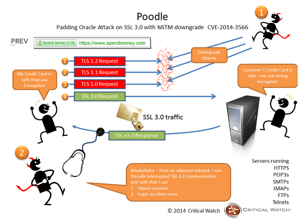

Poodle Attack (Padding Oracle On Downgraded Legacy Encryption)    [Paper](https://www.openssl.org/~bodo/ssl-poodle.pdf)

    +--------------------+         +---------------------+          +--------------------+
    |     - Client -     +-------> |       - Proxy -     +--------> |    -  Server -     |
    |   sends requests   |         |       intercept     |          |       Oracle       |
    |                    | <-------+ read server response| <--------+                    |
    +--------------------+         +-----+--------+------+          +--------------------+
               ^                         |        |                               
               |                         |        |                               
               |                   +-----v--------+------+                        
               +--------+----------+     - Attacker -    |
                                   |   alter, decipher   |                        
               inject javascript   +---------------------+ 

在这个攻击模型中，攻击者可以请求客户端生成一个包含cookie的请求到一个安全的服务器。 在实际情况下，可以通过将一些javascript注入客户端访问的网页来完成。 攻击者还可以更改客户端关于代理拦截的请求，利用了SSLv3消息的不确定填充机制解密客户端请求。

[原理与实验参考](http://www.freebuf.com/articles/web/15504.html)

在CBC模式中，每一个block有一个初始化向量IV(这个IV在服务器第一次生成这个密文的时候就产生了，并保存在服务器上，攻击者提交数据的时候也需要这个IV，攻击者的攻击行为实际上就是在”穷举”这个IV）。攻击者通过不断的修改IV来对目标解密系统进行”试探”，从返回的结果(padding)来进行”侧信道攻击”，从而进行二值逻辑推理。

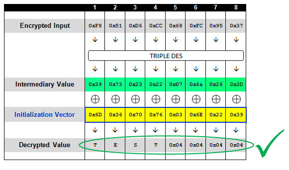

一旦我们通过暴力破解得到中间值Intermediary Value之后，IV便可以用来生成我们想要的任意值。新的IV可以被放在前一个示例的前面，这样便可以得到一个符合我们要求的，包含两个数据块的密文了。这个过程可以不断重复，这样便能生成任意长度的数据了。

__POODLE test 1__  

Result of POODLE_Demo.py

	C:\Python27\python.exe C:/MyPath/Poodle_Demo.py
	=== Padding Oracle Attack POC(CBC-MODE) ===
	=== by axis ===
	=== axis@ph4nt0m.org ===
	=== 2011.9 ===
	=== Generate Target Ciphertext ===
	[+] plaintext is: aaaaaaaaaaaaX
	[+] iv is: \x31\x32\x33\x34\x35\x36\x37\x38\x31\x32\x33\x34\x35\x36\x37\x38
	[+] ciphertext is: \x29\x2f\x71\x22\x52\x46\x41\xff\x18\x15\xe1\x18\x1c\x4a\xab\x1e
	=== Start Padding Oracle Decrypt ===
	[+] Choosing Cipher: AES
	[*] Now try to decrypt block 0
	[*] Block 0's ciphertext is: \x29\x2f\x71\x22\x52\x46\x41\xff\x18\x15\xe1\x18\x1c\x4a\xab\x1e
	
	[*] Try IV: \x00\x00\x00\x00\x00\x00\x00\x00\x00\x00\x00\x00\x00\x00\x00\x3a
	[*] Found padding oracle: \x50\x53\x52\x55\x54\x57\x56\x59\x50\x53\x52\x55\x6d\x35\x34\x01
	[*] Try IV: \x00\x00\x00\x00\x00\x00\x00\x00\x00\x00\x00\x00\x00\x00\x36\x39
	[*] Found padding oracle: \x50\x53\x52\x55\x54\x57\x56\x59\x50\x53\x52\x55\x6d\x35\x02\x02
	[*] Try IV: \x00\x00\x00\x00\x00\x00\x00\x00\x00\x00\x00\x00\x00\x36\x37\x38
	[*] Found padding oracle: \x50\x53\x52\x55\x54\x57\x56\x59\x50\x53\x52\x55\x6d\x03\x03\x03
	[*] Try IV: \x00\x00\x00\x00\x00\x00\x00\x00\x00\x00\x00\x00\x69\x31\x30\x3f
	[*] Found padding oracle: \x50\x53\x52\x55\x54\x57\x56\x59\x50\x53\x52\x55\x04\x04\x04\x04
	[*] Try IV: \x00\x00\x00\x00\x00\x00\x00\x00\x00\x00\x00\x50\x68\x30\x31\x3e
	[*] Found padding oracle: \x50\x53\x52\x55\x54\x57\x56\x59\x50\x53\x52\x05\x05\x05\x05\x05
	[*] Try IV: \x00\x00\x00\x00\x00\x00\x00\x00\x00\x00\x54\x53\x6b\x33\x32\x3d
	[*] Found padding oracle: \x50\x53\x52\x55\x54\x57\x56\x59\x50\x53\x06\x06\x06\x06\x06\x06
	[*] Try IV: \x00\x00\x00\x00\x00\x00\x00\x00\x00\x54\x55\x52\x6a\x32\x33\x3c
	[*] Found padding oracle: \x50\x53\x52\x55\x54\x57\x56\x59\x50\x07\x07\x07\x07\x07\x07\x07
	[*] Try IV: \x00\x00\x00\x00\x00\x00\x00\x00\x58\x5b\x5a\x5d\x65\x3d\x3c\x33
	[*] Found padding oracle: \x50\x53\x52\x55\x54\x57\x56\x59\x08\x08\x08\x08\x08\x08\x08\x08
	[*] Try IV: \x00\x00\x00\x00\x00\x00\x00\x50\x59\x5a\x5b\x5c\x64\x3c\x3d\x32
	[*] Found padding oracle: \x50\x53\x52\x55\x54\x57\x56\x09\x09\x09\x09\x09\x09\x09\x09\x09
	[*] Try IV: \x00\x00\x00\x00\x00\x00\x5c\x53\x5a\x59\x58\x5f\x67\x3f\x3e\x31
	[*] Found padding oracle: \x50\x53\x52\x55\x54\x57\x0a\x0a\x0a\x0a\x0a\x0a\x0a\x0a\x0a\x0a
	[*] Try IV: \x00\x00\x00\x00\x00\x5c\x5d\x52\x5b\x58\x59\x5e\x66\x3e\x3f\x30
	[*] Found padding oracle: \x50\x53\x52\x55\x54\x0b\x0b\x0b\x0b\x0b\x0b\x0b\x0b\x0b\x0b\x0b
	[*] Try IV: \x00\x00\x00\x00\x58\x5b\x5a\x55\x5c\x5f\x5e\x59\x61\x39\x38\x37
	[*] Found padding oracle: \x50\x53\x52\x55\x0c\x0c\x0c\x0c\x0c\x0c\x0c\x0c\x0c\x0c\x0c\x0c
	[*] Try IV: \x00\x00\x00\x58\x59\x5a\x5b\x54\x5d\x5e\x5f\x58\x60\x38\x39\x36
	[*] Found padding oracle: \x50\x53\x52\x0d\x0d\x0d\x0d\x0d\x0d\x0d\x0d\x0d\x0d\x0d\x0d\x0d
	[*] Try IV: \x00\x00\x5c\x5b\x5a\x59\x58\x57\x5e\x5d\x5c\x5b\x63\x3b\x3a\x35
	[*] Found padding oracle: \x50\x53\x0e\x0e\x0e\x0e\x0e\x0e\x0e\x0e\x0e\x0e\x0e\x0e\x0e\x0e
	[*] Try IV: \x00\x5c\x5d\x5a\x5b\x58\x59\x56\x5f\x5c\x5d\x5a\x62\x3a\x3b\x34
	[*] Found padding oracle: \x50\x0f\x0f\x0f\x0f\x0f\x0f\x0f\x0f\x0f\x0f\x0f\x0f\x0f\x0f\x0f
	[*] Try IV: \x40\x43\x42\x45\x44\x47\x46\x49\x40\x43\x42\x45\x7d\x25\x24\x2b
	[*] Found padding oracle: \x10\x10\x10\x10\x10\x10\x10\x10\x10\x10\x10\x10\x10\x10\x10\x10
	[+] Block 0 decrypt!
	[+] intermediary value is: \x50\x53\x52\x55\x54\x57\x56\x59\x50\x53\x52\x55\x6d\x35\x34\x3b
	[+] The plaintext of block 0 is: aaaaaaaaaaaaX
	
	[+] Guess intermediary value is: \x50\x53\x52\x55\x54\x57\x56\x59\x50\x53\x52\x55\x6d\x35\x34\x3b
	[+] plaintext = intermediary_value XOR original_IV
	[+] Guess plaintext is: aaaaaaaaaaaaX
	=== Start Padding Oracle Encrypt ===
	[+] plaintext want to encrypt is: opaas
	[+] Choosing Cipher: AES
	[*] After padding, plaintext becomes to: \x6f\x70\x61\x61\x73\x0b\x0b\x0b\x0b\x0b\x0b\x0b\x0b\x0b\x0b\x0b
	[+] Encrypt Success!
	[+] The ciphertext you want is: \x29\x2f\x71\x22\x52\x46\x41\xff\x18\x15\xe1\x18\x1c\x4a\xab\x1e
	[+] IV is: \x3f\x23\x33\x34\x27\x5c\x5d\x52\x5b\x58\x59\x5e\x66\x3e\x3f\x30
	=== Let's verify the custom encrypt result ===
	[+] Decrypt of ciphertext '\x29\x2f\x71\x22\x52\x46\x41\xff\x18\x15\xe1\x18\x1c\x4a\xab\x1e' is:
	opaas
	[+] Bingo!
	
	Process finished with exit code 0

__POODLE test 2__

获取用户cookie

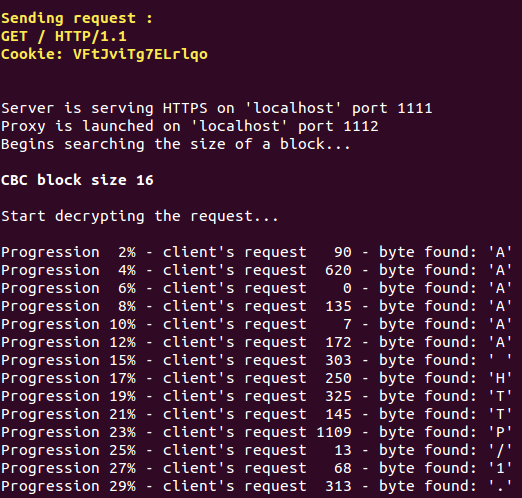
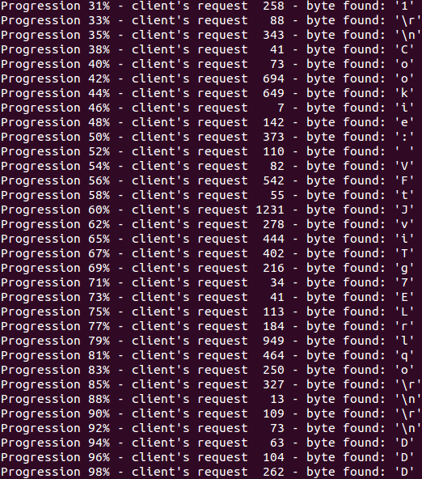
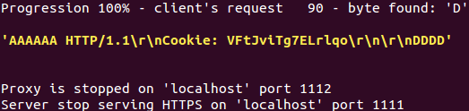  

ref: [kostyll/poodle-exploit - Github](https://github.com/kostyll/poodle-exploit)

#### 解决方法

目前解决该问题可以禁用 SSL3.0 ，或者 SSL 3.0 中使用的CBC模式加密，但是有可能造成兼容性问题。最新版本的 openssl 建议支持 TLS_FALLBACK_SCSV ，这可以解决重试连接失败的问题，从而防止攻击者强制浏览器使用 SSL 3.0。 它还可以防止降级到 TLS 1.2 至 1.1 或 1.0，可能有助于防止未来的攻击。  

__服务器的禁用方法__  

以Nginx为例，原先的配置如下（隐性默认是SSLv3 TLSv1 TLSv1.1 TLSv1.2）。
      
    ssl_protocols SSLv3 TLSv1 TLSv1.1 TLSv1.2;

要禁用SSL 3.0，改成这样即可。
 
    ssl_protocols TLSv1 TLSv1.1 TLSv1.2;

参考链接：[Nginx Configuration - Github](https://github.com/trevorparker/website/blob/9121ba44e3110535627021e93a81d6cf51a36b23/_source/_posts/2014-05-14-hardening-ssl-in-nginx.md#stronger-ciphers)

__客户端的禁用方法__

1. IE/360安全浏览器
 
    点击浏览器右上角的“工具”选项，选择“Internet选项”，选择“高级”，找到“使用SSL3.0”的设置，将方框里的“勾”去掉，点击“确定”保存。 

2. Chrome浏览器

    Windows系统用户设置方法：  
    
    完全关闭 Chrome 浏览器，复制一个平时打开 Chrome 浏览器的快捷方式，在新的快捷方式上右键点击，进入属性，在“目标”后面的空格中字段的末尾输入以下命令 --ssl-version-min=tls1  

	Mac OS X系统用户设置方法：  

	完全关闭 Chrome 浏览器，找到本机自带的终端（Terminal），输入以下命令：/Applications/Google\ Chrome.app/Contents/MacOS/Google\ Chrome --ssl-version-min=tls1

	Linux系统用户设置方法：
	
	完全关闭 Chrome 浏览器，在终端中输入以下命令：google-chrome—ssl-version-min=tls1

3. Firefox 浏览器  

	用户可以进入“关于:设置”，方法是在地址栏输入 about:config，然后将 security.tls.version.min 调至 1。

考虑到老版本浏览器（如IE6）的默认设置为SSLv3协议，如果直接禁用SSLv3协议，将导致这批采用默认设置的用户无法访问对应网站，可以采用通过修改WebServer的SSL配置来修复这个问题，配置实现的效果是客户端通过SSLv3协议访问https业务时双方使用RC4-SHA加密，而采用TLS1.0或更高版本协议时优先使用其他强加密算法。 配合HSTS效果更佳。

#### 2. FREAK( Factoring RSA Export Keys ) Vulnerability

	攻击过程：
		1.在客户端发出的Hello消息中，它会请求标准的RSA加密  
		2.中间人攻击者会改变请求内容，转而请求“出口级的RSA加密”（出口级RSA加密被成为“加密体系的后门”）
		3.服务端会回馈一个512比特位的出口级的RSA密钥，并使用自己的密钥签名
		4.由于OpenSSL/Secure传输的bug，客户端会接受这个存在漏洞的密钥
		5.黑客通过分析RSA模量还原相应的RSA密钥
		6.当客户端加密“pre-master secret”这样的消息，并发送给服务端时，黑客便可以通过获得的RSA密钥解密，改为“master secret”
		7.从这一步起，黑客可以看见明文，然后对其内容任意进行修改

FREAK与POODLE这两个漏洞有一定的相似性——POODLE是利用安全套件进行降级回退攻击，强迫终端使用低版本SSL/TLS；而FREAK则只影响那些使用出口级RSA加密算法的版本。虽然原理都是寻找木桶短板，但是可以把FREAK攻击归为第三类攻击。解决的方法是禁用对出口级套件的支持，包括所有已知的不安全加密机制。

 > 所谓第三类攻击，完全就是软件厂商在软件的设计过程中忽略的了安全的问题。这是一种普遍存在的情况，程序的bug、漏洞，设计缺陷，都会打破一些安全模型。

Read more >> [“FREAK SSL Attack”(CVE-2015-0204)](http://blog.nsfocus.net/freak-ssl-attack%E7%A7%91%E6%99%AE%E7%89%88cve-2015-0204/)

## 利用“合法”证书进行中间人攻击

### 安全事件

[荷兰CA DigiNotar因服务器被黑失去信任而宣告破产](http://www.jianshu.com/p/11aefe4eff9f)

[利用合法证书签名的恶意软件攻陷俄罗斯金融企业](http://www.freebuf.com/news/63619.html)

### 公用证书的危害

[GoAgent漏洞可能导致中间人攻击](http://www.freebuf.com/vuls/35936.html)

如果导入 GoAgent 、铁道部 12306.cn 这种第三方CA的根证书，将会大大增加受到中间人攻击的可能性。如果GoAgent私钥泄露，所有Goagent用户都有遭到中间人攻击的可能性。
而铁道部的根证书更危险，铁道部的私钥必然对 LD 是公开的，GFW完全有能力通过铁道部的私钥来实现对所有导入了铁道部 CA 根证书的用户的中间人攻击，让你的HTTPS加密流量完全暴露给GFW。正确的做法是，不导入根证书，访问 12306 购票时候，无视证书警告，点仍然继续，依然可以正常购票，且不影响购票的安全性。

各大银行的CA证书、支付宝亦是同理。这些网站验证证书时候均使用了插件，那既然如此使用插件自己读取自己的证书即可，本大可不必将根证书导入至系统。但他们却这么干了。如此一来把其根证书作用域从插件自身扩大至整个系统，扩大了安全隐患。

ref: [GoAgent为什么要使用密钥公开的GoAgent CA 证书？](https://www.zhihu.com/question/24044304)

### 三方的交互认证

同样是安全性与易用性发生冲突的事例，CloudFlare 公司近期发布的 Keyless 产品则试通过修改 CDN 端的 SSL/TLS 协议的交互方式来完成 Web 应用对 CDN 授权的认证。

## MITMore

### BEAST Attack

[攻擊 SSL/TLS - BEAST](http://securityalley.blogspot.com/2014/07/ssltls-beast.html)

SSL 3.0 以及 TLS 1.0 以及它们以前的版本，使用CBC模式的方法出现了问题，于是出现了一种选择明文攻击 - BEAST(Browser Exploit Against SSL/TLS)。

BEAST是基于分块的自适应的选择明文攻击，也是一种中间人攻击。它将目标浏览器发送的纯文本段注入到加密的请求流中，以确定共享密钥。可以通过与恶意广告相关联的JavaScript将代码注入用户的浏览器中，包括链接网站中的IFRAME、广告或网页上的其他脚本元素。
然后，使用已知的文本块，BEAST可以使用收集的信息来解密目标的AES加密请求，包括加密的Cookie，然后劫持不再安全的连接。然而，解密发生缓慢; BEAST目前需要至少半小时的会话，以使用长度超过1,000个字符的密钥来破解Cookie。

参考链接：[Man-in-the-Middle Attack Against SSL 3.0/TLS 1.0](https://www.schneier.com/blog/archives/2011/09/man-in-the-midd_4.html)

__BEAST test__

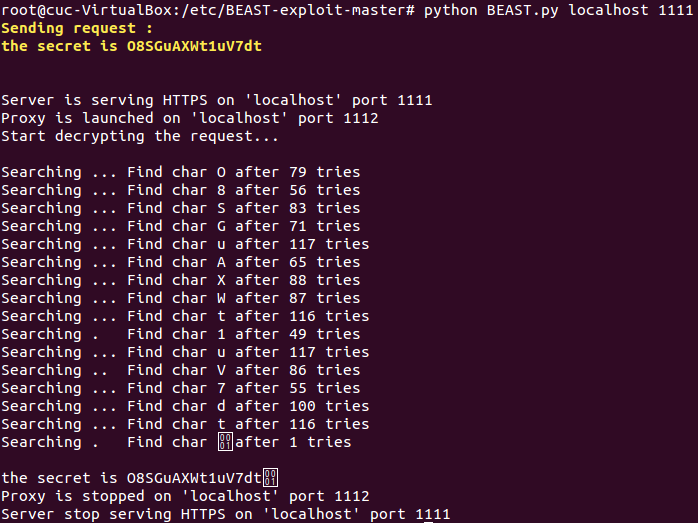  

ref: [kostyll/BEAST - Github](https://github.com/kostyll/BEAST-exploit)

### CRIME Attack

[攻擊 SSL/TLS - CRIME](http://securityalley.blogspot.com/2014/07/ssltls-crime.html)

CRIME( Compression Ratio Info-leak Made Easy )攻击过程

BEAST攻击的作者Juliano Rizzo和Thai Duong发布了一个名为CRIME的新攻击，它允许攻击者窃取加密的SSL隧道内传递的敏感信息。 利用此漏洞的最直接的方法是使用它来发现由应用程序传递的Cookie，并使用它们作为受害者登录应用程序。

CRIME已知可以对抗SSL压缩和SPDY。

 > SPDY是由Google开发的一种特殊的HTTP类协议，并在网络上使用。 根据Ivan Ristic的统计，SSL Pulse收集了大约42％的服务器支持SSL压缩，而SPDY支持为0.8％。 
  
SSL压缩是一个可选功能。 然而，SPDY是Web应用程序原生设计中的东西。

CRIME通过利用压缩函数的属性来工作，并指出压缩数据的长度如何变化。 压缩函数的内部更复杂，但这个简单的例子可以显示如何利用信息泄露。 想象下面的浏览器POST：

	POST /target HTTP/1.1
	Host: example.com
	User-Agent: Mozilla/5.0 (Windows NT 6.1; WOW64; rv:14.0) Gecko/20100101 Firefox/14.0.1
	Cookie: sessionid=d8e8fca2dc0f896fd7cb4cb0031ba249
	
	sessionid=a

以十六进制显示的数据如下所示：  

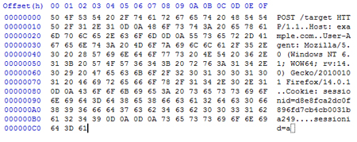

如前所述，DEFLATE压缩算法的内部结构更复杂，但是基本算法是查找重复的字符串，将它们移动到字典，并用对字典中条目的引用替换实际的字符串。 我们将使用上面的例子，并识别两个重复的字符串：“.1”和“sessionid =”。 我们将它们移动到字典，并替换为消息中未使用的字节（0x00和0x01）：

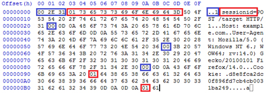

这已将消息从195字节压缩为187字节。 在请求的正文中，我们指定了“sessionid = a”。 观察当我们指定“sessionid = d”（它是秘密会话cookie的第一个字符）时会发生什么：

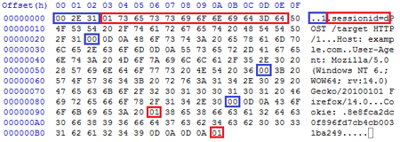

现在，消息从195字节压缩到186字节。 通过观察SSL数据包的大小，攻击者可以利用这种自适应的特性来了解Cookie的确切值。

当然，实际的操作中还有更多障碍需要克服。

### BREACH Attack

[攻擊 SSL/TLS - BREACH](http://securityalley.blogspot.com/2014/07/ssltls-breach.html)  
[BREACH测试代码](https://github.com/nealharris/BREACH)

Browser Reconnaissance & Exfiltration via Adaptive Compression of Hypertext

BREACH与SSL/TLS版本无关，与密钥长度也无关，实际上与SSL/TLS本身皆无关，只要符合三个假设前提：  

1. Server使用HTTP压缩。注意，这和SSL/TLS压缩不同，HTTP压缩至今仍非常常见（风险减缓方案可能需要修改业务代码），而SSL/TLS压缩在今日几乎无人使用了。
2. Server会將client request中的部分资料反映在response里。
3. Server response中含有重要的资料。  

即有可能破解SSL/TLS加密保护的资料，进而做到session hijacking，或是取得重要资料（一般就是指cookie）。因为BEAST 需要突破同源策略( SOP )，这除非搭配浏览器或者Java VM 的漏洞才可。而 CRIME 需要使用 SSL/TLS压缩，现今已经相当罕见，這种情形发生的同时，浏览器可能也旧到会有許多更容易攻击的弱点。因此，BREACH 比之 BEAST 和 CRIME 而言，是三者之中最可能运用在实际环境的攻击手法。

### Lucky 13 Attack ( A kind of Timing Attack )

Lucky 13攻击可以被看作是一种高级形式的Padding Oracle攻击。更详细地说，Lucky 13攻击依赖于这样的事实：对于某些特定长度、使用HMAC-SHA1 MAC算法的消息，处理至少包含两个字节的正确Padding的TLS消息将比包含一个正确填充的字节的消息要来得快。这是因为TLS header bytes，plaintext bytes和MAC tag bytes与分块密码的块边界和散列压缩函数的块边界的偶然对齐( fortuitous alignment )。通过足够频繁地重复攻击并且统计处理实验得到的时间差，可以区分不同的填充条件。因此，攻击者可以区分包含至少两个字节的正确填充的消息与所有其他模式。

参考链接：[Lucky Thirteen: Breaking the TLS and DTLS Record Protocols](http://www.isg.rhul.ac.uk/tls/Lucky13.html)

### Heartbleed

TLS位于传输层和应用层之间，提供数据安全加密。TLS心跳指的是用户向服务器发送数据包，服务器返回一个相同的数据包以确定彼此在线，以支持持续通信功能。

用户向服务器发送的心跳数据中用两个字节表明有效负载数据长度，而服务器端OpenSSL将根据这个有效负载长度构造一个新的数据包会送给对端。

简单的说，服务器端得到数据包，数据包长度为plen_real，而数据包中包含一个字节表明有效负载数据长度plen_fake，数据包剩下的部分是有效负载数据，长度为plen_real-1。整个数据包存储在一个char型数组之中。而服务器端构造新数据包时，先分配一段plen_fake+1的内存空间，前两个字节存放plen_fake，之后使用memcpy从收到的数据包有效负载数据起始位置向新数据包拷贝plen_fake字节数据。正常情况下plen_fake = plen_real-1，当用户有意设置plen_fake大于实际有效负载长度plen_real-1时，服务器就会发送plen_fake长度的数据，其中包括plen_fake - plen_real-1长度的数据，这些数据可能是一些用户密码或者密钥。

