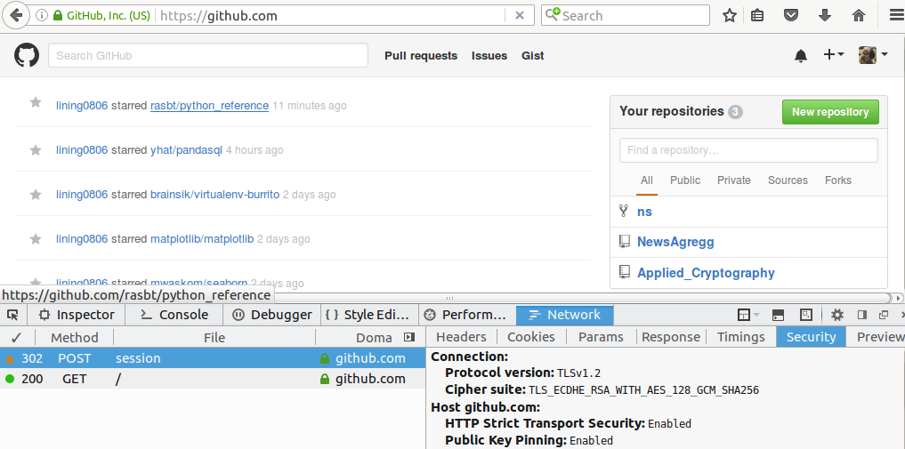
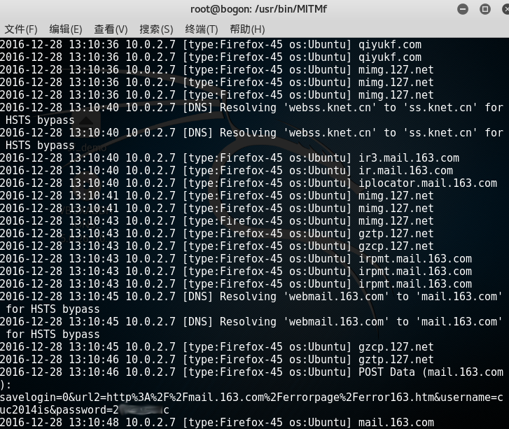
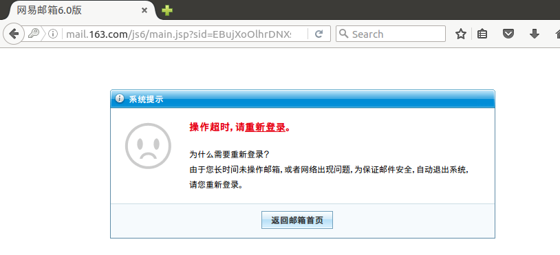
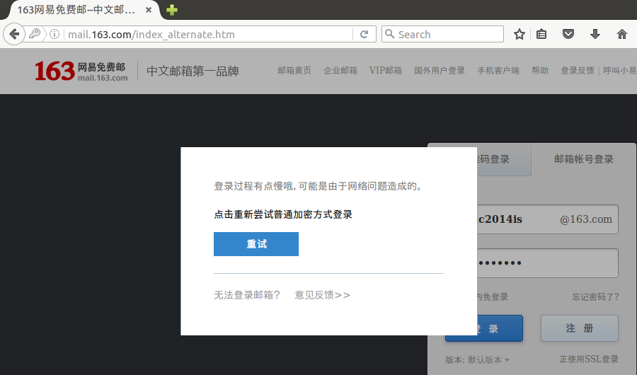
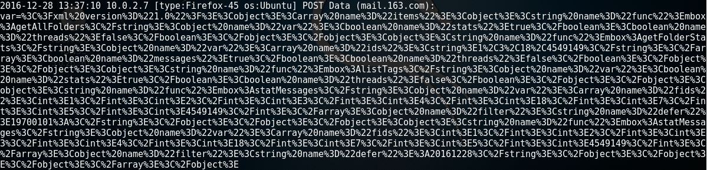
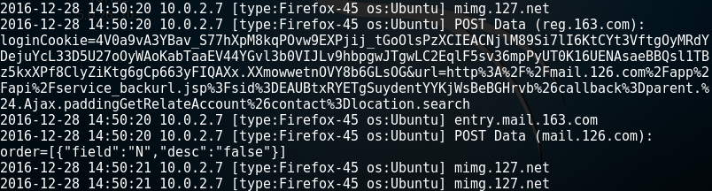

# 使用MITMf框架绕过HSTS（With Plugin SSLStrip+）

[Bypassing HSTS (HTTP Strict Transport Security) with MITMf](https://sathisharthars.wordpress.com/2015/02/27/bypassing-hsts-http-strict-transport-security-with-mitmf/)

[mitmf-and-sslstripv2](https://madmantm.wordpress.com/2015/02/15/mitmf-and-sslstripv2/)

## Part 1 HSTS测试

已知客户端与服务器成功建立HSTS，中间人就无法解密经过客户端的公钥加密通信数据，通过实验进行证实，淘宝、Github等网站设置HSTS后，MITMf都无法探测到数据。

测试Github，网站启用HSTS配置，MITMf无法获取通信数据。  

测试新浪微博，跳转到一个奇怪的url
   
    http://webpassport.weibo.com/visitor/visitor?entry=miniblog&a=enter&url=http%3A%2F%2Fweibo.com%2F&domain=.weibo.com&sudaref=https%3A%2F%2Fwww.baidu.com%2Flink%3Furl%3DmdV3gBYgi3Cf3I9oVPg697AGZD2KmZ7Ctd-kC0Adq9u%26wd%3D%26eqid%3Dd29bc9a60001247f0000000358636728&ua=php-sso_sdk_client-0.6.23&_rand=1482909540.0853

## Part 2 SSL卸载攻击

在受害者Ubuntu与网易163邮件服务器建立HSTS协议之前，攻击者Kali通过ARP欺骗和DNS欺骗（地址解析劫持）进行流量重定向。猜测可能是网易邮箱服务器对请求的时间戳做了处理，经由攻击者转发的HTTPS流量被服务器视为超时操作。

虽然客户端与服务器之间无法建立连接，但是受害者看到网易邮箱的页面正常显示，通常也不会在意上方的灰色小锁，就会按照正常的操作流程输入用户名和密码，这样攻击者就能通过HTTP协议以明文形式看到受害者的用户名与密码。

    python mitmf.py --target 10.0.2.7 --gateway 10.0.2.1 --arp --spoof --hsts

如果服务器的安全验证机制不够完善，受到HTTPS降级攻击或者响应了中间人/攻击者发出的HTTPS请求，攻击者一旦能够篡改服务器响应数据，就能轻易地鼓捣出一把绿色小锁掩人耳目。

  

在实验过程中，没有安全相关的弹框警告。只有服务器察觉到网络异常，拒绝连接。  

受害者多次尝试重新登录，最终见到如下提示：  

此时，服务器将使用HTTP协议进行数据传输，这可能就是自创的SSL双边卸载攻击:)  

再对126邮箱进行测试，HTTPS 会话中的 Cookie 在 HTTP 会话中被泄露。

## Part 3 实验分析

网易邮箱整个网站属于HTTP 和 HTTPS 混合部署。混合部署的一个严重的问题是Cookie的保密性和完 整性难以保证。Cookie 通常用于存储认证和会话管理等重 要的信息，在浏览器与服务器之间按照同源策略（SOP） 进行传输。Cookie 的 SOP 仅由 Domain 和 Path 属性确定而与协议无关，于是 HTTPS 会话中的 Cookie 有可能在 HTTP 会话中被泄露。

从《[SSLStrip 的未来——HTTPS 前端劫持](http://div.io/topic/747)》这一文章中获知，在浏览网页的过程中，客户端依次收到各个数据块，最终才能合并成一个完整的网页。而中间人通常先收集数据，等到页面接收完整，才开始替换，这种工作方式容易造成操作超时。

由于 HTML 兼容众多历史遗留规范，因此替换工作并非是件轻松事。各种复杂的正则表达式，消耗着不少的 CPU 资源。尽管用户最终点击的只是其中一两个链接，但中间人并不知道将会是哪个，因此仍需分析整个网站的页面。