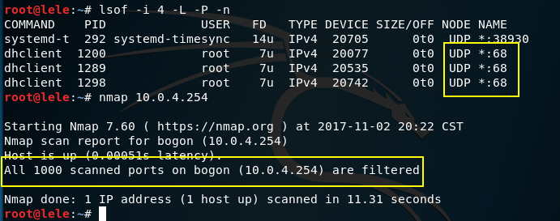

# Scapy编程实现网络扫描

## 实验要求

- TCP connect scan  
- TCP stealth scan
- TCP XMAS scan
- UDP scan

## 实验环境

- Client 10.0.4.17
- Server 10.0.4.254

## 实验过程

### 注：所有截图左侧为服务器，右侧为客户机

### TCP connect scan

- 关闭服务器80端口
	- 使用nmap指令扫描自身，可以看到前1000个端口全部关闭
	- 客户机调用tcp_ connect_ scan后，检测到80端口关闭 

- 开启服务器80端口
	- 开启apache2服务以开启80端口。使用netstat指令检测到已开80端口

- 对服务器80端口进行过滤
	- 使用ufw设置防火墙过滤规则，禁止外部访问80端口

- [Code:Tcp_ Connect_ Scan](Code/tcp_connect_scan.py)

### TCP stealth scan

- 关闭服务器22端口
	- 扫描自身看到22端口没有打开

- 开启服务器22端口

- 对服务器22端口进行过滤

- [Code :Tcp_ Stealth Scan](Code/tcp_stealth_scan.py)

### TCP XMAS scan

- 关闭服务器22端口

- 开启服务器22端口

- 对服务器22端口进行过滤

- [Code :Tcp_ XMAS_ Scan](Code/tcp_xmas_scan.py)

### UDP scan

- 服务器53端口关闭（DNS服务），开启68端口（DHCP服务）

- [Code :Udp_ Scan](Code/udp_scan.py)
