# 翻转课堂2-端口扫描 #

## 实验要求 ##
- TCP connect scan
- TCP stealth scan
- TCP XMAX scan
- UDP scan（未实现）

## 实验配置 ##
* 服务器 10.0.2.15

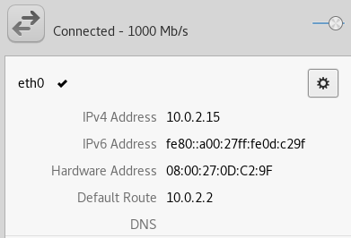

* 客户端 10.0.2.4

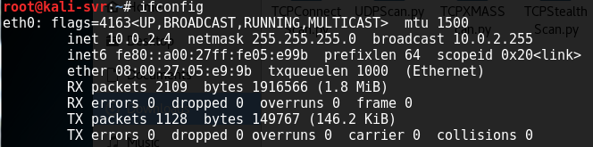

## 实验代码 ##

[TCP Connect Scan](TCPConnectScan.py)

[TCP Stealth Scan](TCPStealthScan.py)

[TCP XMAX Scan](TCPXMASScan.py)

[UDP Scan](UDPScan.py)

## 实验过程 ##

### TCP connect scan ###

**关闭状态**

- 用nmap指令扫描服务器，可以看到1000个端口全部处于关闭状态

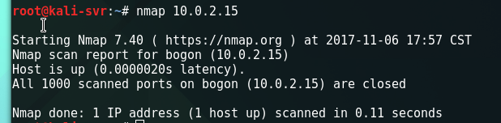

- 在客户端调用TCPConnectScan程序，扫描到服务器80端口处于关闭状态

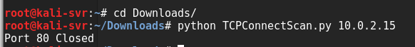

**开启状态**

- 打开服务器80端口，开启apache服务。用netstat命令可查看当前处于监听状态的端口有80端口

- 在客户端调用TCPConnectScan程序，扫描到服务器80端口打开

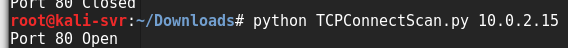

**过滤状态**

- 在服务器设置iptables规则，禁止外部访问80端口

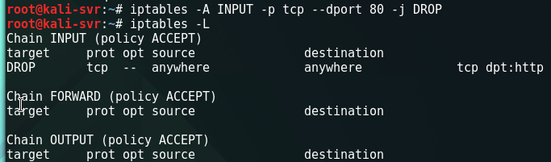

- 在客户端调用TCPConnectScan程序，扫描到80端口处于过滤状态

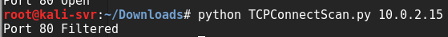

### TCP Stealth Scan ###

**关闭状态**

- 用nmap扫描服务器，检测到除80端口外全部关闭

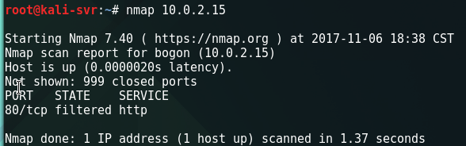

- 在客户端调用TCPStealthScan程序，22端口处于关闭状态

**开启状态**

- 开启ssh服务，打开22端口

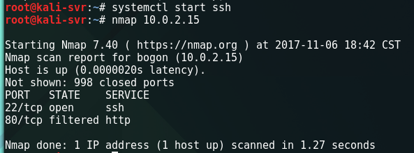

- 在客户端扫描，22端口处于打开状态

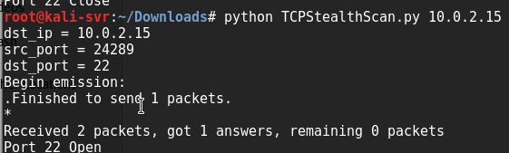

**过滤状态**

- 在服务器设置iptables规则，对22端口进行过滤

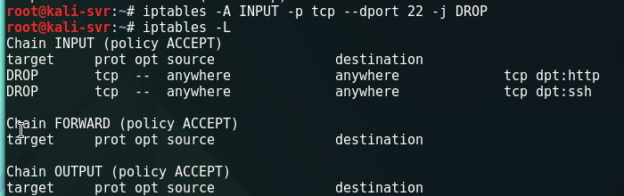

- 在客户端扫描，22端口处于过滤状态

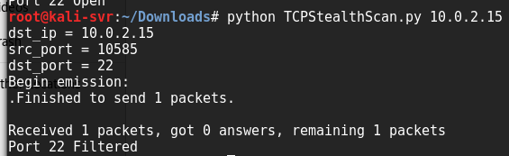

### TCP XMAS Scan ###

**关闭状态**

- 删除上一步设置的22端口iptables规则

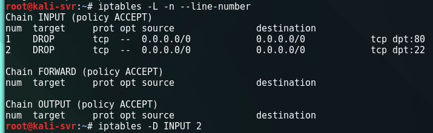

- 删除成功后，iptables规则中只剩下第一步tcp connect scan设置的80端口规则

- 停用ssh服务，关闭22端口

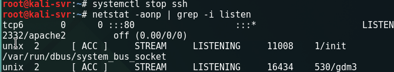

- 在客户端调用TCPXMANScan程序，22处于关闭状态

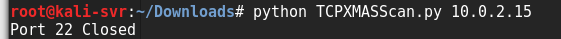

**开启状态**

- 重启ssh服务，打开22端口

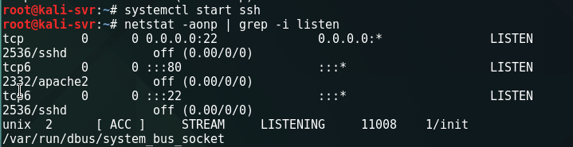

- 在客户端扫描

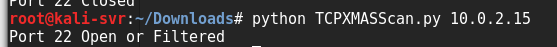

**过滤状态**

- 在服务器设置iptables规则

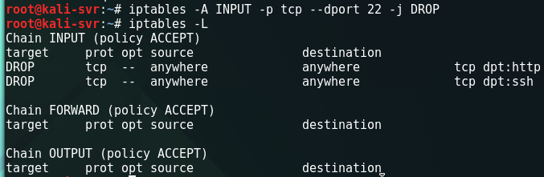

- 在客户端扫描

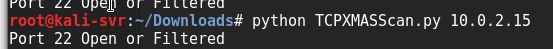

### UDP Scan ###

- 在客户端调用UDPScan程序

- 在服务器用iptables规则开启68端口，并查看iptables规则表

- 可是用netstat和nmap指令都检测不到68端口处于监听状态

