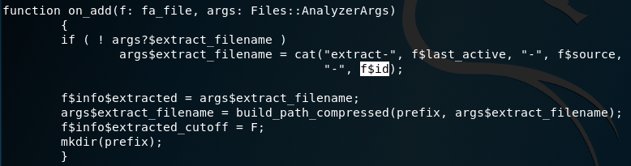

# 实战Bro网络入侵取证

## 实验目的
本次实战的例子是pcap attack trace，通过分析流量包中的extract file和log文件得到攻击主机的IP。

## 实验过程

### 安装bro

`apt-get install bro bro-aux`   

### 实验环境基本信息
   

### 编辑bro配置文件

* 编辑`etc/bro/site/local.bro`,在文件尾部两行配置代码。
   

* 在`/etc/bro/site/`目录下创建文件`mytuning.bro`,并添加内容`redef ignore_checksums = T;`,忽略校验和验证。


### 使用bro自动化分析pcap文件

执行命令`bro -r attack-trace.pcap /etc/bro/site/local.bro`

```
Usage:bro [options] [file ...]
-r|--readfile <readfile>   |read from given tcpdump file
```


执行上述命令后出现警告信息`WARNING: No Site::local_nets have been defined. It's usually a good idea to define your local networks.`对于本次入侵取证实验来说没有影响。       

如果要解决上述警告信息，编辑`mytuning.bro`,增加一行变量定义`redef Site::local_nets = { 192.150.11.0/24 };`增加后再次实验结果如下。


添加一行变量定义前，执行`bro -r`命令在pcap文件所在的目录下会出现八个日志文件和`extract_files`文件夹。   
添加一行变量定义前，执行`bro -r`命令在pcap文件所在的目录下会出现十个日志文件和`extract_files`文件夹。   
增加的两个日志文件为`know_hosts.log`/`know_services.log`，会报告在当前流量（数据包文件）中发现了本地网络IP和该IP关联的已知服务信息。

   

### 分析结果上传virustotal

* 进入extract_files文件夹。       


* 将该文件上传至virustotal网站获得分析结果,确认这是一个已知的后门程序，基于这个发现进行逆向倒推，寻找入侵线索。       


### 获取攻击者IP

通过阅读`usr/share/bro/base/files/extract/main.bro`的源代码我们了解到extract_files中的文件名的最右一个字符串`FHUsSu3rWdP07eRE4l`是`files.log`中的文件唯一标识。



通过查看`files.log`，发现该文件提取自网络会话标识（bro根据IP五元组计算出的一个会话唯一性散列值）为`CyyxsC3MThdEzH58x3`的FTP会话。


查看`conn.log`，找到id为`CyyxsC3MThdEzH58x3`的五元组信息，得到该PE文件来自于IPv4地址为98.114.205.102的主机。

