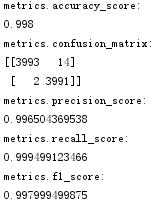

# 针对Web服务器访问日志的威胁检测
----------

# 一.实验要求：
设计并实现一套针对Web服务器访问日志的威胁检测工具（类似于WAF，但也可以用于入侵取证、离线分析）

- 使用机器学习方法

- 以具体威胁检测（威胁识别与分类，例如SQL注入、命令注入、命令执行、webshell行为等）为主、异常（未知威胁）检测为辅

# 二.实验完成情况
- 实现对XSS的检测
- 实现对webshell的检测

# 三.实验思路概述
- 收集日志文件并了解其中各字段含义
- 了解各类威胁的概念和在web日志中表现的异常特征
- 学习机器学习的概念，选择算法
- 对收集到的数据进行预处理
- 特征提取
- 数据标记
- 数据拆分后进行训练和测试

# 四.相关概念补充
- SVM：支持向量机（Support Vector Machine，SVM）是机器学习领域使用最广泛的算法之一，常用来解决二分类问题，通常用来进行模式识别、分类以及回归分析。假设只有二维的特征向量，解决一个分类问题，若能通过一条直线区分，那么这个问题成为**可线性区分**，否则成不可线性区分。讨论最简单的情况，假设这个分类问题是可线性区分，那么这个区分的直线成为超平面，距离超平面最近的样本成为支持向量。对于不可线性区分的情况，需要升级到更高的平面进行区分，比如**二维平面不行就需要升级到三维平面来区分**，这个升级就需要依靠**核函数**。SVM通过一个非线性映射，把样本空间映射到一个高维的特征空间中，使得在原来的样本空间中非线性可分问题转化为在特征空间中的线性可分问题。

- XSS（跨站脚本攻击）： XSS是一种经常出现在Web应用中的计算机安全漏洞，它允许恶意Web用户将代码植入到提供给其他用户使用的页面中。

- SQL注入：通过把SQL命令插入到Web表单提交或输入域名或页面请求的查询字符串，最终达到欺骗服务器执行恶意的SQL命令。

- WebShell： WebShell就是以ASP、PHP、JSP或者CGI等网页文件形式存在的一种**命令执行环境**，也可以将其称为一种网页后门。黑客在入侵了一个网站后，通常会将ASP或PHP后门文件与网站服务器Web目录下正常的网页文件混在一起，然后就可以使用浏览器来访问ASP或者PHP后门，得到一个命令执行环境，从而达到控制网站服务器的目的。

# 五.具体实现
### 机器学习之svm框架

### XSS

1. 数据搜集和数据清洗

2. 特征化：

3. 数据做标记：XSS标记为1，正常访问标记为0。

4. 数据拆分：随机把数据区分成训练组和测试组，通常直接使用cross_validation.train_test_split即可，通常40%作为测试样本，60%作为训练样本。

5. 数据训练：使用Scikit-Learn的SVM模型，SVM用于分类的模型称为SVC，使用最简单的核函数linear。   

6. 代码实现     
[xss实现代码](xss.py)   
测试结果   

### webshell

#### 1.相关字段解释

- c-ip：客户端IP地址。
- s-ip：服务器的IP地址。
- cs-uri-stem：URI资源，记录做为操作目标的统一资源标识符（URI），即访问的页面文件。
- cs-uri-query：URI查询，记录客户尝试执行的查询，只有动态页面需要URI查询，如果有则记录，没有则以连接符-表示。即访问网址的附带参数。
- cs(User-Agent)：用户代理，客户端浏览器、操作系统等情况。
- sc-status：协议状态，记录HTTP状态代码，200表示成功，403表示没有权限，404表示找不到该页面，具体说明在下面。

#### 2.webshell 的相关特征
1. 文本特征：Webshell通常为脚本页面（asp,php,jsp），因此可删除静态的网站文件访问记录，如文件后缀为html、jpg、ico、css、js

2. 统计特征：访问频率小,主要是入侵者访问

3. 文件关联性：该页面属于孤立页面，与其他页面交互少

#### 3.步骤
- 3.1日志预处理
- 3.2文本特征匹配：提取Webshell在Web日志访问中的cs-uri-stem字段特征
  

- 3.3统计特征检测

f(A):计算后的网站页面A的访问频率

Tfirst(A):网站页面A首次被访问的时间

Tend(A):网站页面A最后一次被访问的时间

OUNTFE(A):网站页面A在时间Tfirst(A)到Tend(A)期间的被访问次数

  

- 3.4文件关联性检测

正常网站页面会互相链接，因此会有一定的出入度，而Webshell通常出入度有以下两种：

- ·入度出度均为0；

- ·入度出度均为1且自己指向自己。

根据出入度的关系可以利用图算法中的有向图识别Webshell(使用有向图还可以识别僵尸网络)

# 七.实验待完善地方

* 对靶场环境进行针对性扫描，收集更多种类的web攻击日志数据集并进行标记。但由于在靶场搭建和针对性攻击环节遇到问题，暂时未能完成。   

* SVM算法是针对二分类问题提出的，若要使用一个模型完成对多类攻击的检测，应将机器学习相关部分代码进行调整，实现多分类功能。

# 八.参考资料

1. 《Web安全之机器学习入门》 — 刘焱
2. [几点基于Web日志的Webshell检测思路](https://my.oschina.net/bluefly/blog/626132)
3. [webshell-sample](https://github.com/ysrc/webshell-sample)
4. [SQL注入靶场搭建参考](http://www.freebuf.com/sectool/125940.html)
