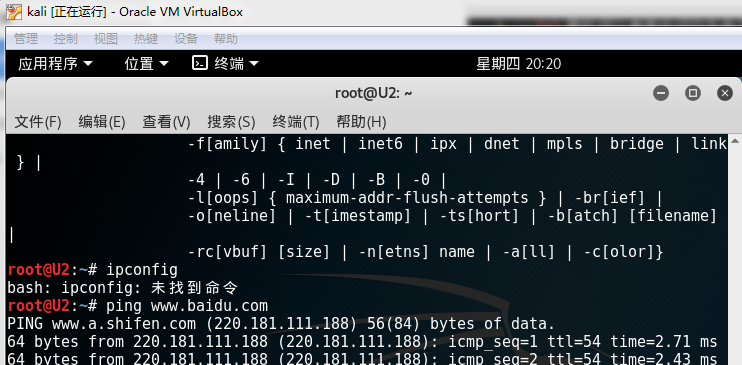

- [x] 靶机可以直接访问攻击者主机
- [x] 攻击者主机无法直接访问靶机
- [x] 网关可以直接访问攻击者主机和靶机
- [x] 靶机的所有对外上下行流量必须经过网关
- [x] 所有节点均可以访问互联网
***

1. 将三台机器均制作为基础镜像，网关的两张网卡一张设置为nat网络，连接外网，一张设置为内部网络，攻击机网卡设置为nat网络，靶机设置为内部网络
***

2. 内网网段设置为192.168.56.0，外网网段设置为10.0.2.0，靶机网关设置为网关的内部网卡地址192.168.56.1，网关的内部网卡网关设置为外部网卡地址10.0.2.4
***

3. 发现网关在两张网卡均开启后无法连接外网，查询后得知是因为有两个默认网关，引起了冲突，重新连接两个网络后解决。
***

4. 设置转发规则，查看规则

5. 将改文件ip_forward中的0改为1（临时开启ip转发，重启后消失），将sysctl.conf文件中第28行的值改为1，删除#（永久开启ip转发，重启后不消失）
***

6. 设置完后用靶机ping外网，成功

7.网关开启抓包，发现靶机与目标网址的流量
***

8. 靶机ping攻击机，成功

9. 网关抓包，发现靶机与攻击机的流量
***

10. 攻击机ping靶机，访问失败

11. 攻击机ping外网，成功
***

12. 网关访问靶机和攻击机，成功