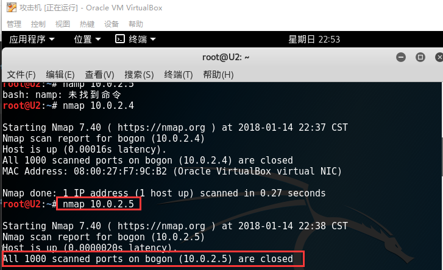
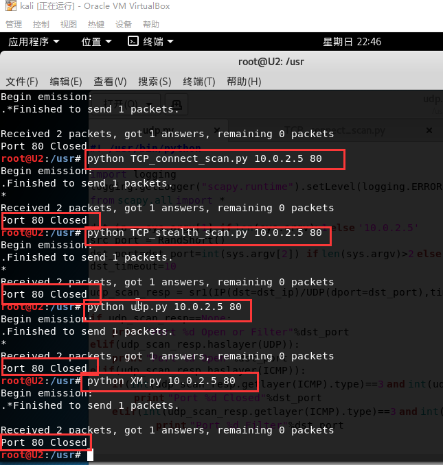

## scapy_编程

- 实现TCP connect scan/TCP stealth scan/TCP XMAS scan/UDP scan

#### 实验环境

服务器ip：10.0.2.5

客户端ip：10.0.2.4

#### 扫描结果

服务器用nmap扫描自身，发现1000个端口均为关闭状态

##### 关闭状态

客户端调用扫描程序，扫描到服务器80端口处于关闭状态

##### 开启状态

打开服务器80端口，开启apache服务。用netstat命令查看当前处于监听状态的端口，有80端口

在客户端进行扫描，扫描到服务器80端口处于开启状态

##### 过滤状态

在服务器设置iptables规则，禁止外部访问80端口

在客户端调用扫描程序，扫描到80端口处于过滤状态

udp扫描一直失败，一直是处于关闭状态

代码：

[TCP connect scan](https://github.com/GameGamer/ns/blob/hw2/2017-2/GameGamer/hw2/TCP_connect_scan.py)

[TCP stealth scan](https://github.com/GameGamer/ns/blob/hw2/2017-2/GameGamer/hw2/TCP_stealth_scan.py)

[TCP XMAS scan](https://github.com/GameGamer/ns/blob/hw2/2017-2/GameGamer/hw2/XM.py)

[UDP scan](https://github.com/GameGamer/ns/blob/hw2/2017-2/GameGamer/hw2/udp.py)