## 从sql注入到shell

#### 配置实验环境

下载iso镜像，并装入虚拟机，查看ip

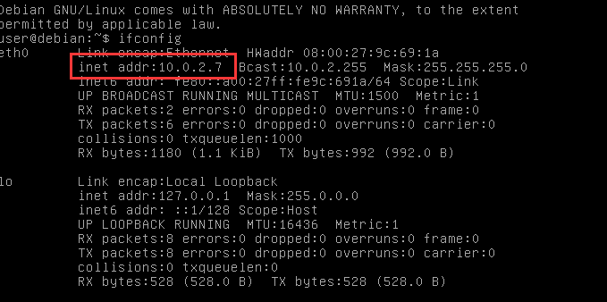

打开攻击者主机，查看ip

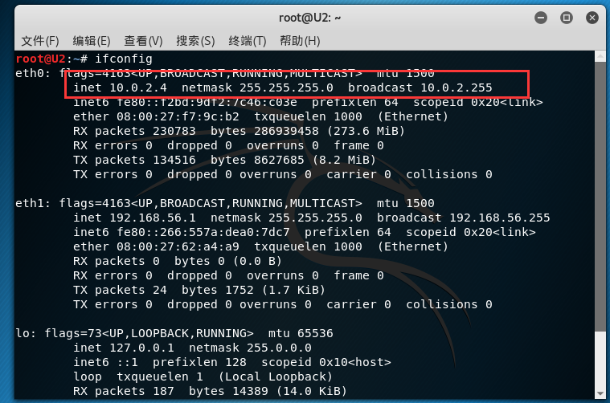

设置浏览器代理

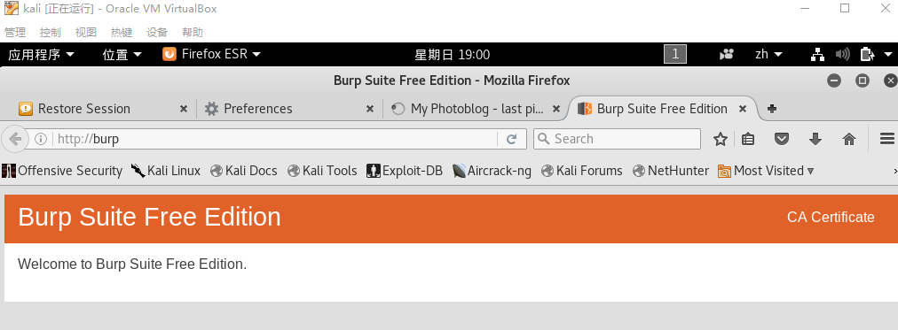

测试连通性

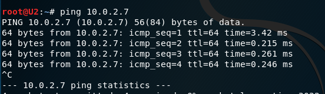

访问页面

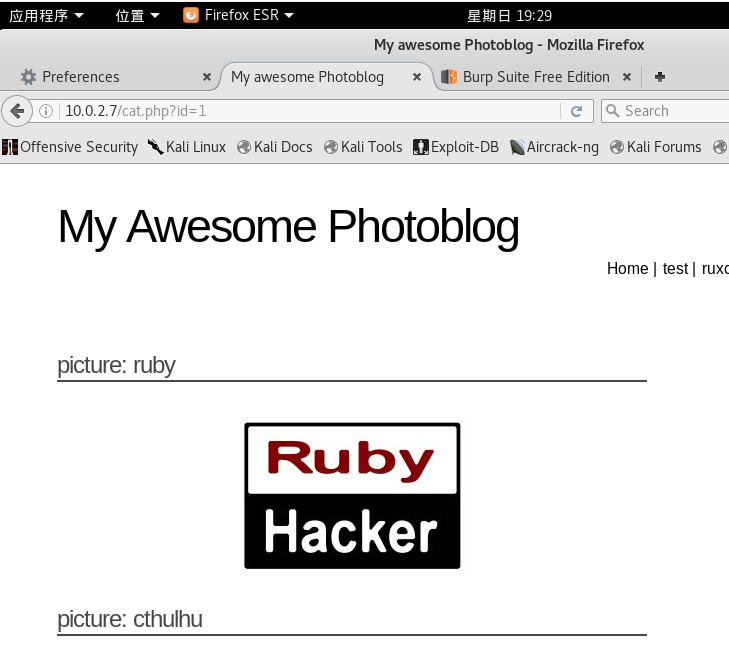

修改页面url，使得id=2-1，发现访问到了与id=1相同的页面，说明数据库直接进行了减法，没有过滤这种输入，存在sql注入可能

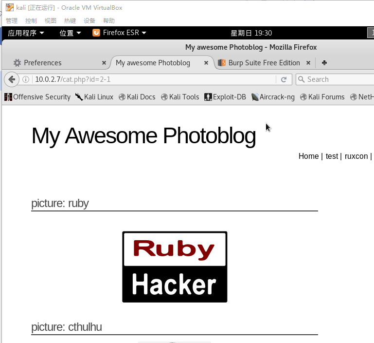

用order by测试id个数，发现到5时出错

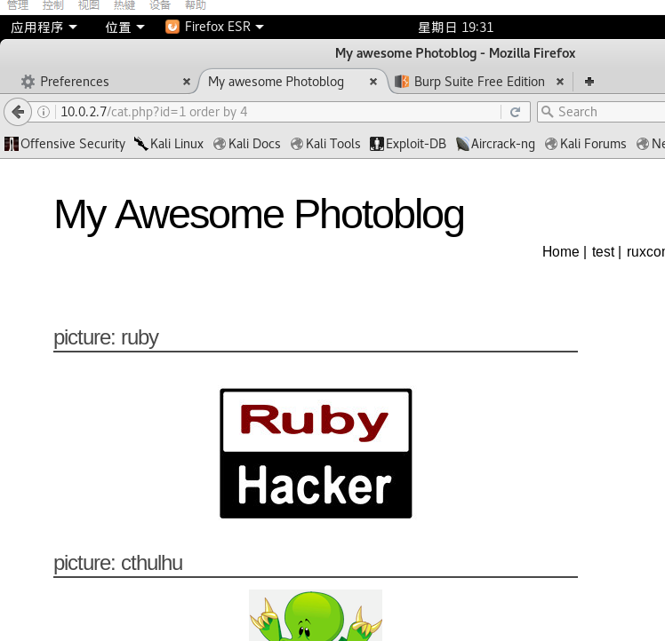

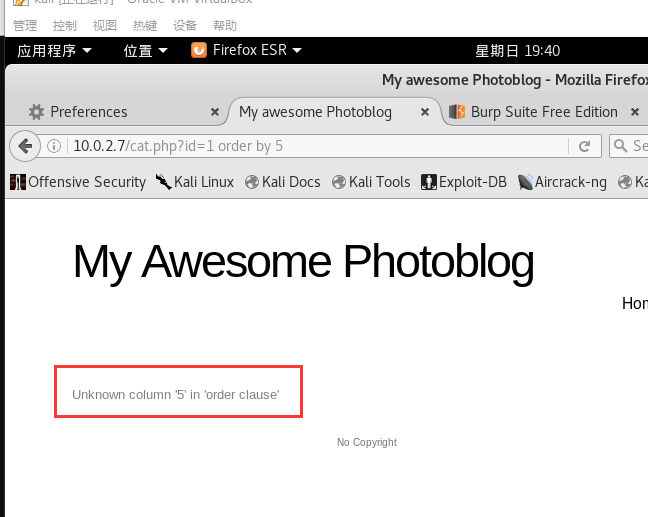

查询数据库版本

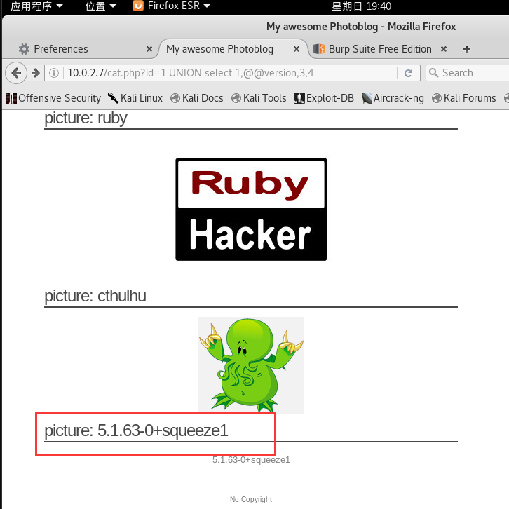

查询当前用户信息

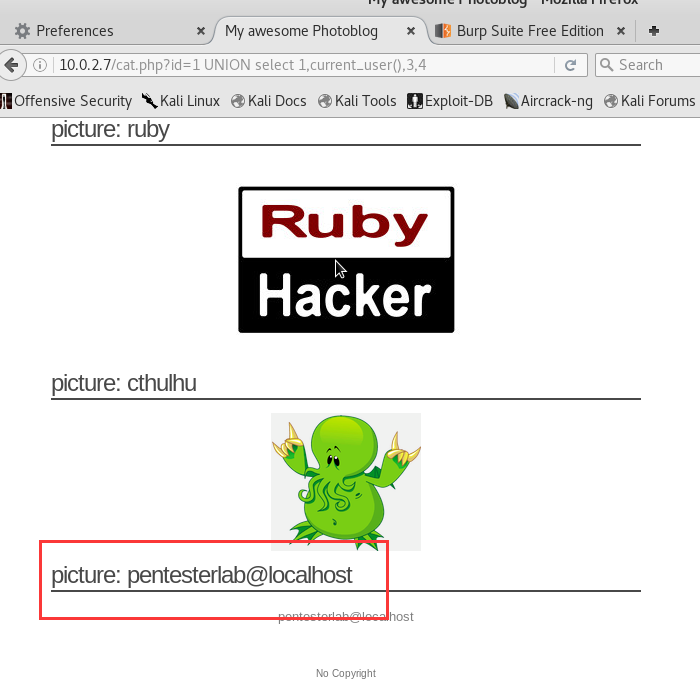

查询数据库名

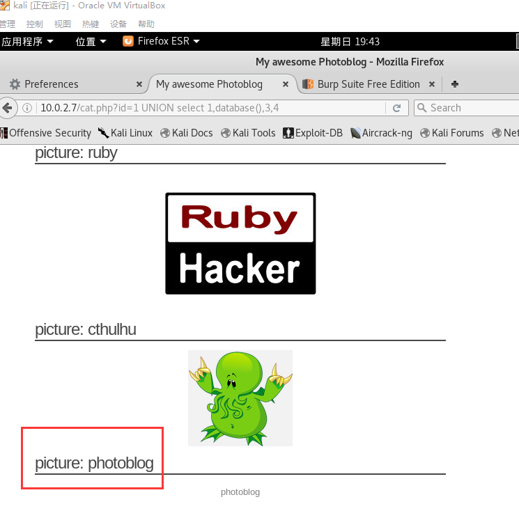

查询数据库中的所有表，看到有users表

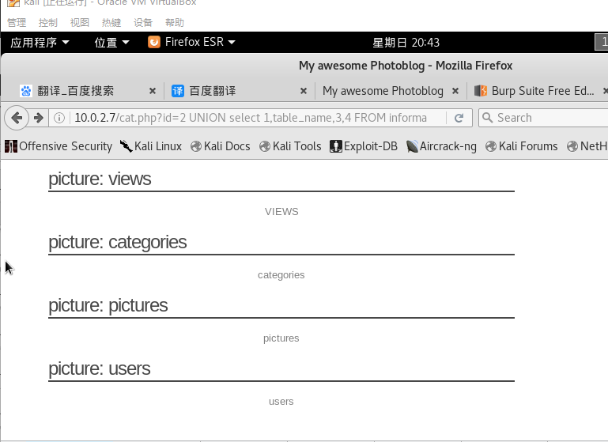

查询用户名和密码字段，得到用户名admin

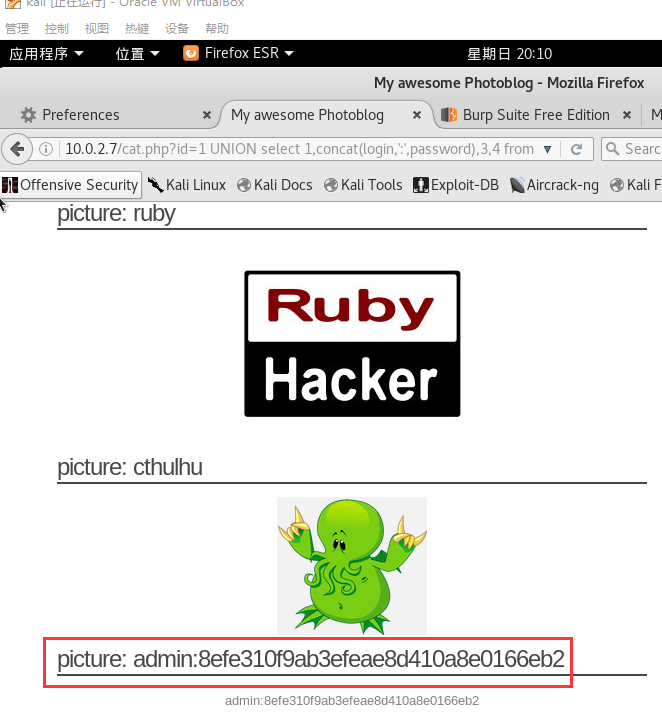

解码密码，得到用户名密码P4ssw0rd，登录后找到上传界面

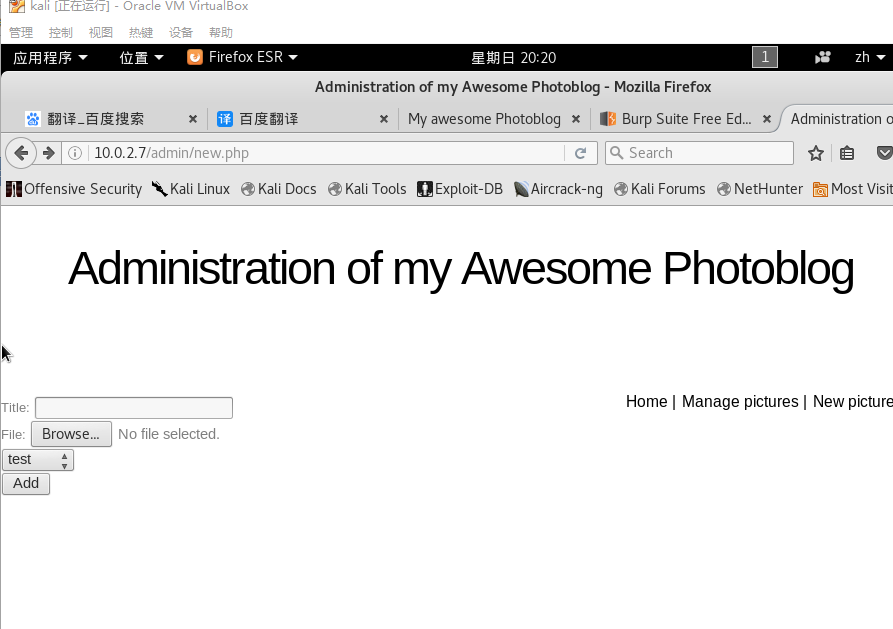

发现无法上传php文件，将后缀改为.php.aaa，成功上传后打开，查看页面信息，找到上传文件夹

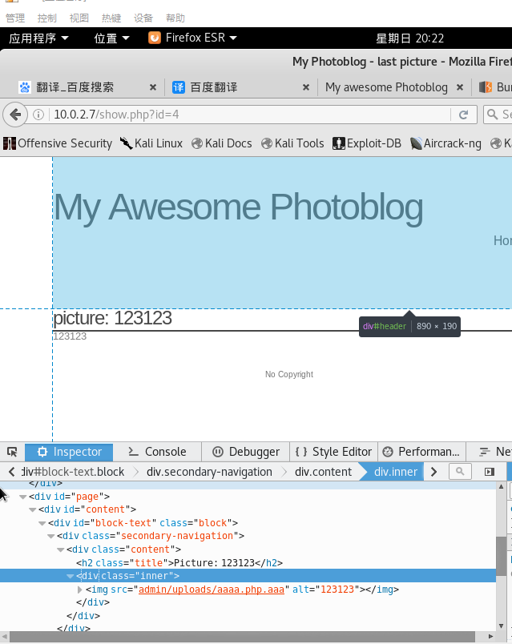

用cmd命令获取各种信息

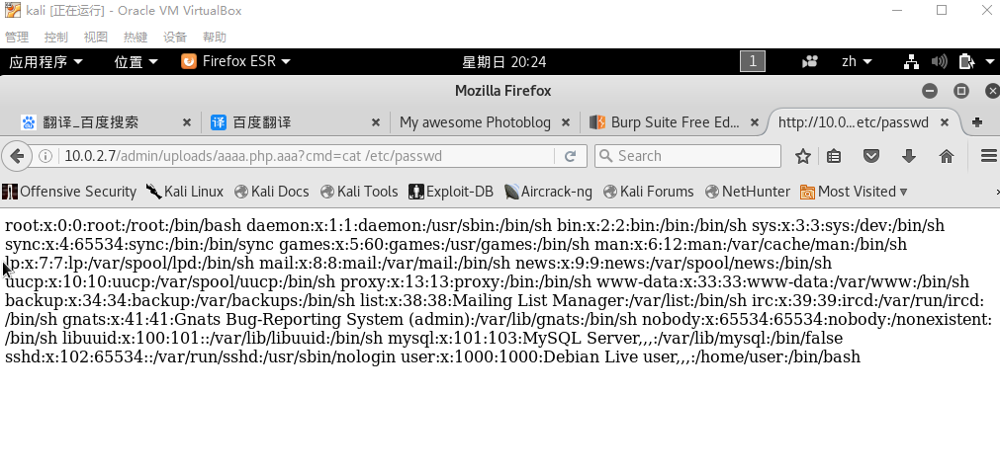