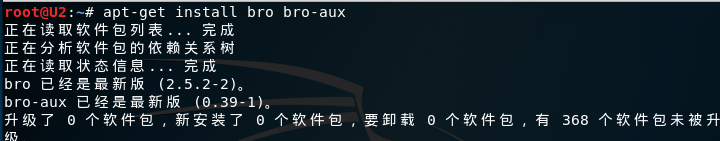
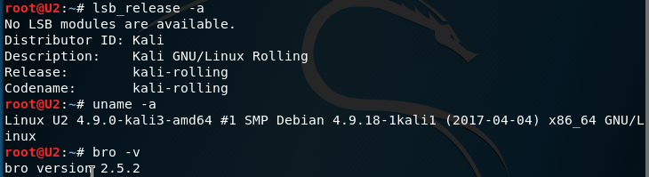
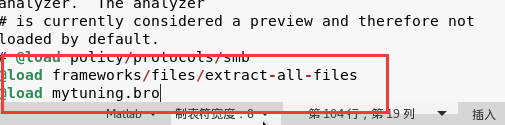
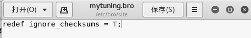
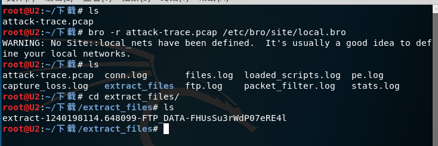
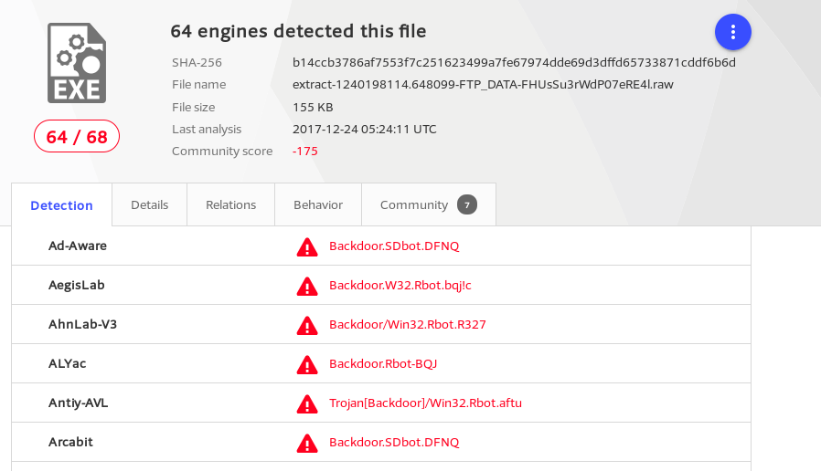
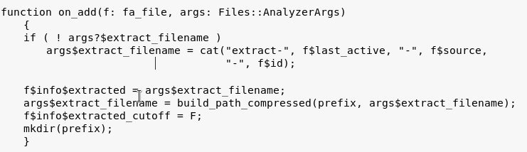
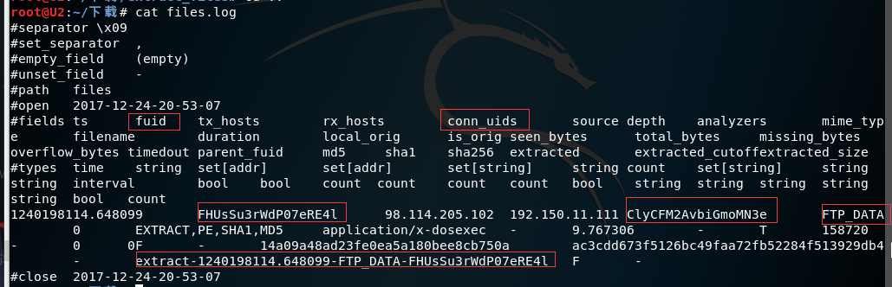
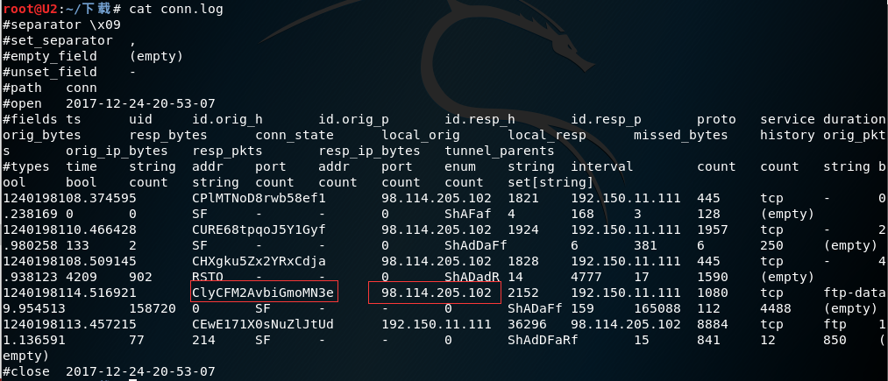

### 第四次翻转课堂实验:网络入侵取证

### 实验过程

#### 1. 安装bro

#### 2. 查看实验环境

#### 3. 配置bro

编辑 /etc/bro/site/local.bro，在文件尾部追加两行新配置代码

在/etc/bro/site/目录下创建新文件mytuning.bro，内容为：

#### 4. 下载pacp包，利用bro自动化分分析

输入命令：bro -r attack-trace.pcap /etc/bro/site/local.bro

运行完命令后在attack-trace.pcap文件的当前目录下会生成一些.log文件和一个extract_files目录，在该目录下我们会发现有一个文件:

将其上传到virustotal后发现是一个已知的后门程序

通过阅读/usr/share/bro/base/files/extract/main.bro的源代码 ， 可以了解到该文件名的最右一个-右侧对应的字符串FHUsSu3rWdP07eRE4l是 files.log 中的文件唯一标识 

查看files.log，可以得到，该文件提取自FTP会话，并得到该流量的conn_uids

查看conn.log，找到相同id的五元组信息，得到该PE文件来自于IPv4地址为98.114.205.102的主机

实验结束