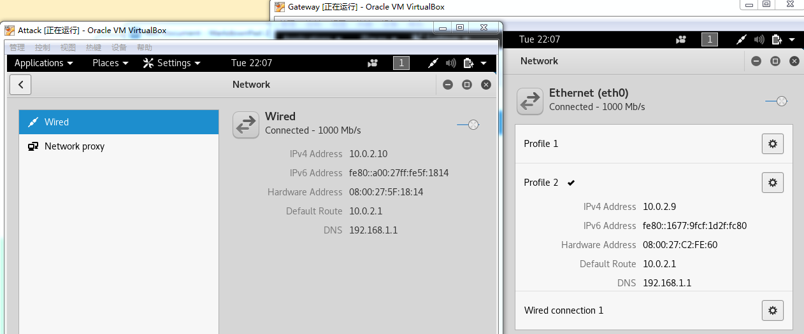
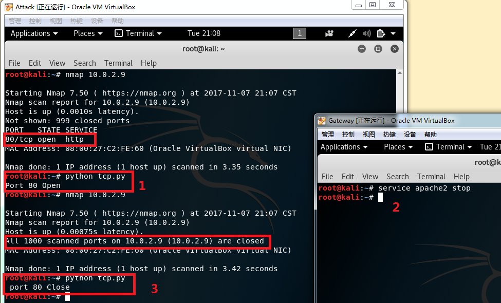
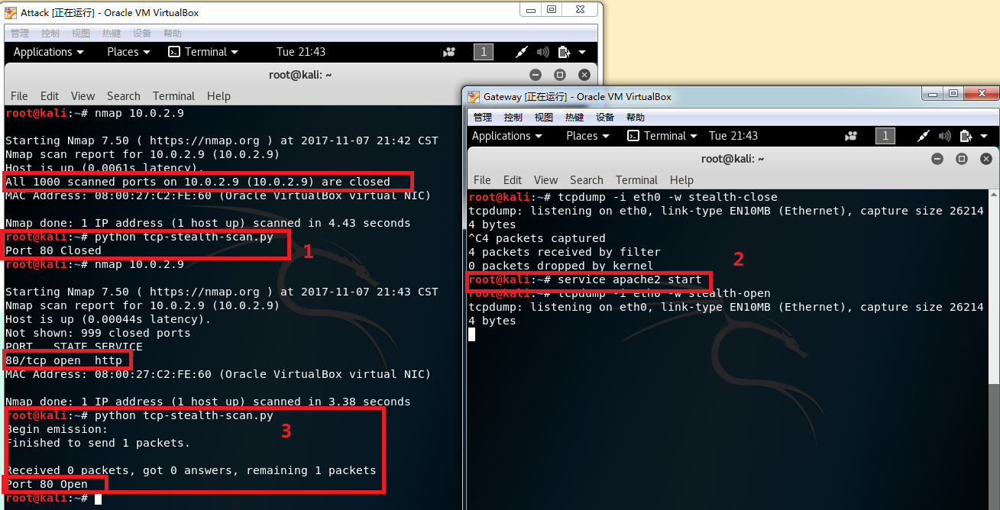
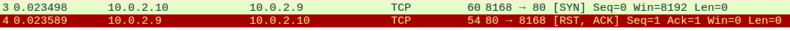
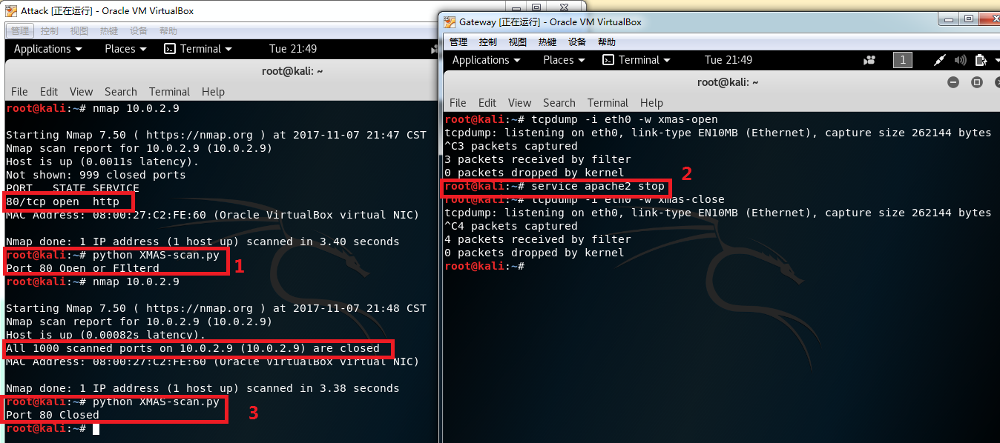
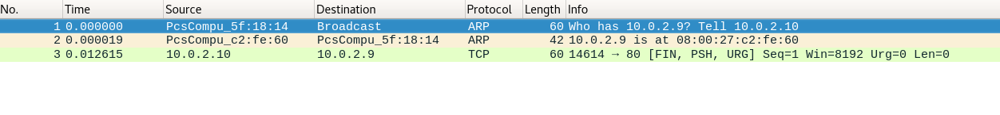

# Port Scanning using Scapy   
----
## 作业完成情况

- [x] TCP connect scan   
- [x] TCP stealth scan   
- [x] TCP XMAS scan   
- [ ] UDP scan

### 实验环境  

虚拟机Attack为扫描机器，虚拟机Gateway为被扫描机器。

### TCP connect scan   

* 代码执行结果   

* 端口开启时抓包   

* 端口关闭时抓包   
   

* 代码   
[code](code/tcp.py)   

### TCP stealth scan

* 代码执行结果
  

* 端口开启时抓包   
   

* 端口关闭时抓包   
   

* 代码   
[code](code/tcp-stealth-scan.py)

### TCP XMAS scan

* 代码执行结果   
   

* 端口开启时抓包   
   

* 端口关闭时抓包   
   

* 代码   
[code](code/XMAS-scan.py)   

### UDP scan

* 存在问题   
UDP端口开启失败，端口关闭时未返回ICMP Error数据包。

* 代码   
[code](code/UDP-scan.py)
