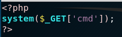

# 从SQL注入到Shell

## 实验环境说明

* 攻击机和靶机的网络设置均为NAT网络，IP地址如下图所示。

## 实验过程

### 指纹识别

* 使用nmap查看端口开放情况。

* 使用浏览器访问目标服务器，通过burpsuite查看response包，可获得目标服务器相关信息。

* 使用wfuzz获取目标服务器上的文件目录。

### 检测并利用SQL注入漏洞

* 通过地址 http://10.0.2.7/cat.php?id=2-1 获取的页面与id=1时获取页面相同，所以存在SQL注入漏洞。

* 使用union查询获取列数为4。

* 获取数据库版本信息。与之前正常页面对比可获得信息显示位置。

* 获取数据库表名和列名，发现用户名表。

* 在用户名表中查询用户名和密码。

### 进入管理页面，代码执行

* 获取密码的MD5值，借助线上网站解码。

* 使用用户名密码成功登录，可以进行上传删除图片的操作。

* 在本地建立shell.php.tset文件。该后缀文件可绕过目标服务器对php文件的检测。

* 上传webshell。

* 在文件管理处可看到shell.php已上传成功。

* 获取webshell利用地址。

* 利用webshell读取目标服务器passwd文件。
   
