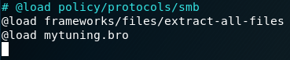
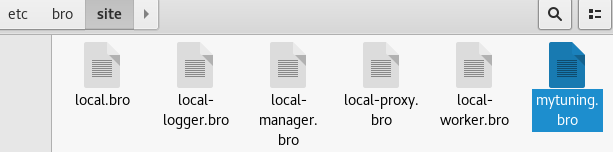
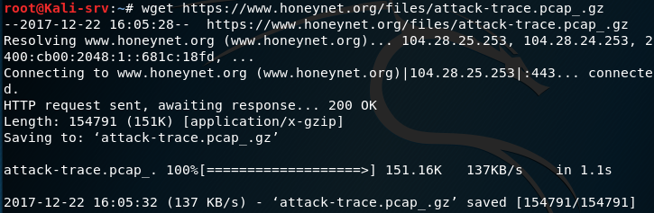
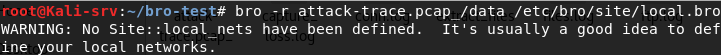
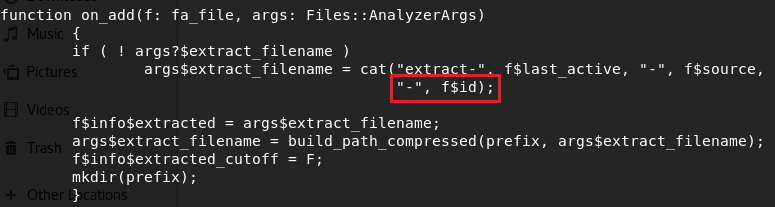
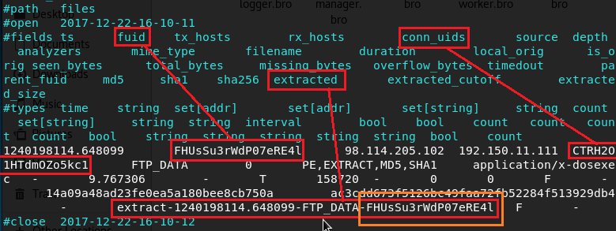
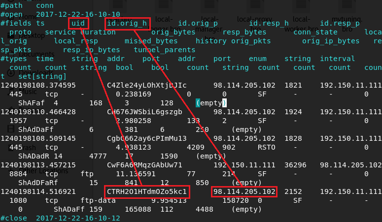
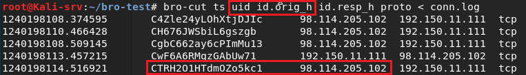

# 翻转课堂4-基于bro的计算机入侵取证实战分析 #

## 环境配置 ##

- 安装bro工具

- 在 /etc/bro/site/local.bro 文件新增两行代码，忽略校验和验证

- 在 /etc/bro/site/ 目录下创建mytuning.bro。内容是

> redef ignore_checksums=T;

## 分析过程 ##

- 下载目标pcap包

- 解压，使用bro自动分析pcap包

    - 出现WARNING警告，对本次实验无影响

- 浏览 /usr/share/bro/base/files/extract/main.bro中的**on_add函数**

    - 代码表明文件名最后的“-”紧跟的字符串就是files.log的文件唯一标识符

- 查看files.log

    - 得到文件全名，文件唯一标识符及conn_uids
    - conn_uids为**CTRH101HTdm0Zo5kc1**

- 查看conn.log

    - 找到uid为**CTRH101HTdm0Zo5kc1**的一项，得到该PE文件来自**98.114.205.102**的ip地址

- 也可以用以下命令查看conn.log文件

