##  基于bro的计算机入侵取证实战分析

### 写在前面
- 什么是计算机入侵取证
```
计算机取证是运用计算机及其相关科学和技术的原理和方法获取与计算机相关的证据以证明某个客观事实的过程。它包括计算机证据的确定、收集、保护、分析、归档以及法庭出示。
```

- bro简介
```
Bro是一个Vern Paxson实现的实时网络入侵检测软件，于98年对外发布，BSD license，它的最初设计目标是实现一个在100M网络下实时告警、机制与策略分离、高可扩展性的入侵检测及网络监视审计系统。
Bro是一款被动的开源流量分析器。它主要用于对链路上所有深层次的可疑行为流量进行一个安全监控。更通俗点说就是，Bro支持在安全域之外进行大范围的流量分析，分析包括性能评估和错误定位。
```
broa系统结构如下图所示：

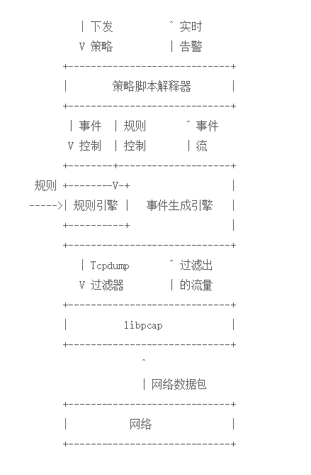

###  实验要求
使用bro开源流量分析器通过分析流量包中的extract file和log文件得到攻击主机的IP

###  实验过程

##### 环境配置

- 安装bro
  - apt install bro bro-aux
- 编辑bro配置文件
  - 编辑 `/etc/bro/site/local.bro`,在文件尾部增加两行新配置代码
  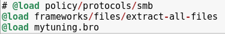

  - 说明：
  ```
  @load 加载module中定义的命名空间
  @load frameworks/files/extract-all-files 表示提取所有文件
  @load mytuning.bro 表示加载mytuning.bro中我们自己编写的指令
  ```

  - 在`/etc/bro/site/`目录下创建新文件mytuning.bro,内容为
  ```
  redef ignore_checksums=T;##忽略校验和验证
  ```
  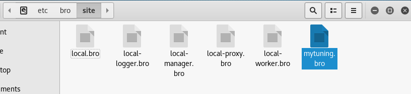

##### 分析过程

- 下载pcap包（实验目标）
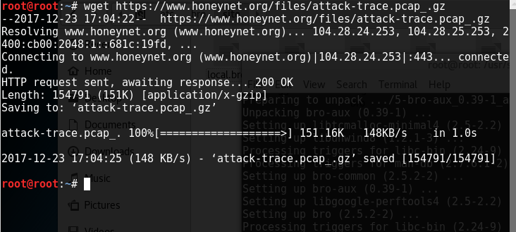
```
wget  https://www.honeynet.org/files/attack-trace.pcap_.gz
```

- 解压缩后使用bro自动分析pcap包
```
bro -r attack-trace.pcap_ /etc/bro/site/local.bro
```

  >出现以下警告信息，对于本次入侵取证实验来说没有影响
```
WARNING: No Site::local_nets have been defined. It's usually a good idea to define your local networks.
```

- 查看attack-trace.pcap文件的当前目录
  - 有一些.log文件和一个extract_files文件夹
  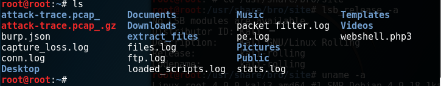
  - 在extract_files文件夹中发现一个文件

  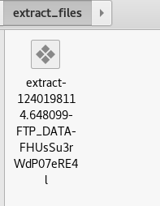

  将该文件上传到[ThreatBook](https://x.threatbook.cn)发现匹配了一个历史扫描报告,该报告表名这是一个已知的后门程序
  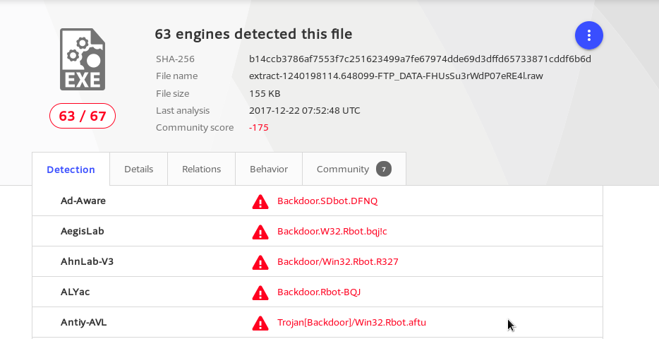


- 阅读/usr/share/bro/base/files/extract/main.bro的源代码中的on_odd函数，了解到该文件名的最右一个"-"紧跟的字符串是 `files.log` 中的文件唯一标识
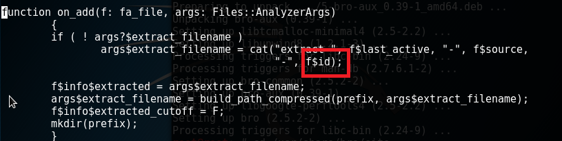

- 查看`files.log`可得
  - 该文件提取自FTP会话
  - 文件的唯一标识符是`FHUsSu3rWdP07eRE4l`
  - 该流量的`conn_uids`为`Cmy8VGL5YkUfwKhfj`

  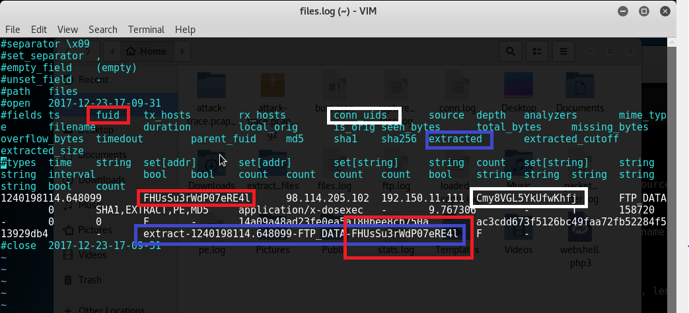

- 查看`conn.log`
  - 找到id为`Cmy8VGL5YkUfwKhfj`的五元组信息，得到该PE文件来自于IPv4地址为98.114.205.102的主机
  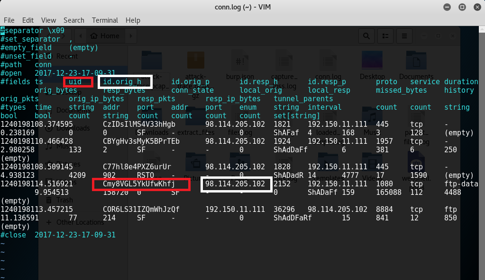
  
  - 也可以使用`bro-cut ts uid id.orig_h id.resp_h proto < conn.log`来查看
  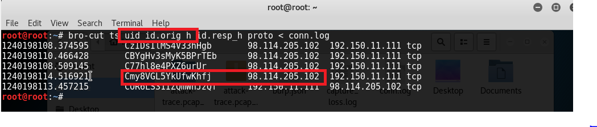

### 参考资料
>[基于bro的计算机入侵取证实战分析](http://www.freebuf.com/articles/system/135843.html)

>[Bro使用手册](https://www.jianshu.com/p/a58d04df8322)

>[Bro：一个开放源码的高级NIDS系统](http://blog.csdn.net/liweiminlining/article/details/51701729)
