#	基于VirtualBox的网络攻防基础环境搭建

##	实验内容
*	靶机可以直接攻击访问者主机
*	攻击者主机无法直接访问靶机
*	网关可以直接访问攻击者主机和靶机
*	靶机的所有对外上下行流量必须经过网关
*	所有节点均可以访问互联网
*  所有节点制作成基础镜像（多重加载的虚拟硬盘）

##	实验过程
####  1、设置网卡
- 网关启用两个网卡，网卡1为NAT网络，网卡2内部网络
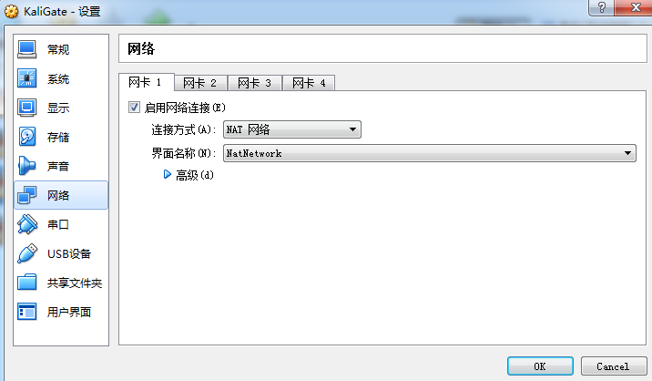
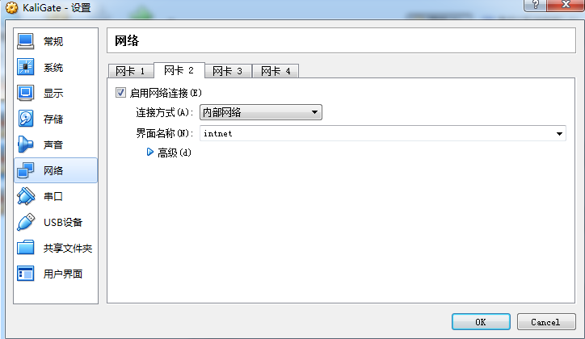
-  攻击者主机启用一个NAT网络网卡
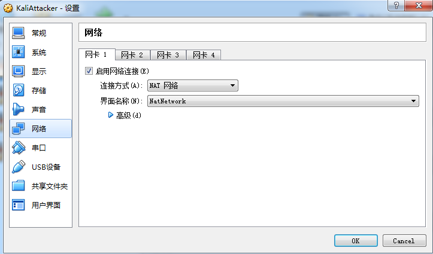
-  靶机启用一个内部网络网卡
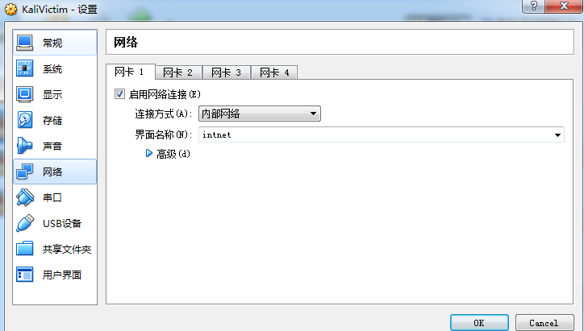
####  2、设置IP
-  网关的网卡一IP使用默认IP 10.0.2.5，网卡二IP手动设置为192.168.56.101
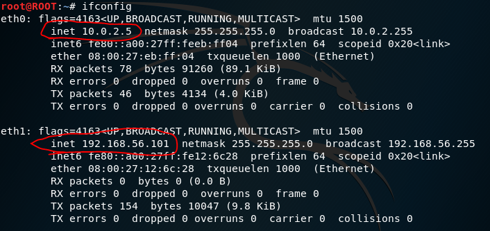
-  攻击者主机主机IP使用默认IP 10.0.2.4
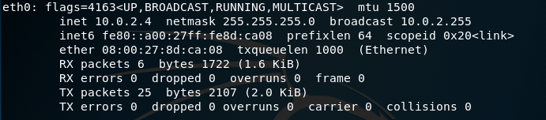
-  靶机IP手动设置192.168.56.102，网关为192.168.56.101
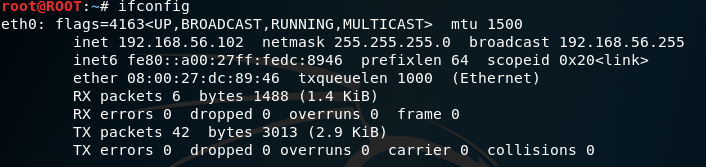
-  网络拓扑图如下 
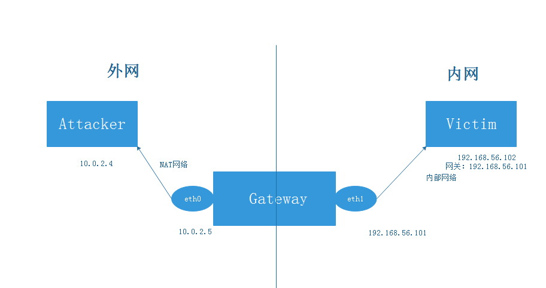
####  3、在网关的操作
-  启用端口转发，实现靶机访问外网
```shell
echo 1 > /proc/sys/net/ipv4/ip_forward
iptables -t nat -A POSTROUTING -s 192.168.56.0/24 -o eth0 -j MASQUERADE
```
####  4、靶机可以直接访问攻击者主机
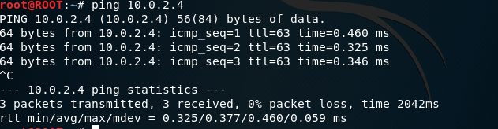
####  5、攻击者主机无法直接访问靶机
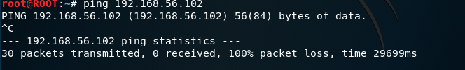
####  6、网关可以直接访问攻击者主机和靶机
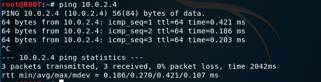
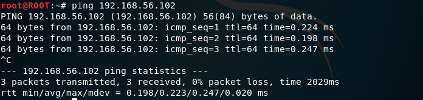
####  7、靶机的所有对外上下行流量必须经过网关
- 靶机访问外网网关监听eth1端口，流量经过网关
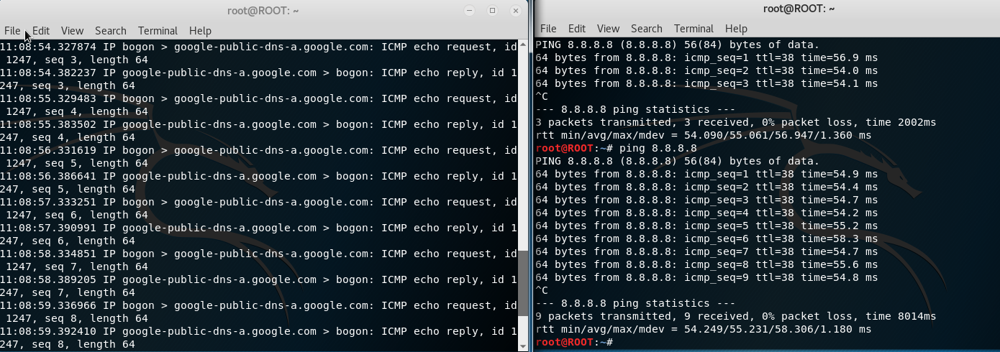
####  8、所有节点均可以访问互联网
- 网关访问外网
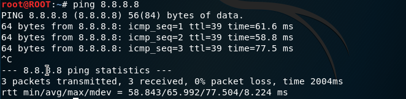
- 攻击者主机访问外网
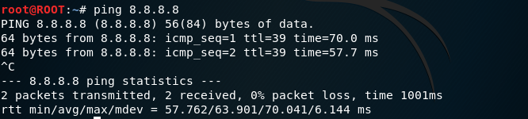
- 靶机访问外网
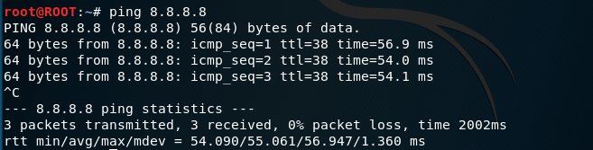
####  9、 所有节点制作成基础镜像（多重加载的虚拟硬盘）
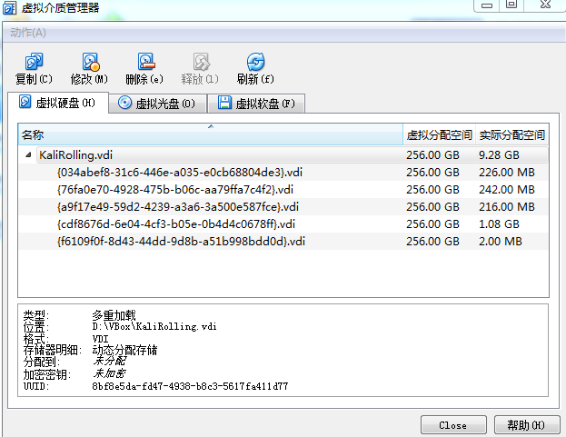
