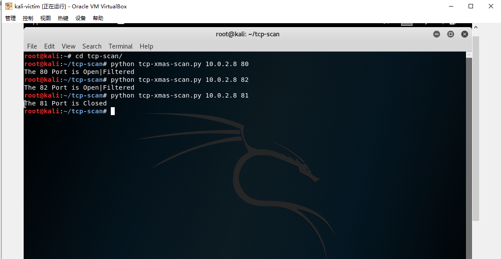

# 端口扫描实验

## **实验环境**

* 被连接主机：kali-gateway。外网ip：10.0.2.8.内网ip：192.168.151.110.配置内网端口转发。

* 发起连接（扫描）主机：kali-victim。ip:192.168.151.104。gateway：192.168.151.110

* 二者可相互连接。

* gateway端口开放情况：

  * 
  * 


  * 添加过滤规则：
    * 
    * UDP过滤端口82；TCP过滤端口82.

### TCP connect scan

* 
* 


* ```python
  #! /usr/bin/python

  import logging
  logging.getLogger("scapy.runtime").setLevel(logging.ERROR)
  from scapy.all import *
  # 设定默认扫描ip
  dst_ip = sys.argv[1] if len(sys.argv)>1 else "10.0.2.8"
  src_port = RandShort()
  dst_port=int(sys.argv[2]) if len(sys.argv)>2 else 80
  # 把目的地址设为指定ip 把通信协议设为tcp 使用指定端口 向其发送数据 限时10ms
  tcp_connect_scan_resp = sr1(IP(dst=dst_ip)/TCP(sport=src_port,dport=dst_port,flags="S"),timeout=10,verbose=0)
  # 如果无响应 则说明端口关闭
  if(str(type(tcp_connect_scan_resp))=="<type 'NoneType'>"):
  	print "The %s Port is Closed"%dst_port
  # 如果响应包是tcp包
  elif(tcp_connect_scan_resp.haslayer(TCP)):
      # ack+syn
  	if(tcp_connect_scan_resp.getlayer(TCP).flags == 0x12):
  		send_rst = sr(IP(dst=dst_ip)/TCP(sport=src_port,dport=dst_port,flags="AR"),timeout=10,verbose=0)
  		print "The %s Port is Open"%dst_port
       # ack+rst
       # rst用来异常的关闭连接
       # 什么时候发送RST包 1. 建立连接的SYN到达某端口，但是该端口上没有正在监听的服务。
  	elif (tcp_connect_scan_resp.getlayer(TCP).flags == 0x14):
  		print "The %s Port is Closed"%dst_port
  ```

* 运行效果

  * 分别扫描80（开放端口）、82（过滤端口）、81（关闭端口）
  * 

### TCP stealth scan

* ```python
  #! /usr/bin/python

  import logging
  logging.getLogger("scapy.runtime").setLevel(logging.ERROR)
  from scapy.all import *

  dst_ip = sys.argv[1] if len(sys.argv)>1 else "10.0.2.8"
  src_port = RandShort()
  dst_port=int(sys.argv[2]) if len(sys.argv)>2 else 80
  tcp_connect_scan_resp = sr1(IP(dst=dst_ip)/TCP(sport=src_port,dport=dst_port,flags="S"),timeout=10,verbose=0)
  if(str(type(tcp_connect_scan_resp))=="<type 'NoneType'>"):
  	print "The %s Port is Closed"%dst_port
  elif(tcp_connect_scan_resp.haslayer(TCP)):
  	if(tcp_connect_scan_resp.getlayer(TCP).flags == 0x12):
          # flags=R表明中断连接 直接中断连接而不告知对方 所以是隐形
  		send_rst = sr(IP(dst=dst_ip)/TCP(sport=src_port,dport=dst_port,flags="R"),timeout=10,verbose=0)
  		print "The %s Port is Open"%dst_port
  	elif (tcp_connect_scan_resp.getlayer(TCP).flags == 0x14):
  		print "The %s Port is Closed"%dst_port
  ```

* 运行效果

  * 分别扫描80（开放端口）、82（过滤端口）、81（关闭端口）
  * 

### TCP XMAS scan

* ```python
  #! /usr/bin/python

  import logging
  logging.getLogger("scapy.runtime").setLevel(logging.ERROR)
  from scapy.all import *

  dst_ip = sys.argv[1] if len(sys.argv)>1 else "10.0.2.8"
  src_port = RandShort()
  dst_port=int(sys.argv[2]) if len(sys.argv)>2 else 80

  xmas_scan_resp = sr1(IP(dst=dst_ip)/TCP(dport=dst_port,flags="FPU"),timeout=10,verbose=0)
  if (str(type(xmas_scan_resp))=="<type 'NoneType'>"):
  	print "The %s Port is Open|Filtered"%dst_port"		
  	elif(xmas_scan_resp.haslayer(TCP)):
  		if(xmas_scan_resp.getlayer(TCP).flags == 0x14):	
  			print "The %s Port is Closed"%dst_port
      # icmp type=3 destination unreachable
  	elif(xmas_scan_resp.haslayer(ICMP)):
  		if(int(xmas_scan_resp.getlayer(ICMP).type)==3 and int(xmas_scan_resp.getlayer(ICMP).code) in [1,2,3,9,10,13]):
  			print "The %s Port is filtered"%dst_port
  ```

* 运行效果

  * 分别扫描80（开放端口）、82（过滤端口）、81（关闭端口）
  * 

* 端口关闭效果：

### UDP scan

* ```python
  #! /usr/bin/python

  import logging
  logging.getLogger("scapy.runtime").setLevel(logging.ERROR)
  from scapy.all import *

  dst_ip = argv[1] if len(sys.argv)>1 else "10.0.2.8"
  src_port = RandShort()

  dst_port=int(sys.argv[2]) if len(sys.argv)>2 else 5355
  dst_timeout=3
  retrans = []

  def udp_scan(dst_ip,dst_port,dst_timeout):
  	udp_scan_resp = sr1(IP(dst=dst_ip)/UDP(dport=dst_port),timeout=dst_timeout,verbose=0,verbose=0)
  	if (str(type(udp_scan_resp))=="<type 'NoneType'>"):
  		retrans = []k
           # 发三次包
  		for count in range(0,3):
  			retrans.append(sr1(IP(dst=dst_ip)/UDP(dport=dst_port),timeout=dst_timeout,verbose=0))
           # 只要有一次有响应 就进行扫描 如果还是全无响应 就说明端口关闭或是被过滤
  		for item in retrans:
  			if (str(type(item))!="<type 'NoneType'>"):
  				udp_scan(dst_ip,dst_port,dst_timeout)
  		return ("The %s Port is Open|Filtered"%dst_port)
  	elif (udp_scan_resp.haslayer(UDP)):
  		return ("The %s Port is Open"%dst_port)
  	elif(udp_scan_resp.haslayer(ICMP)):
  		if(int(udp_scan_resp.getlayer(ICMP).type)==3 and int(udp_scan_resp.getlayer(ICMP).code)==3):
  			return ("The %s Port is Closed"%dst_port)
  		elif(int(udp_scan_resp.getlayer(ICMP).type)==3 and int(udp_scan_resp.getlayer(ICMP).code) in [1,2,9,10,13]):
  			return ("The %s Port is Filtered"%dst_port)

  print udp_scan(dst_ip,dst_port,dst_timeout)
  ```

  * 运行效果
    * 分别扫描5355（UDP开放端口）、82（UDP过滤端口）、81（关闭端口）
    * 
