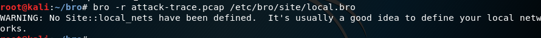
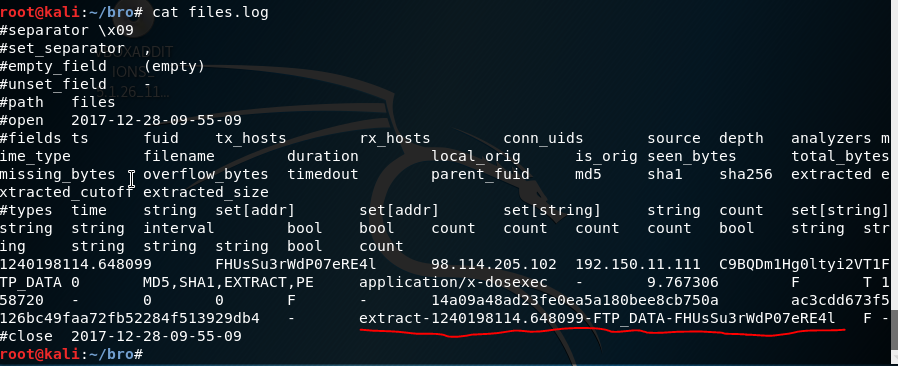

# 基于bro的计算机入侵取证分析

* 安装bro工具

  * ```shell
    apt-get install bro bro-aux
    ```

* 配置bro

  * 编辑/etc/bro/site/local.bro，在文件尾部追加两行代码

    * ```shell
      @load frameworks/files/extract-all-files # 提取所有文件
      @load mytuning.bro
      ```

  * 在/etc/bro/site/目录下创建新文件mytuning.bro， 添加： 

    * ```
      redef ignore_checksums = T;
      ```

* 下载pcap包

  * ```shell
    wget  https://sec.cuc.edu.cn/huangwei/textbook/ns/chap0x12/attack-trace.pcap
    ```

* 使用bro自动分析

  * ```shell
    bro -r attack-trace.pcap /etc/bro/site/local.bro
    ```

  * 出现警告信息

    * 
    * 解决警告信息：在mytuning.bro文件中添加一行代码，指定本地ip地址的范围。

  * 添加后，文件夹下会多出两个日志文件，会报告在当前流量（数据包文件）中发现了本地网络IP和该IP关联的已知服务信息

  * 通过阅读/usr/share/bro/base/files/extract/main.bro的源代码 ，可以了解到该文件名的最右一个-右侧对应的字符串是 files.log中的文件唯一标识

    * 

  * 查看files.log，可以得到，该文件提取自FTP会话，并得到该流量的conn_uids为CK4p013efE9TpisoXg

    * 

  * 查看conn.log，找到id为C9BQDmlHg0ltyi2VT1的五元组信息，得到该PE文件来自于IPv4地址为98.114.205.102的主机    

    * 