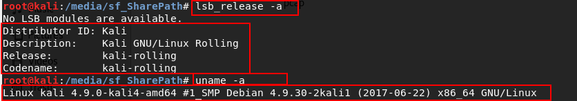
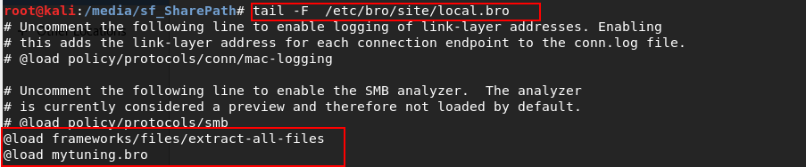
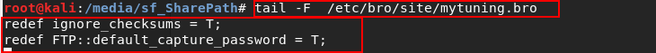
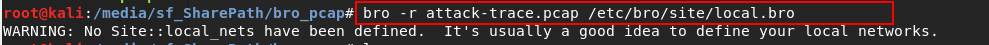
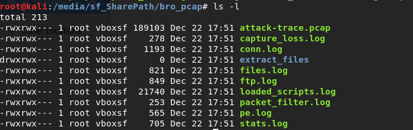
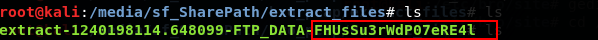
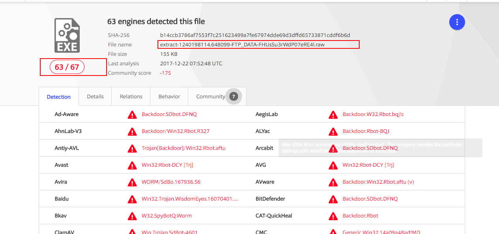
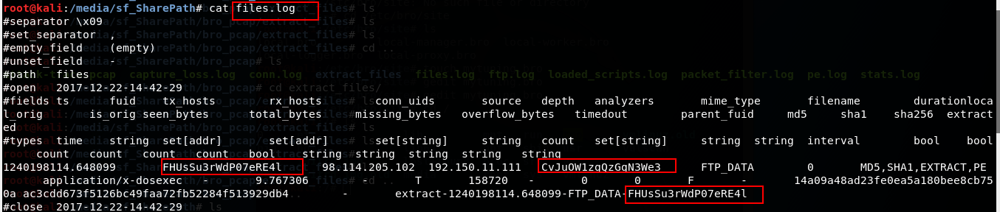
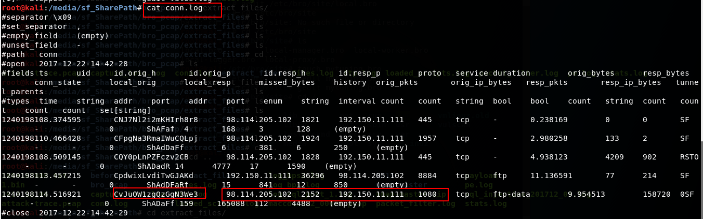
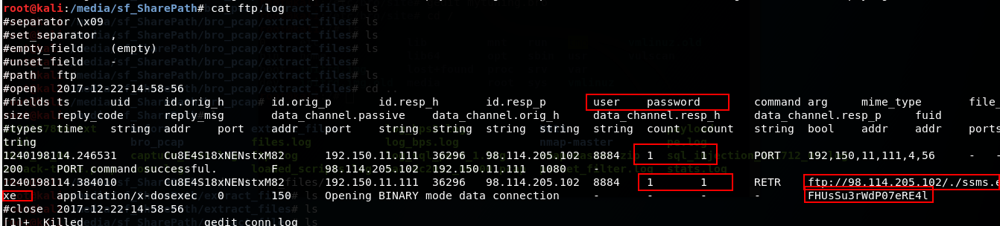

### bro 取证分析

- bro设置

  - 实验环境：

    

  - 设置bro
    - 提取文件负载
    - 提取FTP登录用户名和密码
    - 忽略校验和错误 

    

    

- 数据包分析

  - 数据包分析

    

  - 查看生成的文件

    

  - 查看提取的负载文件

    

  - 将负载文件上传到恶意文件检测平台（virustotal\实验所用机器的预警信息:) ）

    

    说明负载文件是恶意文件，查看恶意文件的来源

  - 根据文件标识找到会话，根据会话锁定IP

    - 根据files.log定位到会话标识（对应字段的含义可以通过bro官网的文档获得）

    

    - 根据conn.log文件中的会话表示定位到IP

    

    - 查看ftp.log

      

- 事件还原：

  ​	结合wireshark分析，可以知道这是一个先使用shellcode利用被攻击主机，然后通过shellcode执行指令从攻击者ftp上下载恶意软件的攻击过程。
