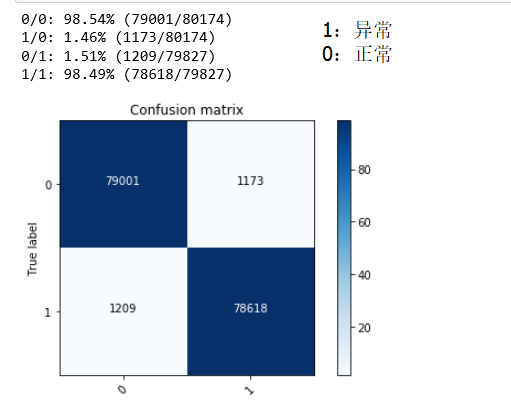
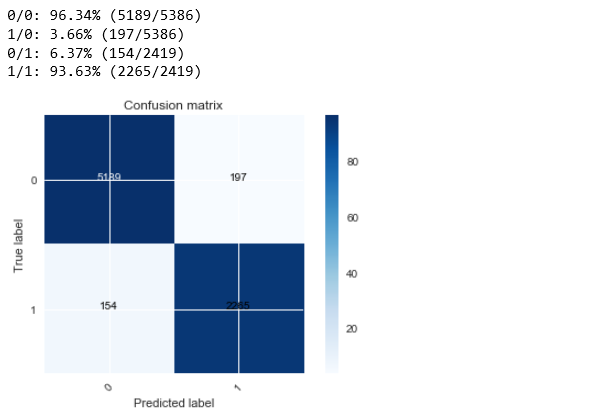
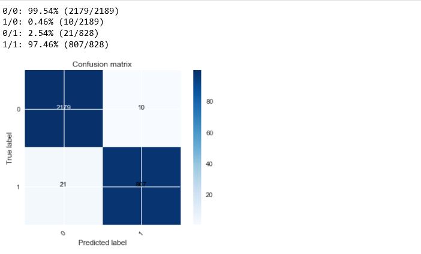

## 网络安全大作业实验报告

####  一）选题相关 

- 选题内容：

  设计并实现一套针对Web代理服务器访问日志的威胁检测工具（类似于安全网关、侧重于发现内网僵尸/傀儡主机行为）

  - 使用机器学习方法
  - 以具体威胁检测（威胁识别与分类，例如C2行为检测、下载器行为、钓鱼网站访问、网络扫描、DoS/DDoS等）为主、异常（未知威胁）检测为辅

- 选题理解（概念解释）：

  - Web代理服务器

    ​	根据题意，这里的web代理服务器是指正向代理。正向代理服务器是指位于客户端和web服务器之间的服务器，为了从web服务器取得内容，客户端向代理发送一个请求并指定目标(web服务器)，然后代理向web服务器转交请求并将获得的内容返回给客户端。正向代理的典型用途是为在防火墙内的局域网客户端提供访问Internet的途径。正向代理还可以使用缓冲特性减少网络使用率。正向代理服务器需要客服端的授权。

  - C2行为

    ​	C2行为，亦即command&control行为，是指僵尸网络的控制者与被控主机之间的通信行为。通过C&C信道，可以控制大量僵尸主机实现信息窃取，分布式拒绝服务攻击和垃圾邮件发送等攻击目标。

  - 下载器行为

    ​	指已经进入被攻击主机的木马通过网络下载恶意软件到被攻击主机的行为。

  - 钓鱼网站访问

    ​	访问伪造网站行为。

  - 网络扫描

    ​	通过网络请求等方式，扫描获得主机、局域网的相关属性。

  - DoS/DDoS

    ​	拒绝服务攻击，通过频繁的网络请求等类似手段达到消耗被攻击者资源，使其无法提供正常服务。

#### 二）实验相关

- 完成任务清单

  - [x] 恶意域名检测（DGA）
  - [x] ICMP DOS检测
  - [x] 下载行为检测
  - [x] 网络扫描行为检测
  - [ ] C&C行为检测
  - [ ] 钓鱼网站访问（未完成 通过DNS解析过程作为训练特征？）

- 恶意域名检测

  - 数据集：

    ​	异常域名：开源的不同DGA算法生成的[域名](https://github.com/andrewaeva/DGA)

    ​	正常域名：Alexa Top Million域名

  - 是否在实际环境进行测试： 

    ​	没有，只是使用数据集进行了性能测试

  - 特征选择

    ​	[参考1](https://paper.seebug.org/papers/Archive/drops2/%E7%94%A8%E6%9C%BA%E5%99%A8%E5%AD%A6%E4%B9%A0%E8%AF%86%E5%88%AB%E9%9A%8F%E6%9C%BA%E7%94%9F%E6%88%90%E7%9A%84C%26amp%3BC%E5%9F%9F%E5%90%8D.html)   [参考2](http://www.evil0x.com/posts/22642.html#)

    ​	实际训练使用了信息熵、似然估计值作为特征，因为用到的数据集是使用各种DGA算法生成的域名，在算法中设置了生成的长度值，所以没有将长度作为特征，但是在实际中长度应该是重要特征之一。	

  - 性能测试

    ​	

  - 可以改进的部分

    - 特征还可以更多。
    - 数据集使用现实场景中收集得到的。
    - 针对分类结果不理想的DGA进行详细分类，根据相应的DGA算法有针对性的检测
    - DGA检测除了单单从域名本身出发，域名解析过程也可以加入特征中

- ICMP DOS检测

  - 数据集：

    [CTU-Malware-Capture-Botnet-52](https://mcfp.felk.cvut.cz/publicDatasets/CTU-Malware-Capture-Botnet-52/)

  - 是否在实际环境进行测试

    否 将数据集中的正常icmp连接和用于DoS的icmp连接作为训练集，测试集进行的测试

  - 特征选择

    ​	通过实验证明会话持续时间，会话状态是两个能取得很好的分类结果的特征

  - 性能测试

    ​	

    ​

  - 可以进行的改进

    - 可以对icmp连接的特征进行进一步的分析，总结

- 下载行为分析

  - 数据集：

    使用了[Botnet](http://www.unb.ca/cic/datasets/botnet.html)数据集，利用bro提取日志，通过是否files.log中的会话作为是否是下载行为的判断

  - 特征选择

    ​	实验结果表明，使用当前连接的上层服务，连接的持续时间，连接的历史信息能取得好的训练结果（仍然不如全特征）

  - 性能测试

    ​	

  - 需要改进的地方

    - 其实在有bro辅助的情况下，这样的识别并没有什么意义。
    - 可以配合对下载文件的分析，进行检测

- 网络扫描行为检测

  - 数据集：

     使用Nmap自制了数据集

  - 是否在实际环境进行测试：

     是，使用bro实时分析数据包，实时读取分析结果进行判断

  - 特征选择：

    ​	没有进行特征选择

  - 性能测试

    ​	在使用网络上找到的[扫描数据包](http://www.pcapanalysis.com/pcap-downloads/scanning-probing/nmap-null-scan-network-traffic-pcap-file-download/)做成的数据集的情况下，得到了很好的测试结果，但是在实际测试中结果并不理想。	

  - 可以改进的部分

    - 性能很大程度上取决于数据集：制作数据集时正常的数据集多采用http(s)连接，只能区分http连接和基本的扫描行为，所以可以通过建立更丰富的数据集来提高性能。

      ​

