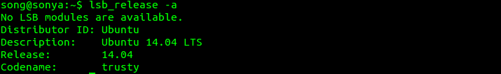
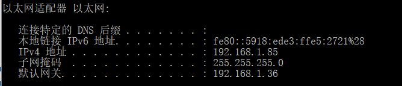
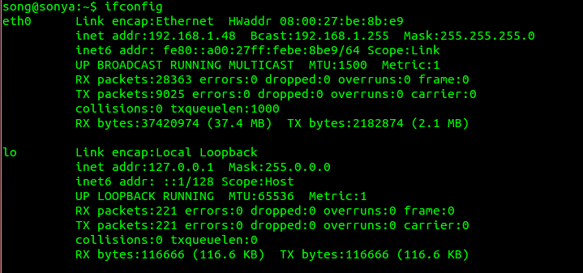
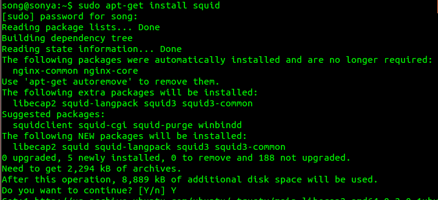
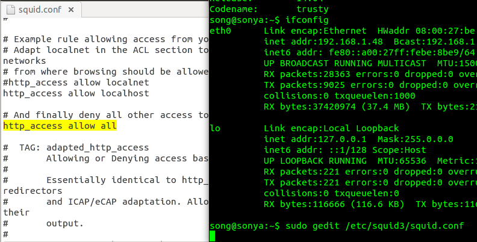
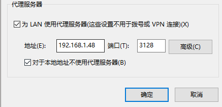
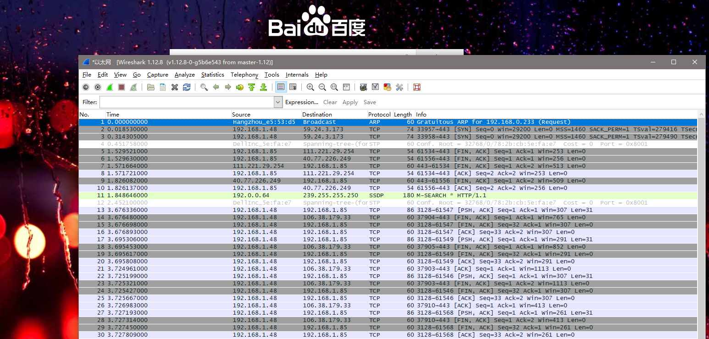

## set up squid

- 环境说明

  - ubuntu server 14.04

    - 

  - 桥接网卡

    - 宿主机  ipconfig

      

    - 虚拟机 ifconfig

      

- 配置步骤

  - sudo apt-get install squid

    

  - 修改squid配置文件

    ```
    sudo gedit /etc/squid3/squid.conf
    在文件中查找 http_access deny all
    改成 http_access allow all 
    通过观察文件 http_port 3128 可知squid的默认端口是3128
    ```

    - 

  - 重启squid

    - 

  - 测试

    - 将浏览器代理更改成设置的代理服务器的地址

      - 
    - 浏览器访问百度 设置成功

      - 
      - 代理服务器查看日志成功

- 其他
	查阅了一些资料，大都围绕了关键字“日志分析 机器学习”，得到的知识都是ELK相关的，不认为是最合适的内容，准备先针对代理服务器的具体内容和具体的攻击方法进行调研准备
