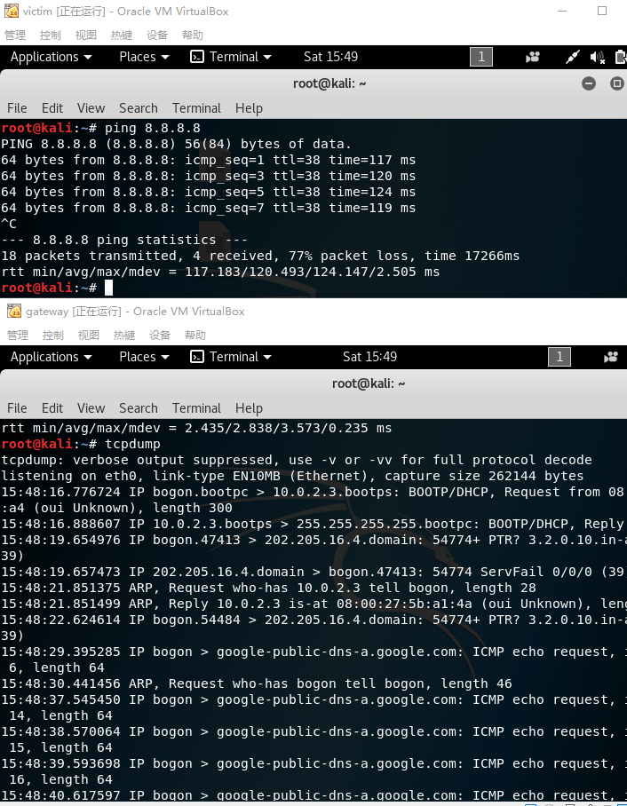

##  基于VirtualBox的网络攻防基础环境搭建修改版


#### 一、任务完成情况清单

- [x]  靶机可以直接访问攻击者主机
- [x]  攻击者主机无法直接访问靶机
- [x]  网关可以直接访问攻击者主机和靶机
- [x]  靶机的所有对外上下行流量必须经过网关
- [x]  所有节点均可以访问互联网
- [x]  所有节点制作成基础镜像（多重加载的虚拟硬盘

#### 二、实验过程记录

- 网络拓扑图

  

- 三台主机的IP地址

  - 攻击者主机 
  - 
  - 网关
    - 


  - 靶机

    

- 靶机可以访问攻击者主机 攻击者不可以访问靶机

  

  ​

- 靶机所有流量都经过网关主机

  ```shell
  #指定靶机的网关为网关主机
  route add default gw 10.0.2.11
  ```

  ​

  

- 所有节点都可以访问互联网

  

- 网关可以访问攻击者主机 和靶机

  


#### 三、实验说明

通过桥接网络和NAT网络的特点实现了实验要求。