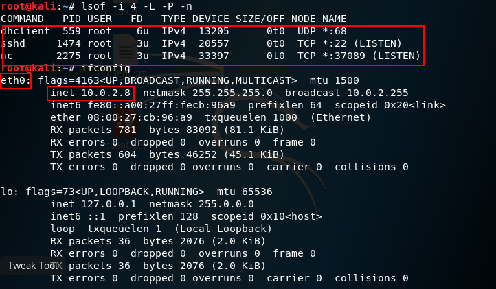
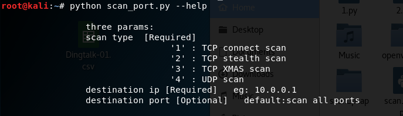
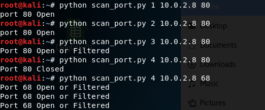
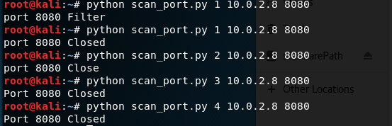
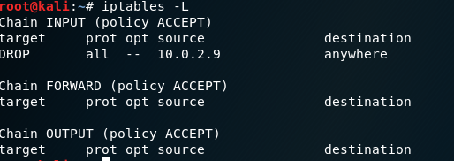
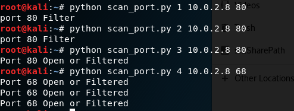

## scapy_编程

- 实现TCP connect scan/TCP stealth scan/TCP XMAS scan/UDP scan

#### 实验效果验证

- 被扫描主机状态（IP 地址，开放端口）

  

- 文件帮助说明

  

- open 端口扫描验证

  

  - 注：目标机器的80端口是建立在tcp连接上的，所以udp scan的扫描结果是close，改用68端口扫描结果显示正确。

- close 端口验证

  

- filtered 端口验证

  - iptables 禁止10.0.2.9（发起扫描主机）访问

  

  - 扫描结果

    

- [代码](https://github.com/songyawen/ns/blob/flip_class_branch/2017-2/Sonya_Coursework/FlippedClassroom_HW/HW_2/scan_port.py)

  ​

  ​
