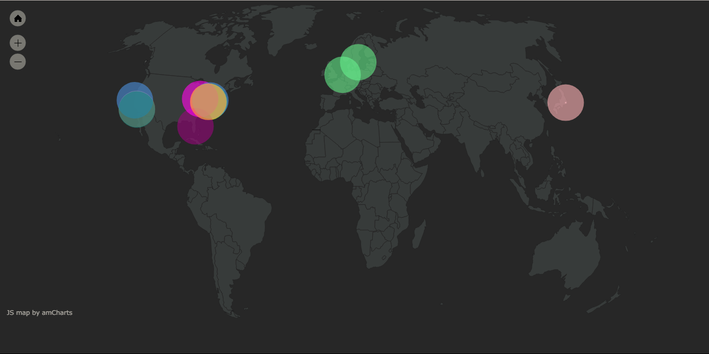
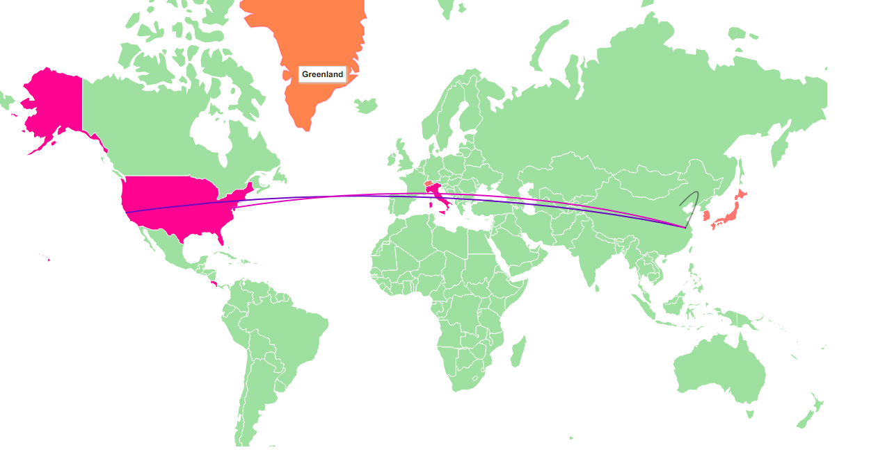

# 大作业完成情况

## 域名解析过程

* 本地作为DNS客户端，请求www.example.com的地址。
* 首先查看本地的缓存中有无域名映射关系，没有则进行查询。
* 递归解析程序（本地DNS服务器）查询根dns服务器
  * 这里的根服务器在全球有13个，以最先回复的为准。
  * 本地DNS服务器：如中国传媒大学的是202.205.16.4
* 最先回复的根服务器返回一个.com顶级域名服务器的地址
* 本地请求.com顶级域名权威服务器（TLD），这里的顶级域名服务器也有13个，同样以最先回复的为准。
* .com顶级域名权威服务器返回一个example.com的权威服务器。
* 本地请求example.com权威服务器，并收到1.2.3.4作为答案。
* 本地递归解析程序缓存在记录中指定的生存时间（TTL）期间内的答案，并将结果返回。

## 实验过程

* 根据老师提出的建议，我使用dig命令找到了全球13个根服务器的域名，进而找到了其地理位置，并已经在地图上可视化了出来。
  * 使用ammap中api。根据经纬度绘图。这里展示是在root.html中。
  * 效果图如下
    * 
* 问题：智利用户访问www.facebook.com时，会请求.com权威服务器。根据dig的结果，我发现.com的权威服务器有13个，在网络上在线查询，发现它们全部在美国。因此，如何证明可能会经过中国？
* 根据dig +trace命令可以列出本地解析一个网址时经过的全部ip.通过查询，可以发现他们来自不同的国家，这样可以证明dns解析过程中，国与国的界限很模糊。
  * 这一点在之前提交的代码中可以展示。
  * 具体过程
    * 前端输入域名，后端拿到域名后，给python代码传参。
    * python代码使用该域名调用ubuntu的dig +trace命令，获得本机解析当前域名的全部过程，取到每一跳的ip，并使用api查询到其经纬度，以json串的形式返回给前端绘图。
    * 使用的查询经纬度的API是http://ip-api.com/json/
    * 使用的绘图api是datamaps
    * 不足：动态效果难以显示。目前只能通过使用不同的颜色连线实现每一跳的不同。
  * 解析www.baidu.com域名时，效果图如下
    * 
  * 代码介绍
    * dns-resolve.py：通过dig +trace命令，先获得一个dns解析过程的ip列表，再根据列表中每一个ip查询其经纬度，以json串的形式返回给调用处。
    * returnvalue.php：调用dns-resolve.py，获得经纬度的json串。
    * procedure.php：调用returnvalue.php，用得到的经纬度信息绘图。

